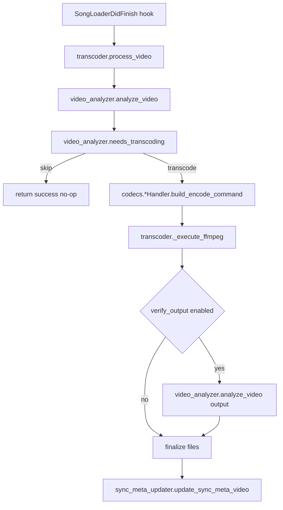

# Video Transcoder Addon Architecture

This document is the canonical architecture reference for the Video Transcoder addon (a USDB Syncer addon). It is written for maintainers who need to:

- understand the runtime call flows (automatic transcode, batch transcode, backup management)
- make safe changes around file replacement and SyncMeta updates
- extend codecs or hardware acceleration without breaking the existing pipeline

## Goals and non-goals

Goals

- Transcode downloaded videos into a configured target codec and container.
- Preserve USDB Syncer synchronization correctness by updating SyncMeta and the song text file.
- Provide user-facing safety mechanisms:
  - persistent backups of originals
  - optional rollback protection for batch operations
  - abort support for both automatic and batch workflows

Non-goals

- No attempt is made to keep an internal job queue or resume partially completed transcodes.
- No migration documentation is provided; this project is pre-release.

## Glossary

- SyncMeta: USDB Syncer per-song metadata file and database record (see USDB Syncer codebase). The addon reads and updates the video `ResourceFile` attached to `sync_meta.video`.
- Resource ID: `sync_meta.video.file.resource` identifies the remote asset. The addon must preserve it when changing the local filename.
- SongLogger: USDB Syncer per-song logger, created via [`song_logger()`](../__init__.py:37).

## Code map (modules and responsibilities)

| Area | Module(s) | Responsibility |
|---|---|---|
| Addon entrypoint | [`__init__.py`](../__init__.py) | Hook registration, config bootstrap, GUI menu wiring |
| Config | [`config.py`](../config.py) | Dataclasses, JSON load/save, config path |
| Analysis + decision | [`video_analyzer.py`](../video_analyzer.py) | `ffprobe` analysis and decision logic |
| Transcoding engine | [`transcoder.py`](../transcoder.py) | Orchestrate analysis, command build, execute ffmpeg, file replacement, SyncMeta update |
| Codec command builder | [`codecs.py`](../codecs.py) | Registry and per-codec `ffmpeg` argument builders |
| Hardware acceleration | [`hwaccel.py`](../hwaccel.py) | Accelerator registry + QuickSync probing |
| SyncMeta + song text update | [`sync_meta_updater.py`](../sync_meta_updater.py) | Preserve resource ID, update filename + mtime, update or insert `#VIDEO:` |
| Abort + progress parsing | [`utils.py`](../utils.py) | Abort signal aggregation, ffmpeg progress parsing helpers |
| Batch workflow (GUI) | [`batch_orchestrator.py`](../batch_orchestrator.py), [`batch_worker.py`](../batch_worker.py) | Scan, selection UI, worker thread, progress/abort, results |
| Rollback (batch) | [`rollback.py`](../rollback.py), [`rollback_backup_worker.py`](../rollback_backup_worker.py), [`rollback_backup_progress_dialog.py`](../rollback_backup_progress_dialog.py) | Pre-transcode temp backups (non-blocking creation), manifest, restore-on-abort |
| Persistent backup management (GUI) | [`backup_manager.py`](../backup_manager.py) plus dialogs | Discover, delete, restore persistent backups |

## Configuration model

The addon stores configuration in a JSON file located in the addon directory (next to the Python modules). The path is computed by [`config.get_config_path()`](../config.py:105) and created on first load by [`config.load_config()`](../config.py:110).

The root configuration object is [`config.TranscoderConfig`](../config.py:90). Two design choices are important when changing settings behavior:

- Global operational toggles live under [`config.GeneralConfig`](../config.py:63) (timeouts, free-space guard, hardware toggles, backup toggles).
- Codec-specific quality and container settings live under per-codec dataclasses (for example [`config.H264Config`](../config.py:18)).

## Runtime entry points

### Addon load

On import, the addon:

1. ensures a default config exists by calling [`config.load_config()`](../config.py:110) from [`__init__.py`](../__init__.py:19)
2. registers the download hook via [`hooks.SongLoaderDidFinish.subscribe()`](../__init__.py:71)
3. attempts to register GUI menu items (if USDB Syncer GUI is available) via [`_register_gui_hooks()`](../__init__.py:74)

### Automatic transcode after download

USDB Syncer triggers the hook handler [`on_download_finished()`](../__init__.py:35) after a song finishes downloading.

The handler:

- loads current settings (`auto_transcode_enabled`)
- verifies `ffmpeg` is available
- locates the current video path from `song.sync_meta`
- delegates the actual work to [`transcoder.process_video()`](../transcoder.py:41)

### GUI entry points

When running in GUI mode, the addon adds tools menu actions for:

- settings: [`settings_gui.show_settings()`](../settings_gui.py:711)
- batch transcode: [`BatchTranscodeOrchestrator.start_batch_workflow()`](../batch_orchestrator.py:170)
- backup management: [`BackupDialogOrchestrator.start_workflow()`](../backup_dialog_orchestrator.py:98)

## High-level data flow

## Core transcoding pipeline

The orchestration logic lives in [`transcoder.process_video()`](../transcoder.py:41).

### Step 1: Analyze input video

The addon runs `ffprobe` and parses metadata into a [`VideoInfo`](../video_analyzer.py:22) struct via [`video_analyzer.analyze_video()`](../video_analyzer.py:60).

Important details

- Container is derived from the file extension (`path.suffix`) in [`_parse_ffprobe_output()`](../video_analyzer.py:105). This is pragmatic but means a mismatched extension can produce incorrect container decisions.

### Step 2: Resolve effective limits

Before deciding whether to transcode, the addon may translate USDB Syncer settings into effective limits via [`transcoder._apply_limits()`](../transcoder.py:473):

- if `use_usdb_resolution` is enabled, it pulls the resolution from USDB Syncer settings
- if `use_usdb_fps` is enabled, it pulls FPS from USDB Syncer settings
- to avoid unintended upscaling, it only applies these limits when the source exceeds them

### Step 3: Decide whether transcoding is needed

Decision logic is implemented in [`video_analyzer.needs_transcoding()`](../video_analyzer.py:232).

The file is transcoded if any of the following are true:

- codec mismatch for the configured target codec
- container mismatch with the configured codec container
- general caps exceeded (or exact mismatch depending on USDB integration flags):
  - resolution
  - fps
  - bitrate
- handler reports incompatibility via [`CodecHandler.is_compatible()`](../codecs.py:52)

Force mode

- If [`config.GeneralConfig.force_transcode`](../config.py:64) is enabled, the addon will transcode even when `needs_transcoding` returns false (but it still performs analysis and disk space checks).

### Step 4: Select codec handler and build the ffmpeg command

Codec handlers are registered in [`codecs.CODEC_REGISTRY`](../codecs.py:89) and retrieved via [`codecs.get_codec_handler()`](../codecs.py:99).

Each handler builds a full `ffmpeg` command line in `build_encode_command` (for example [`codecs.H264Handler.build_encode_command()`](../codecs.py:131)).

Common conventions across handlers

- always uses `ffmpeg -y -hide_banner`
- enforces constant frame rate output via `-vsync cfr`
- for MP4 and MOV outputs, enables fast-start when applicable (`-movflags +faststart`)
- optionally applies:
  - scaling and padding filters for resolution
  - `fps=` filter for frame rate
  - `-maxrate` and `-bufsize` when `max_bitrate_kbps` is set
- audio strategy depends on container compatibility:
  - MP4/MOV: prefer copying `aac/mp3/alac`, otherwise encode to AAC
  - WebM/MKV: prefer copying `opus/vorbis`, otherwise encode to Opus

### Step 5: Hardware acceleration (encode and decode)

Hardware acceleration selection happens inside [`transcoder.process_video()`](../transcoder.py:41) using:

- encoder selection: [`hwaccel.get_best_accelerator()`](../hwaccel.py:79)
- decoder selection (when encoding is software): [`hwaccel.get_best_decoder_accelerator()`](../hwaccel.py:104)

Important behavior

- Encode and decode are independently controlled by:
  - [`config.GeneralConfig.hardware_encoding`](../config.py:64)
  - [`config.GeneralConfig.hardware_decode`](../config.py:64)
- If hardware encoding is enabled and resolution or FPS filters are requested, hardware decoding is explicitly disabled for that run to avoid hardware-surface filter pipeline issues.

Current implementation

- Only Intel QuickSync is implemented via [`hwaccel.QuickSyncAccelerator`](../hwaccel.py:121).
- QuickSync is only supported on `win32` and `linux` as declared by [`QuickSyncAccelerator.capabilities()`](../hwaccel.py:125).
- Availability is probed by running a short `ffmpeg` encode attempt.

Availability probing and caching

- QuickSync availability is cached in-process via the `_qsv_available` module variable in [`hwaccel.py`](../hwaccel.py:116).

Codec-level implications

- When QuickSync encoding is active, handlers force `-pix_fmt nv12` (hardware-friendly) even if the configured pixel format differs.

### Step 6: Execute ffmpeg with progress, timeout, and abort

Execution is implemented in [`transcoder._execute_ffmpeg()`](../transcoder.py:297).

Key behaviors

- Parses stderr lines containing `time=` using [`utils.parse_ffmpeg_progress()`](../utils.py:77) and logs progress roughly every 5 seconds.
- Supports a UI progress callback (used by batch UI) to show percent, FPS, speed, and ETA.
- Enforces a hard timeout via [`config.GeneralConfig.timeout_seconds`](../config.py:64).

Abort behavior

- The abort signal is aggregated by [`utils.is_aborted()`](../utils.py:84), which checks:
  - USDB Syncer per-download job abort flags
  - batch abort flags from [`BatchAbortRegistry`](../batch_worker.py:29)
- On abort:
  - Windows: kills the full process tree via `taskkill /F /T`
  - POSIX: sends terminate then escalates to kill if needed

Temporary file cleanup

- The engine writes to a temp path like `MyVideo.transcoding.mp4` and removes partial files on failure or abort.
- Deletion uses retries and an optional rename-first strategy in [`transcoder._safe_unlink()`](../transcoder.py:433) to cope with Windows file locking.

Subprocess environment hygiene

- All `ffmpeg` and `ffprobe` subprocess invocations run under USDB Syncer’s [`LinuxEnvCleaner`](../transcoder.py:14) wrapper, which helps provide a consistent environment for child processes.

### Step 7: Verify output (optional)

If [`config.GeneralConfig.verify_output`](../config.py:64) is enabled, the addon re-runs `ffprobe` on the temporary output via [`video_analyzer.analyze_video()`](../video_analyzer.py:60) and fails the operation if the output cannot be analyzed.

### Step 8: Finalize files and update SyncMeta

File finalization is deliberately conservative:

- output is written to a temporary `.transcoding` path first
- on success, the output is moved into place via `Path.replace` (atomic replacement semantics)
- optional persistent backup of the original is done by renaming the original to `stem + backup_suffix + original_extension`
- if no backup is taken and the output extension differs from the input extension, the old source file is deleted after the new output is successfully in place

SyncMeta update

- After placing the final output, the addon updates USDB Syncer metadata via [`sync_meta_updater.update_sync_meta_video()`](../sync_meta_updater.py:25).
- The call preserves the original resource ID and updates:
  - video filename (`fname`)
  - microsecond mtime (`mtime`) via USDB Syncer `get_mtime`
  - the song text file `#VIDEO:` header via [`update_txt_video_header()`](../sync_meta_updater.py:130)
- It persists changes using `sync_meta.synchronize_to_file()` then `sync_meta.upsert()`.

Custom data keys

The addon stores operational metadata in `sync_meta.custom_data`:

- `transcoder_source_fname`
- `transcoder_output_fname`
- `transcoder_codec`
- `transcoder_profile`
- `transcoder_timestamp`

These values are expected to be strings (see [`update_sync_meta_video()`](../sync_meta_updater.py:25)).

Related helper

- [`sync_meta_updater.check_already_transcoded()`](../sync_meta_updater.py:177) provides a quick check based on stored `custom_data` and the existence of the output file.

## Persistent backups (original preservation)

The addon supports user-visible persistent backups next to the song files.

Creation paths

- Automatic and batch transcodes back up the original file in [`transcoder.process_video()`](../transcoder.py:41) by renaming it before replacing the output.
- [`sync_meta_updater.update_sync_meta_video()`](../sync_meta_updater.py:25) also has an optional `backup_source` mode (kept for flexibility), but the main pipeline currently performs the backup itself and calls the updater with `backup_source` disabled.

Discovery and management

- Backups are discovered via:
  1. exact filename stored in `transcoder_source_fname`
  2. fallback glob search using `backup_suffix` next to the active video
- The implementation is in [`backup_manager.discover_backups()`](../backup_manager.py:54).

## Batch transcoding architecture

Batch transcoding is a GUI-driven workflow orchestrated by [`BatchTranscodeOrchestrator`](../batch_orchestrator.py:155).

There is also a non-GUI batch helper module, [`batch.py`](../batch.py), which exposes iterator-style discovery via [`find_videos_needing_transcode()`](../batch.py:41). The current GUI workflow does not call this module directly.

### Phase 1: Scan

- Runs in a background thread [`batch_orchestrator.ScanWorker`](../batch_orchestrator.py:102)
- Enumerates SyncMeta records in the song directory, analyzes videos, and selects candidates using:
  - [`video_analyzer.analyze_video()`](../video_analyzer.py:60)
  - [`video_analyzer.needs_transcoding()`](../video_analyzer.py:232)

### Phase 2: Preview and selection

- The preview UI is [`BatchPreviewDialog`](../batch_preview_dialog.py:32).
- The orchestrator builds per-video estimates using [`BatchEstimator`](../batch_estimator.py:15).

### Phase 3: Execute

- If rollback protection is enabled, the orchestrator first creates pre-transcode rollback backups via [`BatchTranscodeOrchestrator._create_rollback_backups()`](../batch_orchestrator.py:371). Backup copies are created on a background thread (see [`RollbackBackupWorker.run()`](../rollback_backup_worker.py:41)) while a modal progress dialog is shown (see [`RollbackBackupProgressDialog`](../rollback_backup_progress_dialog.py:26)). The user can cancel this phase, which aborts the batch before transcoding begins.
- Work is performed on a `QThread` in [`BatchWorker.run()`](../batch_worker.py:108).
- For each selected candidate, the worker calls the same core engine [`transcoder.process_video()`](../transcoder.py:41) and forwards progress updates to the UI.

Abort propagation

- The progress dialog emits an abort request that calls [`BatchWorker.abort()`](../batch_worker.py:100).
- The abort implementation sets a flag in [`BatchAbortRegistry`](../batch_worker.py:29) for the current song id.
- The core ffmpeg loop checks abort state through [`utils.is_aborted()`](../utils.py:84).

### Phase 4: Results

- Summary and export live in [`BatchResultsDialog`](../batch_results_dialog.py:31).

## Rollback protection (batch-only)

Rollback is optional and only applies to batch operations.

Design

- Before any transcoding starts, the orchestrator enables rollback (creates a unique temp directory) via [`RollbackManager.enable_rollback()`](../rollback.py:67), then creates per-video copies of the original videos on a background thread via [`RollbackBackupWorker.run()`](../rollback_backup_worker.py:41) while showing [`RollbackBackupProgressDialog`](../rollback_backup_progress_dialog.py:26). This keeps the UI responsive during large backup batches.
- Users can cancel backup creation (dialog emits [`RollbackBackupProgressDialog.abort_requested`](../rollback_backup_progress_dialog.py:30) which triggers [`RollbackBackupWorker.abort()`](../rollback_backup_worker.py:37)), which aborts the batch before any transcoding begins.
- If rollback backup creation fails, the orchestrator prompts whether to continue the batch (potentially without rollback protection) (see [`BatchTranscodeOrchestrator._on_backup_error()`](../batch_orchestrator.py:422)).
- After each successful transcode, it records an entry in the rollback manifest via [`RollbackManager.record_transcode()`](../rollback.py:101).
- On user abort, the orchestrator offers rollback and performs restore operations via [`RollbackManager.rollback_all()`](../rollback.py:129).

Rollback correctness details

- Rollback updates SyncMeta to point back to the restored original video by creating a new `ResourceFile` via [`ResourceFile.new()`](../rollback.py:212).
- Rollback entries are applied in reverse order.

Backup preservation rule

After a successful batch (no abort), the orchestrator applies a special rule: if a persistent user backup already existed before the batch, it is overwritten with the pre-transcode version from the rollback backup directory. This is implemented in [`BatchTranscodeOrchestrator._apply_backup_preservation_rule()`](../batch_orchestrator.py:394).

## Backup management (delete/restore persistent backups)

Backup management is a separate GUI workflow, started by [`BackupDialogOrchestrator.start_workflow()`](../backup_dialog_orchestrator.py:98).

Discover

- Runs in a worker thread and collects [`BackupInfo`](../backup_manager.py:17) records.

Delete

- Deletes selected backups and clears `transcoder_source_fname` when it exactly matches the deleted backup filename.
- Core logic is [`backup_manager.delete_backups_batch()`](../backup_manager.py:173).

Restore

- Restores by overwriting the active video with the selected backup.
- Creates a temporary safety copy of the current active video first (`.safety-<timestamp>`).
- Performs an atomic replacement pattern via `os.replace`.
- Updates SyncMeta and the song `#VIDEO:` header.
- Deletes the backup file after successful restore.
- Core logic is [`backup_manager.restore_backup()`](../backup_manager.py:219).

## Extension points

### Add a new target codec

1. Implement a new `CodecHandler` subclass.
2. Register it with [`codecs.register_codec`](../codecs.py:92).
3. Ensure `build_encode_command`:
   - supports the addon’s filters and audio strategy (or documents limitations)
   - respects `hw_encode_enabled` and `hw_decode_enabled` semantics
4. Update `TargetCodec` in [`config.TargetCodec`](../config.py:13) and GUI selectors if the codec is user-facing.

### Add a new hardware accelerator

1. Implement a `HardwareAccelerator` subclass.
2. Register it with [`hwaccel.register_hwaccel`](../hwaccel.py:63).
3. Implement:
   - platform support and availability probing
   - decoder mapping for relevant codecs via `get_decoder`
   - encoder availability checks if the accelerator has per-encoder constraints
4. Ensure priority ordering in [`hwaccel.get_best_accelerator()`](../hwaccel.py:79) matches desired selection behavior.

## Known constraints and design trade-offs

- Container detection for decision-making is based on the file extension, not `ffprobe` container metadata.
- Hardware decode is intentionally conservative and may be disabled when filters are active.
- QuickSync support is limited to Windows and Linux.
- Windows file locking is explicitly handled with retries in temp file cleanup.

## Related documentation

- Batch usage walkthrough: [`docs/BATCH_TRANSCODING.md`](BATCH_TRANSCODING.md)
- Configuration reference: [`docs/CONFIGURATION.md`](CONFIGURATION.md)
- Troubleshooting: [`docs/TROUBLESHOOTING.md`](TROUBLESHOOTING.md)
