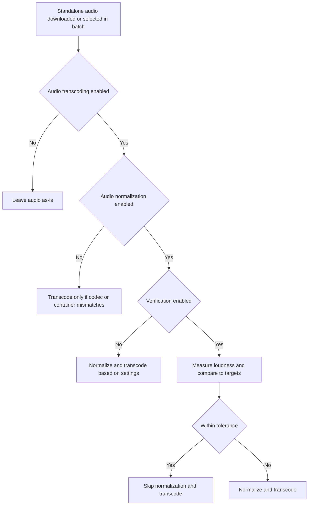

# Audio Transcoding — Guide

This guide describes how the Transcoder addon processes **standalone audio files** referenced by USDB Syncer SyncMeta (the audio resource for a song).

If you are looking for the full configuration reference (including defaults), see [`docs/CONFIGURATION.md`](CONFIGURATION.md).

## What “audio transcoding” means in this addon

The addon can:

- detect the current audio codec/container via `ffprobe`
- transcode audio to a configured target codec/container
- optionally apply audio normalization
- update SyncMeta and song headers (`#AUDIO:` and `#MP3:`) to prevent re-download loops

Important scope note

- This guide is about **standalone audio files** (SyncMeta audio).
- It does not “replace the audio track inside video files.” Video transcoding may copy or re-encode the video’s embedded audio stream as part of the video output.

## Supported audio output codecs

The addon supports these target codecs (configured via `audio.audio_codec`):

| Setting | Codec | Typical file extension | Notes |
|---|---|---|---|
| `aac` | AAC (FFmpeg `aac`) | `.m4a` | Good default for broad compatibility |
| `mp3` | MP3 (FFmpeg `libmp3lame`) | `.mp3` | Widest compatibility; can be larger at equal quality |
| `vorbis` | Ogg Vorbis (FFmpeg `libvorbis`) | `.ogg` | Open format; player support varies |
| `opus` | Opus (FFmpeg `libopus`) | `.opus` | Very efficient; requires newer decoders in some environments |

Encoder availability

- These outputs depend on your FFmpeg build.
- If you get errors like “Unknown encoder 'libmp3lame'”, see [`docs/TROUBLESHOOTING.md`](TROUBLESHOOTING.md).

## Codec selection recommendations

Use these practical defaults:

- **Choose `aac`** if you want a simple default with good compatibility.
- **Choose `mp3`** if you prioritize maximum playback compatibility.
- **Choose `opus`** if you want great quality at smaller sizes and your playback environment is modern.
- **Choose `vorbis`** if you want an open codec and your player supports it.

Lossy-to-lossy warning

If your inputs are already lossy (AAC/MP3/Vorbis/Opus), transcoding them again can reduce quality. The addon tries to stream-copy when possible, but normalization or force flags will re-encode.

## Quality settings (by codec)

Only the setting for your selected codec is used.

### MP3 (`mp3_quality`)

- Range: `0` to `9` (lower is better quality)
- Uses LAME VBR quality (`-q:a`)

Recommended

- `0–2`: transparent/very high quality
- `3–5`: smaller files

### Vorbis (`vorbis_quality`)

- Range: `-1.0` to `10.0` (higher is better quality)

Recommended

- `8.0–10.0`: very high quality
- `5.0–7.0`: smaller files

### AAC (`aac_vbr_mode`)

- Range: `1` to `5` (higher is better quality)

Recommended

- `5`: highest quality
- `3`: balanced

### Opus (`opus_bitrate_kbps`)

- Range: `6` to `510`
- Target bitrate in kbps

Recommended

- `96–128`: good quality for most music
- `160`: very high quality for music

## Normalization guide

Normalization aims to make tracks play at a consistent perceived loudness.

## Audio Normalization Verification

Normalization verification checks whether a track is already normalized *well enough* to match your configured loudness targets, before spending time re-encoding it.

Why this is useful

- **Saves time**: already-normalized files can be skipped.
- **Preserves quality**: skipping avoids lossy-to-lossy re-encoding when it is not needed.

### How verification works

When verification is enabled, the addon:

1. Runs an FFmpeg loudness measurement pass using the `loudnorm` filter in analysis mode.
2. Compares the measured loudness values against your configured targets using a tolerance preset.
3. Classifies the file as:
   - **Within tolerance**: close enough to the targets → the addon can skip normalization/transcoding.
   - **Out of tolerance**: not close enough → the addon proceeds with normalization (and any required transcoding).

Tolerance presets are designed to match perceptual thresholds (based on EBU R128 / common loudness guidance), so small differences that are rarely audible do not force unnecessary work.

For details, including preset meanings and advanced custom tolerances, see [`docs/CONFIGURATION.md`](CONFIGURATION.md).

### When verification runs

Verification can happen in two places:

1. **Automatic processing after download** (opt-in)
   - If `verification.enabled` is enabled, newly downloaded standalone audio can be verified before normalization/transcoding.

2. **Batch wizard verification** (opt-in per run)
   - In the **batch wizard**, verification happens during the optional **Verification** step (labeled Analysis in the UI).
   - This step can take a long time for large libraries, but it lets you avoid re-encoding audio that is already within tolerance.
   - See [`docs/BATCH_TRANSCODING.md`](BATCH_TRANSCODING.md).

### Performance trade-offs

Verification is not free:

- Loudness measurement requires decoding the entire file and typically runs at **about realtime**.
- As a rough guide, expect **2–5 minutes per song** depending on track duration and your machine.

The trade-off is that verification can save *much more* time than it costs if your library contains many files that already match the targets.

### Caching (to avoid repeated verification)

Verification results are cached automatically in a local **SQLite database**. This means:

- The **first** time a file is verified, it is slow (full decode).
- Later runs can reuse cached measurements if the file has not changed, making verification effectively instant.

The cache is invalidated automatically when the file changes (for example, different size/modified time) or when you change targets/tolerances.

### Key terms (user-friendly)

- **Loudness (LUFS)**: "how loud it sounds" (more negative means quieter)
- **EBU R128**: a standard way to measure/normalize loudness
- **True Peak (dBTP)**: helps avoid clipping after normalization

### Smart skipping behavior

The addon intelligently skips transcoding when normalization is already applied.

- **R128 (loudnorm)**: Files that match the target codec/container are assumed to be already normalized and transcoding is skipped.
- **ReplayGain**: Files that match the target codec/container are checked for existing ReplayGain tags. If tags are present, transcoding is skipped.

If you enable normalization verification (`verification.enabled`), the addon can make a more accurate decision for loudnorm by measuring loudness and checking whether the file is **within tolerance**.

To force re-normalization of files that would otherwise be skipped, enable `force_transcode_audio` in settings.

### Decision flow (simplified)



### Methods

Configure these in `audio.audio_normalization_*`.

#### 1) EBU R128 loudnorm (`audio_normalization_method: "loudnorm"`)

How it works

- Pass 1 measures loudness for the file.
- Pass 2 applies normalization using those measurements.
- When format matches target: assumes file is already normalized, skips transcoding.

Why you'd use it

- You want consistent loudness across different players (it rewrites the audio).

Recommended starting point

- `audio_normalization_target`: `-18.0` LUFS
- `audio_normalization_true_peak`: `-2.0` dBTP
- `audio_normalization_lra`: `11.0` LU

#### 2) ReplayGain tagging (`audio_normalization_method: "replaygain"`)

How it works

- Writes ReplayGain tags into the output when the container/player supports it.
- When format matches target: checks for existing ReplayGain tags, skips transcoding if present.

Why you'd use it

- You prefer tag-based adjustment (player-controlled) rather than rewriting samples.

Important limitation

- Support depends on your player and output format.
- Tag detection checks standard ReplayGain fields (REPLAYGAIN_TRACK_GAIN, etc.) in format metadata or stream tags (for Ogg containers).

## Example configurations

### Example: MP3 for maximum compatibility

```json
{
  "audio": {
    "audio_transcode_enabled": true,
    "audio_codec": "mp3",
    "mp3_quality": 2,
    "audio_normalization_enabled": false
  }
}
```

### Example: Opus + loudnorm normalization (consistent loudness)

```json
{
  "audio": {
    "audio_transcode_enabled": true,
    "audio_codec": "opus",
    "opus_bitrate_kbps": 160,
    "audio_normalization_enabled": true,
    "audio_normalization_method": "loudnorm",
    "audio_normalization_target": -18.0,
    "audio_normalization_true_peak": -2.0,
    "audio_normalization_lra": 11.0
  }
}
```

### Example: Force re-encode even if already correct

```json
{
  "audio": {
    "audio_transcode_enabled": true,
    "audio_codec": "aac",
    "force_transcode_audio": true
  }
}
```

## Troubleshooting quick links

- Encoder missing (`libmp3lame`, `libvorbis`, `libopus`): [`docs/TROUBLESHOOTING.md`](TROUBLESHOOTING.md)
- Verification or loudnorm failures / invalid measurements: [`docs/TROUBLESHOOTING.md`](TROUBLESHOOTING.md)
