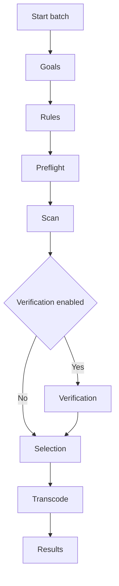

# Batch Transcoding — Comprehensive Guide

This guide explains the end-to-end workflow for batch transcoding synchronized media (video + standalone audio) with the Transcoder addon. It covers user experience, advanced options, troubleshooting, and technical details.

## 1) Overview

Batch transcoding converts an existing library of synchronized media files to your configured targets in one operation. Use it when:
- You changed codec or quality settings and want your library standardized
- You enabled strict matching and want non-conforming videos updated
- You migrated devices and need a uniform, compatible format

Supported media types

- **Video** referenced by SyncMeta video
- **Standalone audio** referenced by SyncMeta audio (when present)

Entry point: Tools → Batch Media Transcode.

This addon supports two batch workflows:

- **Batch wizard** (recommended for verification and fine control)
- **Legacy batch** (traditional scan → preview → transcode flow)

Both workflows ultimately run the same underlying transcode pipeline and use the same progress and results dialogs.

Entry points

- Batch wizard: launched via [batch.run_batch_with_wizard()](../batch.py:86)
- Legacy batch: launched via [batch.run_batch_transcode_legacy()](../batch.py:25) (internally uses [BatchTranscodeOrchestrator.start_batch_workflow()](../batch_orchestrator.py:235))

If you primarily want to verify audio normalization and skip already-correct files, use the batch wizard.

## 2) Prerequisites

- FFMPEG/FFPROBE available and working. Verification steps are in [TROUBLESHOOTING.md](TROUBLESHOOTING.md)
- Sufficient free disk space for outputs, temporary files, and optional backups. The preview dialog estimates required disk space and disables the Start button if insufficient (estimation is heuristic and conservative)
- Optional hardware acceleration supported and enabled via [config.GeneralConfig](../config.py:106)

Warnings
- Ensure plenty of free space. The dialog will compute required space, but real outputs can vary
- Abort attempts graceful termination of the active FFmpeg process. Response time is usually quick but can be delayed if FFmpeg isn't producing output. The system will attempt SIGTERM then force-kill if needed. If rollback is enabled, you are prompted to restore processed videos

## 3) Step-by-Step Walkthrough

### Batch Wizard Workflow

The batch wizard is a guided, multi-step workflow designed for two common goals:

- **Fast standardization** (change codec/limits and re-encode what does not match)
- **Normalization verification** (measure loudness first, then transcode only what is out of tolerance)

Compared to legacy batch, the wizard can optionally spend time up-front to verify loudness. That extra time can prevent unnecessary lossy re-encoding and may save time overall.

Wizard steps (high level)

#### Step 1: Goals (what to process)

Choose what you want to batch process:

- Video, standalone audio, or both

This step is where you decide the overall scope.

#### Step 2: Rules (force options and verification options)

Configure how the wizard should make decisions:

- Force transcode options (video and/or audio)
- **Normalization verification** options (for standalone audio)
  - Enable verification
  - Choose a tolerance preset (Strict / Balanced / Relaxed)

Verification terminology

- **Within tolerance**: loudness is close enough to your targets to skip normalization.
- **Out of tolerance**: loudness differs enough that normalization/transcoding is recommended.

For preset details and advanced custom tolerances, see [`docs/CONFIGURATION.md`](CONFIGURATION.md).

#### Step 3: Preflight (estimates and confirmation)

Preflight summarizes:

- What will be scanned
- Whether verification is enabled
- Estimated work (where available)

This is your last chance to back out before the wizard starts scanning.

#### Step 4: Scan (fast metadata scan)

The scan step is intentionally fast:

- It uses ffprobe-level metadata to find items that do not match your targets (codec/container/limits)
- It does **not** measure loudness

This design keeps the initial scan responsive even on large libraries.

#### Step 5 (optional): Verification (loudness measurement with progress)

If verification is enabled, the wizard runs a loudness measurement pass for standalone audio.

What to expect

- Measurement uses FFmpeg `loudnorm` in analysis mode.
- It typically runs at **about realtime**, so large libraries can take hours.
- Results are cached so re-running the wizard is faster when files have not changed.

See also: [`docs/AUDIO_TRANSCODING.md`](AUDIO_TRANSCODING.md) for how verification works and why it helps.

#### Step 6: Selection (tree view with verification results)

Selection groups items by song and shows each song’s media (video/audio) under it.

If verification ran, the selection UI surfaces verification results so you can make an informed choice:

- Audio that is **within tolerance** can be preselected to *skip* (depending on your chosen goal/rules)
- Audio that is **out of tolerance** is typically preselected for processing

The exact defaults may vary based on your chosen goals and force flags, but the intent is consistent: verified-within-tolerance audio should not be re-encoded unless you explicitly request it.

#### Step 7: Transcode (existing progress UI)

Once you confirm selection, the wizard uses the existing transcode worker and progress dialog.

- Worker: [BatchWorker](../batch_worker.py:26)
- Progress UI: [batch_progress_dialog.py](../batch_progress_dialog.py:1)

If the wizard already verified loudness, those cached results are reused during transcoding to avoid duplicate analysis.

#### Step 8: Results

Results are shown in the existing results dialog:

- [batch_results_dialog.py](../batch_results_dialog.py:1)

### When to use batch wizard vs legacy batch

Use the batch wizard when:

- You want **normalization verification** to avoid re-encoding already-correct audio
- You want a guided, step-by-step workflow with Back/Next navigation
- You are making a careful, high-impact change and want a clear selection stage

Use legacy batch when:

- You want the simplest, fastest batch experience
- You do not need normalization verification
- You already know you want to transcode all discovered candidates

### Back navigation and cached results

The wizard is designed to let you go Back without losing expensive work:

- Scan results are kept in memory for the current wizard run.
- Verification results are cached on disk, so repeating a verification run is much faster as long as files and settings have not changed.

### Legacy Batch Walkthrough (traditional flow)

The legacy batch flow is the original scan → preview → transcode workflow.

1. Launching the batch transcode
- Open Tools → Batch Media Transcode
- Orchestrator: [BatchTranscodeOrchestrator.start_batch_workflow()](../batch_orchestrator.py:235)

2. Understanding the preview dialog
- The orchestrator scans synchronized songs, identifies media files that need transcoding, analyzes them, and computes estimates
  - Preview generation: [BatchTranscodeOrchestrator._generate_preview()](../batch_orchestrator.py:180)
  - Analysis (video): [video_analyzer.analyze_video()](../video_analyzer.py:60)
  - Analysis (audio): [audio_analyzer.analyze_audio()](../audio_analyzer.py:41)
  - Decision logic (video): [video_analyzer.needs_transcoding()](../video_analyzer.py:198)
  - Decision logic (audio): handled in the scan worker based on codec/container/normalization settings (see [batch_orchestrator.ScanWorker.run()](../batch_orchestrator.py:129))
  - Size/time estimation: [BatchEstimator.estimate_output_size()](../batch_estimator.py:19), [BatchEstimator.estimate_transcode_time()](../batch_estimator.py:89)

3. Filtering and selecting videos
- Use the filter box to search by title, artist, codec, etc.
- Select All / Deselect All apply to currently visible rows
- Live statistics update as you select or filter
- Dialog: [batch_preview_dialog.py](../batch_preview_dialog.py)
- Stats and validation: [BatchPreviewDialog._update_statistics()](../batch_preview_dialog.py:170) using [BatchEstimator.calculate_disk_space_required()](../batch_estimator.py:200) and [BatchEstimator.get_free_disk_space()](../batch_estimator.py:181)

⚠️ **Important:** Filtering automatically deselects hidden items. If you filter the view, items that don't match the filter will be unselected and won't be transcoded. See [BatchPreviewDialog._on_filter_changed()](../batch_preview_dialog.py:258).

4. Understanding statistics
- Selected count and total videos
- Estimated total time for the selected set
- Required disk space vs current free space, with red/green indicator; Start is disabled when space is insufficient

5. Rollback protection option
- Enable rollback to allow restoration of processed videos if the batch is aborted
- Rollback copies are temporary backups created only for the current batch operation (see Advanced Features)
- Rollback manager: [RollbackManager](../rollback.py) invoked from [BatchTranscodeOrchestrator._execute_batch()](../batch_orchestrator.py:301) and finalized in [BatchTranscodeOrchestrator._handle_abort()](../batch_orchestrator.py:363)

6. Starting the transcode
- Click Start Transcoding; the orchestrator launches the background worker
- Worker thread: [BatchWorker](../batch_worker.py) processes videos and emits per-video signals

7. Monitoring progress
- A modal progress dialog displays the current video along with percent, fps, speed, elapsed, and ETA per video, plus overall progress
- Progress UI: [batch_progress_dialog.py](../batch_progress_dialog.py)
- Signals: [BatchWorker.video_progress](../batch_worker.py:29), [BatchProgressDialog.abort_requested](../batch_progress_dialog.py:27)

8. Handling abort
- Click the Abort button at any time
- Abort attempts graceful termination of the active FFmpeg process. Response time is usually quick but can be delayed if FFmpeg isn't producing output. The system will attempt SIGTERM then force-kill if needed. If rollback is enabled, you are prompted to restore processed videos
- Temporary .transcoding* files are cleaned automatically; only completed outputs remain
- Orchestrator: [BatchTranscodeOrchestrator.abort_batch()](../batch_orchestrator.py:393) and [BatchTranscodeOrchestrator._handle_abort()](../batch_orchestrator.py:363)

9. Understanding results
- Summary shows counts of succeeded/failed/aborted among selected items. When rollback is used, rollback status may also appear in the report
- Detailed table lists each media item’s status, change summary, and any error
  - Results dialog: [batch_results_dialog.py](../batch_results_dialog.py)

10. Exporting reports
- Export the detailed results to CSV or copy a text summary to the clipboard
- CSV: [BatchResultsDialog._export_to_csv()](../batch_results_dialog.py:180)

## 4) Advanced Features

Rollback system details
- When enabled, the orchestrator activates rollback tracking and records each successful transcode
- Manager: [RollbackManager](../rollback.py), enabling via [RollbackManager.enable_rollback()](../rollback.py:66), restoration via [RollbackManager.rollback_all()](../rollback.py:90)

Interaction with backup settings
- If [config.GeneralConfig.backup_original](../config.py:106) is true, originals are preserved automatically using the configured suffix
- Rollback data is cleaned after a fully successful batch by [RollbackManager.cleanup_rollback_data()](../rollback.py:173)
- If you abort a batch and then decline rollback when prompted, rollback temp directories may persist (for safety) and require manual cleanup

Backup types (important distinction)
- **Rollback copies**: Temporary backups in a system temp folder, used only for the current batch operation (to support rollback after abort)
- **Persistent backups**: Controlled by the `backup_original` setting, stored next to your media files, retained after the batch completes

## Mixed batches (video + audio)

It’s normal for a single batch run to include both:

- video candidates that exceed video limits or don’t match your target video codec/container
- audio candidates that don’t match your target audio codec/container, or have normalization enabled, or have `force_transcode_audio` enabled

Practical notes

- Audio transcodes are usually much faster than video transcodes.
- Hardware acceleration (QuickSync) applies to video encodes; audio encodes are typically CPU-only.
- Rollback and backup handling are still per-file: each processed media file is replaced atomically and can be restored if rollback is enabled.

USDB integration for resolution/FPS
- The preview shows whether resolution/FPS limits are sourced from USDB Syncer settings or exact values
- Display formatting: [BatchTranscodeOrchestrator._format_resolution_display()](../batch_orchestrator.py:399), [BatchTranscodeOrchestrator._format_fps_display()](../batch_orchestrator.py:409)
  - Candidate discovery note: batch scanning uses the configured general.max_resolution/general.max_fps values directly (not computed USDB limits). If those config values are null, videos that only exceed USDB limits will not appear as batch candidates

## 5) Troubleshooting

Common issues and solutions
- Preview generation is slow
  - Large libraries or network/NAS storage increase scan time; allow the first pass to complete and consider filtering
- Disk space estimate seems off
  - Estimates are heuristic; leave headroom. Estimation logic: [BatchEstimator.estimate_output_size()](../batch_estimator.py:19)
- Abort did not stop immediately
  - Abort response is usually quick, but can be delayed if FFmpeg isn't producing output. If it takes longer, check the log for Transcode aborted by user and any FFmpeg shutdown messages. The general timeout still applies per [transcoder._execute_ffmpeg()](../transcoder.py:396)
- CSV export failed
  - Pick a writable directory and ensure the file is not open elsewhere. Export path: [BatchResultsDialog._export_to_csv()](../batch_results_dialog.py:180)

Understanding error messages
- Per-video errors are shown in the results dialog and recorded in the log
- Failures typically originate from the single-file pipeline [transcoder.process_video()](../transcoder.py:41)

## 6) Technical Details

How estimation works
- Size: codec efficiency, CRF, resolution scaling, and optional bitrate caps → [BatchEstimator.estimate_output_size()](../batch_estimator.py:19)
- Time: codec complexity, hardware acceleration, preset, and resolution → [BatchEstimator.estimate_transcode_time()](../batch_estimator.py:89)
- Disk: outputs + temp files + backups/rollback → [BatchEstimator.calculate_disk_space_required()](../batch_estimator.py:200)

Resolution/FPS handling
- When USDB integration is enabled, limits are treated as maxima; otherwise exact values are targeted
- Displayed via [BatchTranscodeOrchestrator._format_resolution_display()](../batch_orchestrator.py:399) and [BatchTranscodeOrchestrator._format_fps_display()](../batch_orchestrator.py:409)

Thread safety and background processing
- The batch runs in a dedicated worker thread [BatchWorker](../batch_worker.py:26) to keep the UI responsive
- Progress updates are emitted via Qt signals [BatchWorker.video_progress](../batch_worker.py:31) and consumed by [BatchProgressDialog](../batch_progress_dialog.py)
- Each single-file transcode uses the same verified pipeline [transcoder.process_video()](../transcoder.py:41), including cleanup of partial files on failure [transcoder.process_video()](../transcoder.py:189)
