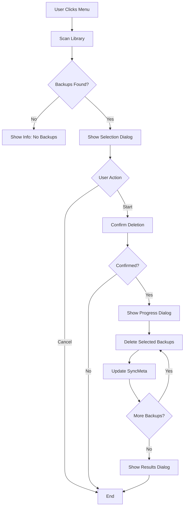
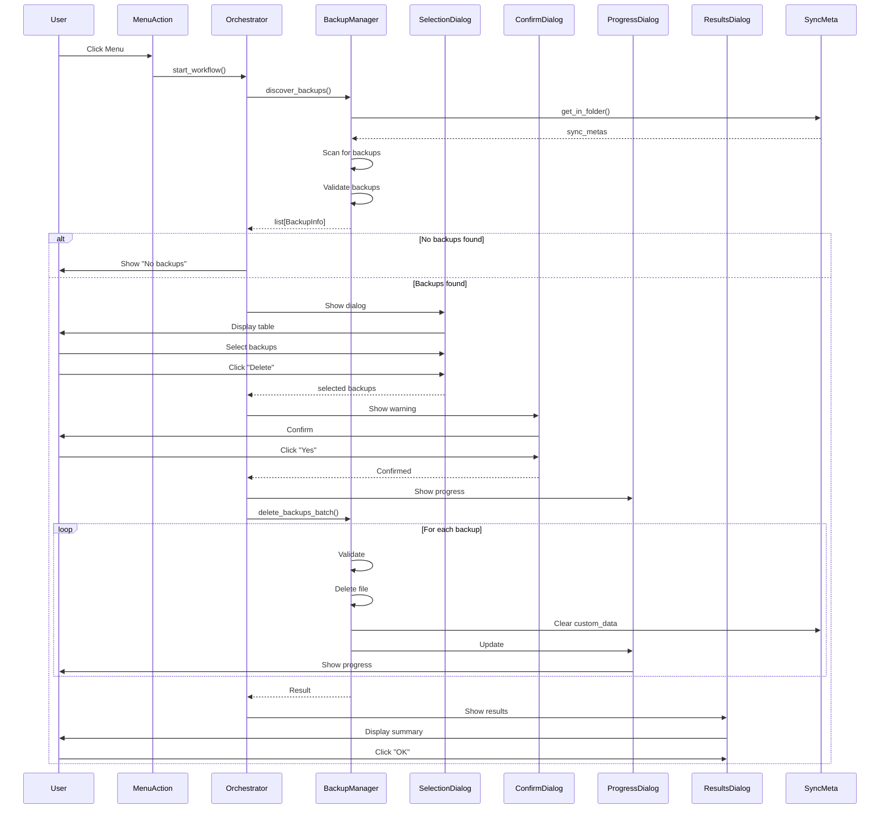

# Video Backup Deletion Feature Architecture

**Version:** 1.0  
**Date:** 2026-01-08  
**Status:** Proposed Design

## Table of Contents

1. [Executive Summary](#1-executive-summary)
2. [Context and Requirements](#2-context-and-requirements)
3. [Architecture Overview](#3-architecture-overview)
4. [Detailed Component Design](#4-detailed-component-design)
5. [GUI Design](#5-gui-design)
6. [Integration Points](#6-integration-points)
7. [Safety Mechanisms](#7-safety-mechanisms)
8. [Data Flow](#8-data-flow)
9. [Error Handling](#9-error-handling)
10. [Batch Transcode Interaction](#10-batch-transcode-interaction)
11. [Implementation Recommendations](#11-implementation-recommendations)

---

## 1. Executive Summary

This document defines the architecture for a **backup deletion feature** for the video transcoder addon. The feature provides a user-friendly GUI to identify and remove persistent video backups created during automatic downloads.

### Key Design Decisions

- **Persistent backups only**: This feature ONLY manages user backups from automatic downloads (files with [`config.GeneralConfig.backup_suffix`](addons/video_transcoder/config.py:72), default `-source`). Temporary rollback backups from batch transcoding are NOT touched.
- **Safety-first approach**: Multi-level confirmation, validation, and graceful error handling prevent accidental data loss.
- **Selective deletion**: Users can choose specific songs or delete all backups at once.
- **SyncMeta integration**: Properly cleans up [`custom_data.transcoder_source_fname`](addons/video_transcoder/sync_meta_updater.py:54) after deletion.
- **Batch transcode awareness**: Warns users about the "backup preservation rule" ([`BatchTranscodeOrchestrator._apply_backup_preservation_rule()`](addons/video_transcoder/batch_orchestrator.py:394)) that may recreate backups.

---

## 2. Context and Requirements

### 2.1 Background

The video transcoder addon creates persistent backup files when [`config.GeneralConfig.backup_original`](addons/video_transcoder/config.py:71) is enabled. These backups:

- Are named using [`config.GeneralConfig.backup_suffix`](addons/video_transcoder/config.py:72) (default `-source`)
  - Example: `video.mp4` → `video-source.mp4` (backup)
- Are stored alongside the transcoded video in the song folder
- Are tracked in SyncMeta via [`custom_data.transcoder_source_fname`](addons/video_transcoder/sync_meta_updater.py:54)
- **Currently have NO deletion or retention mechanism**

### 2.2 User Requirements

1. User-friendly GUI to remove persistent video backups
2. Must be reliable and safe
3. Cannot execute without explicit user confirmation
4. Must support removing ALL backups in the song library (minimum requirement)
5. Should ideally allow picking and choosing which specific songs to remove backups from

### 2.3 Technical Requirements

- Discover backups across the entire song library based on configured suffix
- Validate files are actually backups (not current active videos)
- Safely delete selected backups with proper error handling
- Update SyncMeta metadata after deletion (clear [`custom_data.transcoder_source_fname`](addons/video_transcoder/sync_meta_updater.py:54))
- Provide progress feedback and cancellation support
- Display results summary with any errors

---

## 3. Architecture Overview

### 3.1 System Flow



### 3.2 Component Architecture

```
┌─────────────────────────────────────────────┐
│     Main Window (USDB Syncer)               │
│  Menu: "Manage Video Backups..."            │
└─────────────────────────────────────────────┘
                   │
                   ▼
┌─────────────────────────────────────────────┐
│  BackupManager (Core Logic)                 │
│  - Discover persistent backups              │
│  - Validate backup files                    │
│  - Execute deletion with safety checks      │
│  - Update SyncMeta custom_data              │
└─────────────────────────────────────────────┘
         │               │               │
         ▼               ▼               ▼
 ┌──────────────┐ ┌──────────────┐ ┌──────────────┐
 │ Selection    │ │ Progress     │ │ Results      │
 │ Dialog       │ │ Dialog       │ │ Dialog       │
 └──────────────┘ └──────────────┘ └──────────────┘
```

---

## 4. Detailed Component Design

### 4.1 BackupManager Module (`backup_manager.py`)

**Purpose:** Core logic for discovering, validating, and deleting persistent video backups.

**File:** `addons/video_transcoder/backup_manager.py`

#### 4.1.1 Data Models

```python
from __future__ import annotations

import logging
from dataclasses import dataclass
from pathlib import Path
from typing import Literal, Optional

from usdb_syncer import SongId

_logger = logging.getLogger(__name__)


@dataclass
class BackupInfo:
    """Information about a discovered backup file."""
    song_id: SongId
    song_title: str
    artist: str
    backup_path: Path
    active_video_path: Path  # The current transcoded video
    size_mb: float
    backup_date: Optional[float]  # mtime timestamp
    
    # Runtime state
    selected: bool = True
    deletion_status: Literal["pending", "deleting", "deleted", "failed", "skipped"] = "pending"
    error_message: Optional[str] = None


@dataclass
class BackupDeletionResult:
    """Result of a backup deletion operation."""
    success: bool
    backups_deleted: int
    backups_failed: int
    total_space_freed_mb: float
    errors: list[tuple[SongId, str]]  # (song_id, error_message)
```

#### 4.1.2 Core Functions

```python
def discover_backups(cfg: TranscoderConfig) -> list[BackupInfo]:
    """Discover all persistent backup files in the song library.
    
    Methodology:
    1. Iterate through all SyncMetas in song library
    2. Check if a backup file exists using configured backup_suffix
    3. First check custom_data for recorded source filename
    4. Fallback to glob pattern matching: <video_stem><suffix>.*
    5. Validate each discovered backup file
    
    Returns:
        List of BackupInfo objects for discovered backups
    """
    from usdb_syncer import settings
    from usdb_syncer.sync_meta import SyncMeta
    from usdb_syncer.usdb_song import UsdbSong
    
    backups: list[BackupInfo] = []
    song_dir = settings.get_song_dir()
    suffix = cfg.general.backup_suffix
    
    for sync_meta in SyncMeta.get_in_folder(song_dir):
        video_path = sync_meta.video_path()
        if not video_path or not video_path.exists():
            continue
        
        # Check custom_data first (most reliable)
        source_fname = sync_meta.custom_data.get("transcoder_source_fname")
        if source_fname:
            backup_path = sync_meta.path.parent / source_fname
            if backup_path.exists() and validate_backup(backup_path, video_path):
                backups.append(_create_backup_info(sync_meta, backup_path, video_path))
                continue
        
        # Fallback: glob pattern search
        video_stem = video_path.stem
        pattern = f"{video_stem}{suffix}*"
        for candidate in sync_meta.path.parent.glob(pattern):
            if candidate != video_path and validate_backup(candidate, video_path):
                backups.append(_create_backup_info(sync_meta, candidate, video_path))
    
    return backups


def validate_backup(backup_path: Path, active_video_path: Path) -> bool:
    """Validate that a file is actually a backup (not the active video).
    
    Safety checks:
    1. Paths must be different
    2. Backup file must exist
    3. Backup must be a regular file (not directory)
    4. Active video must exist
    5. Backup must not be the current video
    
    Returns:
        True if file is a valid backup that can be safely deleted
    """
    if backup_path == active_video_path:
        return False
    if not backup_path.exists() or not backup_path.is_file():
        return False
    if not active_video_path.exists():
        _logger.warning(f"Active video missing for backup: {backup_path}")
        return False
    return True


def delete_backup(
    backup_info: BackupInfo,
    cfg: TranscoderConfig,
    update_sync_meta: bool = True
) -> bool:
    """Delete a backup file and optionally update SyncMeta.
    
    Process:
    1. Re-validate backup before deletion
    2. Check write permissions
    3. Delete the file
    4. Update SyncMeta custom_data (clear transcoder_source_fname)
    5. Persist SyncMeta changes
    
    Returns:
        True if deletion succeeded
    """
    from usdb_syncer.sync_meta import SyncMeta
    from usdb_syncer.logger import song_logger
    
    slog = song_logger(backup_info.song_id)
    
    try:
        # Double-check validation
        if not validate_backup(backup_info.backup_path, backup_info.active_video_path):
            slog.error(f"Backup validation failed: {backup_info.backup_path}")
            return False
        
        # Check write permission
        if not os.access(backup_info.backup_path, os.W_OK):
            slog.error(f"No write permission for: {backup_info.backup_path}")
            return False
        
        # Delete the file
        backup_info.backup_path.unlink()
        slog.info(f"Deleted backup: {backup_info.backup_path.name}")
        
        # Update SyncMeta if requested
        if update_sync_meta:
            sync_meta = _get_sync_meta(backup_info.song_id)
            if sync_meta:
                source_fname = sync_meta.custom_data.get("transcoder_source_fname")
                if source_fname == backup_info.backup_path.name:
                    sync_meta.custom_data.set("transcoder_source_fname", None)
                    sync_meta.synchronize_to_file()
                    sync_meta.upsert()
                    slog.debug("Cleared transcoder_source_fname from sync_meta")
        
        return True
        
    except (PermissionError, OSError) as e:
        slog.error(f"Error deleting backup: {e}")
        return False
    except Exception as e:
        slog.error(f"Unexpected error: {e}")
        _logger.debug(None, exc_info=True)
        return False


def delete_backups_batch(
    backups: list[BackupInfo],
    cfg: TranscoderConfig,
    progress_callback: Optional[Callable[[int, int, BackupInfo], None]] = None,
    cancel_check: Optional[Callable[[], bool]] = None
) -> BackupDeletionResult:
    """Delete multiple backups with progress tracking.
    
    Args:
        backups: List of BackupInfo objects to delete
        cfg: Transcoder configuration
        progress_callback: Called after each deletion (current, total, backup_info)
        cancel_check: Called before each deletion, return True to cancel
        
    Returns:
        BackupDeletionResult with statistics
    """
    deleted = 0
    failed = 0
    total_freed_mb = 0.0
    errors: list[tuple[SongId, str]] = []
    
    for i, backup in enumerate(backups):
        # Check for cancellation
        if cancel_check and cancel_check():
            _logger.info("Backup deletion cancelled by user")
            break
        
        # Update progress
        if progress_callback:
            progress_callback(i, len(backups), backup)
        
        # Delete the backup
        backup.deletion_status = "deleting"
        if delete_backup(backup, cfg):
            backup.deletion_status = "deleted"
            deleted += 1
            total_freed_mb += backup.size_mb
        else:
            backup.deletion_status = "failed"
            failed += 1
            error_msg = backup.error_message or "Unknown error"
            errors.append((backup.song_id, error_msg))
    
    return BackupDeletionResult(
        success=(failed == 0),
        backups_deleted=deleted,
        backups_failed=failed,
        total_space_freed_mb=total_freed_mb,
        errors=errors
    )
```

---

### 4.2 GUI Dialog: BackupSelectionDialog

**Purpose:** Display discovered backups in a table with selection and statistics.

**File:** `addons/video_transcoder/backup_selection_dialog.py`

**UI Layout:**

```
┌──────────────────────────────────────────────────────────────┐
│  Manage Video Backups                                        │
├──────────────────────────────────────────────────────────────┤
│  ┌────────────────────────────────────────────────────────┐  │
│  │ [Filter: _____________]  [Select All] [Deselect All]  │  │
│  ├────────────────────────────────────────────────────────┤  │
│  │ ☑│ Title    │ Artist  │ Backup File    │ Size  │ Date │  │
│  │ ☑│ Song 1   │ Artist1 │video-source.mp4│125 MB │12/25│  │
│  │ ☑│ Song 2   │ Artist2 │video-source.webm│98 MB │12/26│  │
│  └────────────────────────────────────────────────────────┘  │
├──────────────────────────────────────────────────────────────┤
│  ╔═══════════════════ Statistics ════════════════════════╗   │
│  ║ Selected: 25 of 30 backups                          ║   │
│  ║ Total Space to Reclaim: 2,345 MB (2.29 GB)          ║   │
│  ╚═════════════════════════════════════════════════════════╝   │
├──────────────────────────────────────────────────────────────┤
│  ⚠ Warning: This action is irreversible!                    │
│  Deleted backups cannot be recovered.                        │
├──────────────────────────────────────────────────────────────┤
│                             [Delete Selected]  [Cancel]      │
└──────────────────────────────────────────────────────────────┘
```

**Implementation follows pattern from:** [`BatchPreviewDialog`](addons/video_transcoder/batch_preview_dialog.py)

**Key Features:**
- Filtering on all columns
- Select All / Deselect All buttons
- Dynamic statistics that update on selection change
- Warning message about irreversibility
- Table with checkboxes for selection

---

### 4.3 Confirmation Dialog

Before executing deletion, show a separate confirmation dialog:

```python
def _confirm_deletion(self, selected_count: int, total_size_mb: float) -> bool:
    """Show confirmation dialog with clear warning."""
    message = (
        f"You are about to PERMANENTLY DELETE {selected_count} backup files.\n\n"
        f"This will free {self._format_size(total_size_mb)} of disk space.\n\n"
        "⚠ THIS ACTION CANNOT BE UNDONE! ⚠\n\n"
        "Deleted backups cannot be recovered. Your transcoded videos will remain intact, "
        "but you will lose the ability to restore from these backups.\n\n"
        "Are you absolutely sure you want to continue?"
    )
    
    reply = QtWidgets.QMessageBox.warning(
        self,
        "Confirm Backup Deletion",
        message,
        QtWidgets.QMessageBox.StandardButton.Yes | QtWidgets.QMessageBox.StandardButton.No,
        QtWidgets.QMessageBox.StandardButton.No  # Default to No
    )
    
    return reply == QtWidgets.QMessageBox.StandardButton.Yes
```

---

### 4.4 Progress Dialog

**Purpose:** Show progress during deletion with cancellation support.

**File:** `addons/video_transcoder/backup_deletion_progress_dialog.py`

**UI Layout:**

```
┌────────────────────────────────────────────────────┐
│  Deleting Video Backups                            │
├────────────────────────────────────────────────────┤
│  Deleting backup 12 of 25...                       │
│  [████████████████░░░░░░░░░] 48%                   │
│                                                     │
│  Currently deleting:                               │
│  Artist - Song Title                               │
│  video-source.mp4 (125 MB)                         │
│                                                     │
│  Deleted: 11 | Failed: 0                           │
│  Space Freed: 1,234 MB                             │
│                                                     │
│              [Cancel]                               │
└────────────────────────────────────────────────────┘
```

**Implementation follows pattern from:** [`BatchProgressDialog`](addons/video_transcoder/batch_progress_dialog.py)

---

### 4.5 Results Dialog

**Purpose:** Display summary after deletion completes.

**File:** `addons/video_transcoder/backup_deletion_results_dialog.py`

**UI Layout (Success):**

```
┌────────────────────────────────────────────────────┐
│  Backup Deletion Complete                          │
├────────────────────────────────────────────────────┤
│  ╔═══════════════ Summary ════════════════╗        │
│  ║ ✓ Successfully deleted: 25 backups    ║        │
│  ║ ✗ Failed: 0                           ║        │
│  ║ Total Space Freed: 2,345 MB (2.29 GB) ║        │
│  ╚════════════════════════════════════════╝        │
│                     [OK]                            │
└────────────────────────────────────────────────────┘
```

**Implementation follows pattern from:** [`BatchResultsDialog`](addons/video_transcoder/batch_results_dialog.py)

---

## 5. GUI Design

### 5.1 Entry Point Integration

Add a menu item to the Tools menu in [`__init__.py`](addons/video_transcoder/__init__.py:73):

```python
def on_window_loaded(main_window) -> None:
    """Add menu items under Tools."""
    global _settings_action, _batch_action, _backup_mgmt_action
    
    # ... existing actions ...
    
    def manage_backups() -> None:
        from .backup_dialog_orchestrator import BackupDialogOrchestrator
        orchestrator = BackupDialogOrchestrator(main_window)
        orchestrator.start_workflow()
    
    _backup_mgmt_action = main_window.menu_tools.addAction(
        "Manage Video Backups...", 
        manage_backups
    )
    _backup_mgmt_action.setIcon(icons.Icon.BIN.icon())
```

### 5.2 Workflow Orchestrator

**File:** `addons/video_transcoder/backup_dialog_orchestrator.py`

```python
class BackupDialogOrchestrator:
    """Orchestrates the backup management workflow."""
    
    def __init__(self, parent: QMainWindow):
        self.parent = parent
        self.cfg = config.load_config()
        self.backups: list[BackupInfo] = []
        
    def start_workflow(self) -> None:
        """Entry point for backup management."""
        # Phase 1: Discover backups
        if not self._discover_backups():
            return
        
        # Phase 2: Show selection dialog
        if not self._show_selection_dialog():
            return
        
        # Phase 3: Confirm deletion
        selected = [b for b in self.backups if b.selected]
        if not self._confirm_deletion(selected):
            return
        
        # Phase 4: Execute deletion with progress
        self._execute_deletion(selected)
        
        # Phase 5: Show results
        self._show_results()
    
    def _discover_backups(self) -> bool:
        """Discover backups with progress dialog."""
        # Implementation similar to BatchTranscodeOrchestrator._generate_preview()
        
    def _show_selection_dialog(self) -> bool:
        """Show BackupSelectionDialog."""
        
    def _confirm_deletion(self, selected: list[BackupInfo]) -> bool:
        """Show confirmation dialog."""
        
    def _execute_deletion(self, selected: list[BackupInfo]) -> None:
        """Execute deletion with progress dialog."""
        
    def _show_results(self) -> None:
        """Show BackupDeletionResultsDialog."""
```

---

## 6. Integration Points

### 6.1 With Existing Code

**Import from existing modules:**

```python
from .config import TranscoderConfig, load_config
from usdb_syncer import SongId, settings
from usdb_syncer.sync_meta import SyncMeta
from usdb_syncer.usdb_song import UsdbSong
from usdb_syncer.logger import song_logger
from usdb_syncer.gui import icons
```

**Update existing files:**

1. **[`__init__.py`](addons/video_transcoder/__init__.py:73):** Add menu item after "Batch Video Transcode"
2. **No changes to:** [`config.py`](addons/video_transcoder/config.py), [`sync_meta_updater.py`](addons/video_transcoder/sync_meta_updater.py)

### 6.2 Thread Safety

- Scan operation: Run in worker thread (similar to [`ScanWorker`](addons/video_transcoder/batch_orchestrator.py:102))
- Deletion operation: Run in worker thread with progress signals
- SyncMeta updates: Thread-safe via per-thread database connection

---

## 7. Safety Mechanisms

### 7.1 Pre-Deletion Validation

**Check before ANY deletion:**

1. File exists: `backup_path.exists()`
2. Is a regular file: `backup_path.is_file()`
3. Not the active video: `backup_path != active_video_path`
4. Active video exists: Safety check to prevent orphaned state
5. Write permission: `os.access(backup_path, os.W_OK)`
6. Filename pattern matches: Ends with expected suffix

### 7.2 Multi-Level Confirmation

**Confirmation sequence:**

1. **Selection dialog:** User must explicitly check backups to delete
2. **Warning in dialog:** Large red warning text about irreversibility
3. **Confirmation dialog:** Separate warning dialog with count/size and default to "No"
4. **Progress dialog:** Shows file-by-file progress, can cancel mid-operation

### 7.3 Error Tolerance

**Graceful handling:**

- Per-file errors: Continue to next file, track errors separately
- Permission errors: Log and continue, report in results
- Files in use: Skip with error, report in results
- SyncMeta update fails: Log warning, continue (deletion still succeeded)

---

## 8. Data Flow

### 8.1 Complete Flow Diagram



---

## 9. Error Handling

### 9.1 Error Categories

| Error Type | Detection | Handling | User Impact |
|------------|-----------|----------|-------------|
| **No backups found** | Empty discover result | Info message, exit early | No action taken |
| **Permission denied** | `os.access()` check | Skip file, log error | Reported in results |
| **File in use** | `OSError` on unlink | Skip file, log error | Reported in results |
| **File not found** | Pre-deletion check | Skip file, log warning | Reported in results |
| **Disk full** | `OSError` on write | Stop operation, show error | Partial completion |
| **SyncMeta update fails** | Exception in upsert | Log warning, continue | Deletion succeeded |

### 9.2 Error Recovery Pattern

```python
def delete_backup_safe(backup_info: BackupInfo) -> tuple[bool, Optional[str]]:
    """Delete with comprehensive error handling."""
    try:
        # Pre-deletion validation
        if not validate_backup(backup_info.backup_path, backup_info.active_video_path):
            return False, "Validation failed"
        
        if not os.access(backup_info.backup_path, os.W_OK):
            return False, "Permission denied"
        
        # Attempt deletion
        backup_info.backup_path.unlink()
        
        # Update SyncMeta (non-critical)
        try:
            _update_sync_meta(backup_info)
        except Exception as e:
            _logger.warning(f"Failed to update SyncMeta: {e}")
            # Continue - deletion itself succeeded
        
        return True, None
        
    except PermissionError:
        return False, "Permission denied"
    except OSError as e:
        if e.errno == errno.EACCES:
            return False, "Access denied"
        elif e.errno == errno.EBUSY:
            return False, "File in use"
        elif e.errno == errno.ENOENT:
            return False, "File not found"
        else:
            return False, f"OS error: {e}"
    except Exception as e:
        _logger.error(f"Unexpected error: {e}", exc_info=True)
        return False, f"Unexpected error: {type(e).__name__}"
```

---

## 10. Batch Transcode Interaction

### 10.1 The Backup Preservation Rule

**Critical Understanding:**

The batch transcoder has a "backup preservation rule" in [`BatchTranscodeOrchestrator._apply_backup_preservation_rule()`](addons/video_transcoder/batch_orchestrator.py:394):

```python
def _apply_backup_preservation_rule(self) -> None:
    """For any video where a user backup exists, update it to contain
    the pre-transcode version. This keeps backups one revision behind."""
```

**What this means:**

If a user:
1. Deletes all backups using this feature
2. Later runs batch transcode
3. The batch transcode will **recreate** backups (one revision behind)

This is by design and is actually helpful, but users should be aware of it.

### 10.2 User Warnings

**In Selection Dialog:**

Add an info section:

```
ℹ Note About Batch Transcoding:
If you later batch transcode videos, new backups may be created as a safety
measure. This is normal behavior and helps protect your videos during batch
operations.
```

**Optional: Check for Rollback Temp Backups**

If rollback temporary backups exist, warn the user:

```python
def _check_for_active_rollback(self) -> bool:
    """Check if batch transcode rollback is active."""
    from usdb_syncer.utils import AppPaths
    rollback_dir = AppPaths.data / "transcoder_rollback"
    if rollback_dir.exists() and any(rollback_dir.iterdir()):
        # Warn user about active batch operation
        return show_warning_dialog()
    return True
```

### 10.3 Interaction Matrix

| Scenario | Backup Deletion Feature | Batch Transcode |
|----------|------------------------|-----------------|
| **User backups exist** | Can delete them | Will recreate on next batch (preservation rule) |
| **Rollback temp backups exist** | Does NOT touch them | Uses them normally |
| **Backup deletion during batch** | Blocked (should detect active batch) | May cause rollback issues |

---

## 11. Implementation Recommendations

### 11.1 Implementation Phases

**Phase 1: Core Functionality (Week 1)**
1. Implement [`backup_manager.py`](#41-backupmanager-module-backup_managerpy) with discovery and deletion
2. Add comprehensive logging
3. Write unit tests for validation logic

**Phase 2: GUI Dialogs (Week 1-2)**
1. Implement `BackupSelectionDialog`
2. Implement `BackupDeletionProgressDialog`
3. Implement `BackupDeletionResultsDialog`

**Phase 3: Integration (Week 2)**
1. Add menu item to [`__init__.py`](addons/video_transcoder/__init__.py:73)
2. Implement `BackupDialogOrchestrator`
3. Connect all dialogs

**Phase 4: Testing & Polish (Week 2-3)**
1. Test with various backup scenarios
2. Test error conditions
3. Verify SyncMeta updates
4. User testing

### 11.2 File Organization

```
addons/video_transcoder/
├── __init__.py                              # Updated: add menu item
├── backup_manager.py                        # NEW
├── backup_dialog_orchestrator.py            # NEW
├── backup_selection_dialog.py               # NEW
├── backup_deletion_progress_dialog.py       # NEW
├── backup_deletion_results_dialog.py        # NEW
└── ... (existing files)
```

**Estimated LOC:**

| File | Estimated LOC |
|------|---------------|
| `backup_manager.py` | ~400 |
| `backup_dialog_orchestrator.py` | ~200 |
| `backup_selection_dialog.py` | ~350 |
| `backup_deletion_progress_dialog.py` | ~200 |
| `backup_deletion_results_dialog.py` | ~250 |
| `__init__.py` changes | ~20 |
| **Total** | **~1,420** |

### 11.3 Testing Strategy

**Unit Tests:**
- `discover_backups()` with various suffix patterns
- `validate_backup()` with edge cases
- `delete_backup()` with mocked file operations
- Error handling paths

**Integration Tests:**
- Full workflow from menu to results
- Multi-file deletion
- Cancellation during deletion
- SyncMeta update verification

**Manual Tests:**
- Permission errors
- Files in use
- Large batch (100+ files)
- Empty library

---

## 12. Conclusion

This architecture provides a **safe, user-friendly backup deletion feature** that:

✅ **Addresses all requirements** from the specification  
✅ **Integrates seamlessly** with existing video transcoder infrastructure  
✅ **Follows USDB Syncer patterns** (PySide6 dialogs, progress tracking, threading)  
✅ **Provides robust safety mechanisms** (multi-level confirmation, validation)  
✅ **Handles errors gracefully** with clear user feedback  
✅ **Maintains SyncMeta integrity** with proper custom_data cleanup  
✅ **Documents batch transcode interactions** to avoid confusion  

The modular design allows for incremental implementation while maintaining a clear separation of concerns between discovery, deletion, and UI presentation.

---

*Document Version: 1.0*  
*Last Updated: 2026-01-08*
