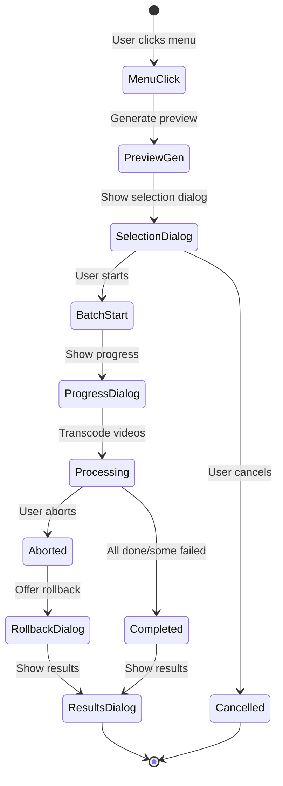
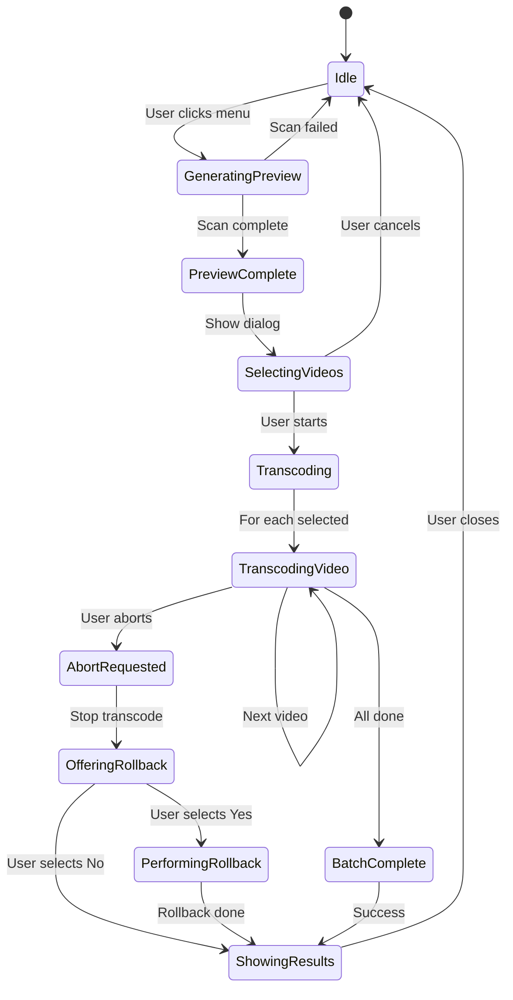
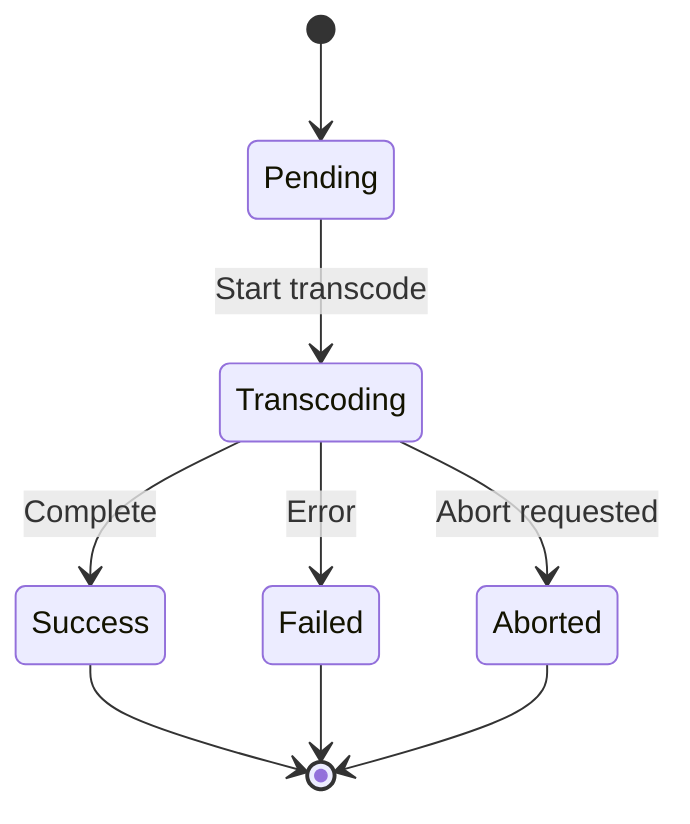
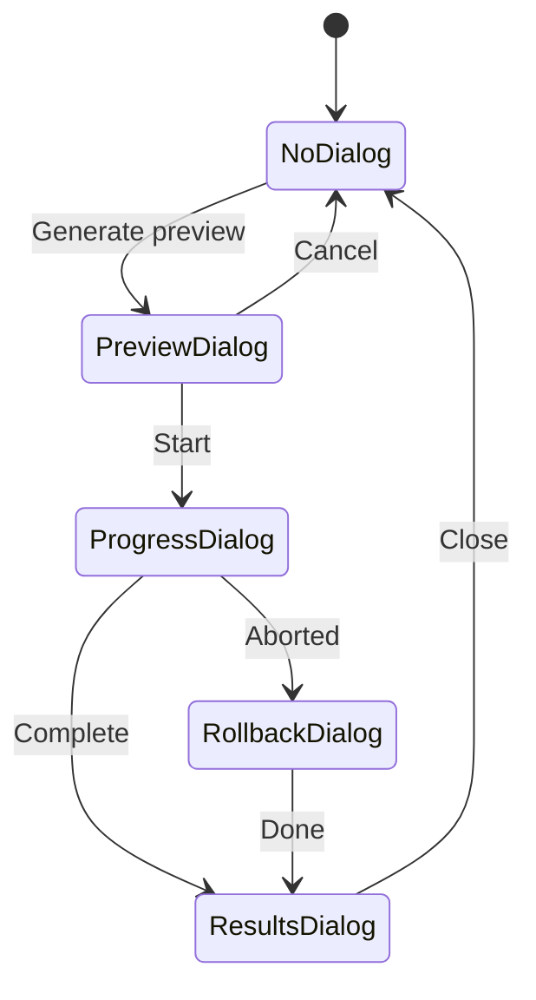
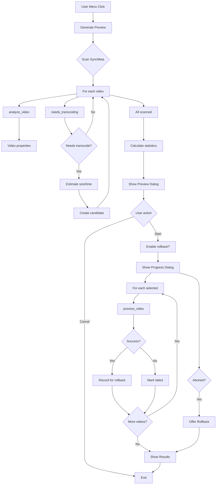
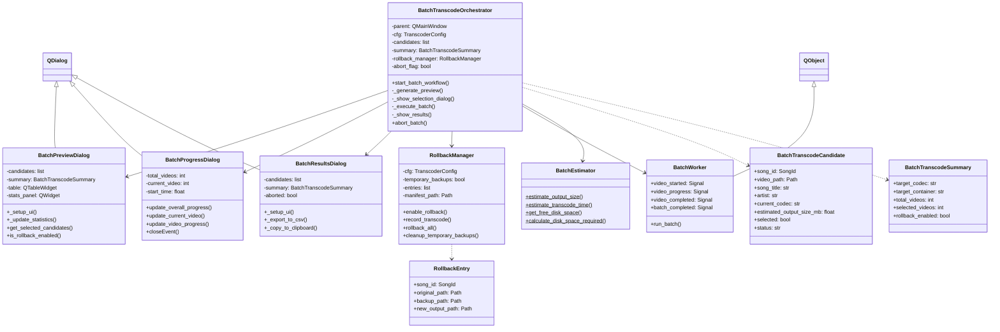

# Batch Video Transcoding System Architecture

**Version:** 1.0  
**Date:** 2026-01-05  
**Status:** Proposed Design

## Table of Contents

1. [Executive Summary](#1-executive-summary)
2. [Current Implementation Analysis](#2-current-implementation-analysis)
3. [Architecture Overview](#3-architecture-overview)
4. [Detailed Component Design](#4-detailed-component-design)
5. [Data Models](#5-data-models)
6. [State Machines](#6-state-machines)
7. [Integration Points](#7-integration-points)
8. [File Organization](#8-file-organization)
9. [Implementation Recommendations](#9-implementation-recommendations)

---

## 1. Executive Summary

This document defines the architecture for a comprehensive batch video transcoding system for the video_transcoder addon. It replaces the current simple implementation with a sophisticated solution that includes:

- **Preview generation** with estimation of disk space, time, and output sizes
- **Interactive selection dialog** with filtering and dynamic statistics
- **Real-time progress monitoring** with abort capability
- **Rollback system** for recovering from aborted batch operations
- **Comprehensive results reporting** with detailed logs and export capabilities

The design leverages existing transcoding infrastructure while adding GUI components built with PySide6, following the patterns established in USDB Syncer.

---

## 2. Current Implementation Analysis

### 2.1 Existing Components

The current implementation (`batch.py` and `__init__.py`) provides:

**Strengths:**
- Reuses core transcoding engine via `process_video()`
- Uses `find_videos_needing_transcode()` to scan SyncMeta
- Simple `BatchResult` dataclass for result tracking
- Basic abort checking via `is_aborted()`

**Limitations:**
- Simple confirmation dialog (just shows count)
- No preview or estimation
- No selection/filtering capability
- No detailed progress monitoring
- No rollback capability on abort
- Basic results summary (no detailed report)
- Menu says "Transcode All Videos" (should be "Transcode Synchronized Videos")

### 2.2 Integration Points

**Core Dependencies:**
- `transcoder.process_video()` - main transcode function
- `transcoder.TranscodeResult` - result dataclass
- `video_analyzer.analyze_video()` - get video properties
- `video_analyzer.needs_transcoding()` - determine transcode need
- `batch.find_videos_needing_transcode()` - scan library
- `utils.is_aborted()` - check abort status
- `config.TranscoderConfig` - configuration
- `gui.progress.run_with_progress()` - background task execution
- `SyncMeta` - access synchronized songs

---

## 3. Architecture Overview

### 3.1 System Flow



### 3.2 Component Architecture

```
┌─────────────────────────────────────────────────────┐
│           Main Window (USDB Syncer)                 │
│  ┌──────────────────────────────────────────────┐   │
│  │ Menu: "Transcode Synchronized Videos"        │   │
│  └──────────────────────────────────────────────┘   │
└─────────────────────────────────────────────────────┘
                      │
                      ▼
┌─────────────────────────────────────────────────────┐
│        BatchTranscodeOrchestrator                   │
│  - Coordinates entire batch workflow                │
│  - Manages state transitions                        │
│  - Owns rollback manager                            │
└─────────────────────────────────────────────────────┘
           │          │           │
           ▼          ▼           ▼
    ┌─────────┐  ┌─────────┐  ┌─────────┐
    │ Preview │  │Progress │  │ Results │
    │ Dialog  │  │ Dialog  │  │ Dialog  │
    └─────────┘  └─────────┘  └─────────┘
           │          │           │
           ▼          ▼           ▼
    ┌──────────────────────────────────┐
    │     BatchEstimator               │
    │  - Estimate file sizes           │
    │  - Estimate transcode times      │
    │  - Calculate disk space          │
    └──────────────────────────────────┘
                     │
                     ▼
    ┌──────────────────────────────────┐
    │   RollbackManager                │
    │  - Track successful transcodes   │
    │  - Manage temporary backups      │
    │  - Execute rollback operations   │
    └──────────────────────────────────┘
                     │
                     ▼
    ┌──────────────────────────────────┐
    │   Core Transcoding Engine        │
    │  - process_video()               │
    │  - analyze_video()               │
    │  - TranscodeResult               │
    └──────────────────────────────────┘
```

---

## 4. Detailed Component Design

### 4.1 BatchTranscodeOrchestrator

**Purpose:** Central coordinator for the entire batch transcode workflow.

**File:** `addons/video_transcoder/batch_orchestrator.py`

**Class Definition:**

```python
@dataclass
class BatchTranscodeCandidate:
    """Single video candidate for batch transcoding."""
    song_id: SongId
    video_path: Path
    song_title: str
    artist: str
    
    # Current properties
    current_codec: str
    current_resolution: str  # e.g., "1920x1080"
    current_fps: float
    current_container: str
    current_size_mb: float
    duration_seconds: float
    
    # Estimates
    estimated_output_size_mb: float
    estimated_time_seconds: float
    
    # Runtime state
    selected: bool = True
    status: Literal["pending", "transcoding", "success", "failed", "aborted", "skipped"] = "pending"
    error_message: Optional[str] = None
    actual_time_seconds: Optional[float] = None


@dataclass
class BatchTranscodeSummary:
    """Summary configuration for entire batch (same for all videos)."""
    target_codec: str
    target_container: str
    
    # Resolution setting (depends on USDB integration vs manual)
    resolution_display: str  # Human-readable, e.g., "Max: 1080p" or "Exact: 1080p" or "Original"
    resolution_value: Optional[tuple[int, int]]  # Actual value if set
    resolution_is_limit: bool  # True if max limit, False if exact target
    
    # FPS setting (depends on USDB integration vs manual)
    fps_display: str  # Human-readable, e.g., "Max: 60" or "Exact: 60" or "Original"
    fps_value: Optional[int]  # Actual value if set
    fps_is_limit: bool  # True if max limit, False if exact target
    
    hardware_acceleration: str  # e.g., "Intel QuickSync", "Disabled", "NVIDIA"
    
    total_videos: int
    selected_videos: int
    total_estimated_time_seconds: float
    total_disk_space_required_mb: float
    current_free_space_mb: float
    rollback_enabled: bool = False


class BatchTranscodeOrchestrator:
    """Orchestrates the entire batch transcode workflow."""
    
    def __init__(self, parent: QMainWindow, cfg: TranscoderConfig):
        self.parent = parent
        self.cfg = cfg
        self.candidates: list[BatchTranscodeCandidate] = []
        self.summary: Optional[BatchTranscodeSummary] = None
        self.rollback_manager: Optional[RollbackManager] = None
        self._abort_flag = False
        
    def start_batch_workflow(self) -> None:
        """Entry point: start the entire batch transcode workflow."""
        # Phase 1: Generate preview (with progress dialog)
        preview_result = self._generate_preview()
        if not preview_result:
            return
            
        # Phase 2: Show selection dialog
        if not self._show_selection_dialog():
            return
            
        # Phase 3: Execute batch with progress monitoring
        self._execute_batch()
        
        # Phase 4: Show results
        self._show_results()
    
    def _generate_preview(self) -> bool:
        """Generate preview data for all candidate videos."""
        
    def _show_selection_dialog(self) -> bool:
        """Show selection dialog, return True if user starts."""
        
    def _execute_batch(self) -> None:
        """Execute batch transcode with progress monitoring."""
        
    def _show_results(self) -> None:
        """Show results dialog."""
        
    def abort_batch(self) -> None:
        """Request abort of current batch operation."""
        self._abort_flag = True
```

**Key Methods:**

- `start_batch_workflow()`: Entry point, coordinates all phases
- `_generate_preview()`: Scan library, analyze videos, generate estimates
- `_show_selection_dialog()`: Show modal selection dialog
- `_execute_batch()`: Run transcoding with progress monitoring
- `_show_results()`: Show results dialog
- `abort_batch()`: Trigger abort mechanism

---

### 4.1.1 Resolution and FPS Handling

The orchestrator must carefully handle resolution and FPS settings based on the current configuration:

**USDB Integration Mode (Limits):**
- When `cfg.usdb_integration.use_usdb_resolution = True`:
  - Resolution acts as a **maximum limit**
  - Videos exceeding this resolution will be downscaled
  - Videos below this resolution remain unchanged
  - Display: "Max: 1080p (1920x1080)" or "Original (no limit)"
  
- When `cfg.usdb_integration.use_usdb_fps = True`:
  - FPS acts as a **maximum limit**
  - Videos exceeding this FPS will be reduced
  - Videos below this FPS remain unchanged
  - Display: "Max: 60 fps" or "Original (no limit)"

**Manual Mode (Exact Targets):**
- When `cfg.usdb_integration.use_usdb_resolution = False`:
  - Resolution acts as an **exact target**
  - All videos will be transcoded to this exact resolution (respecting aspect ratio)
  - Display: "Exact: 1080p (1920x1080)" or "Original (no change)"
  
- When `cfg.usdb_integration.use_usdb_fps = False`:
  - FPS acts as an **exact target**
  - All videos will be transcoded to this exact FPS
  - Display: "Exact: 60 fps" or "Original (no change)"

**Codec-Specific Container:**
The target container comes from the codec-specific config section, not general config:

```python
codec_cfg = getattr(cfg, cfg.target_codec)  # e.g., cfg.h264
container = codec_cfg.container  # e.g., "mp4" for H.264
```

This ensures that each codec uses its appropriate container (e.g., H.264→mp4, VP9→webm, AV1→mkv).

---

### 4.2 BatchPreviewDialog

**Purpose:** Display candidate videos with estimates and allow user selection.

**File:** `addons/video_transcoder/batch_preview_dialog.py`

**Class Definition:**

```python
class BatchPreviewDialog(QDialog):
    """Dialog for selecting videos and reviewing batch estimates."""
    
    def __init__(
        self,
        parent: QMainWindow,
        candidates: list[BatchTranscodeCandidate],
        summary: BatchTranscodeSummary
    ):
        super().__init__(parent)
        self.candidates = candidates
        self.summary = summary
        self._setup_ui()
        self._load_data()
        
    def _setup_ui(self) -> None:
        """Build UI with summary panel, table, and statistics."""
        # Summary panel at top
        # Table with candidate videos
        # Statistics panel at bottom
        # Rollback checkbox
        # Start/Cancel buttons
        
    def _update_statistics(self) -> None:
        """Recalculate statistics based on current selection."""
        
    def _on_selection_changed(self) -> None:
        """Handle selection change in table."""
        
    def get_selected_candidates(self) -> list[BatchTranscodeCandidate]:
        """Return list of selected candidates."""
        
    def is_rollback_enabled(self) -> bool:
        """Return rollback checkbox state."""
```

**UI Layout:**

```
┌──────────────────────────────────────────────────────────────┐
│  Batch Video Transcoding                                     │
├──────────────────────────────────────────────────────────────┤
│  ╔═══════════════════ Target Settings ══════════════════╗    │
│  ║ Target Codec: h264                                  ║    │
│  ║ Target Container: mp4                               ║    │
│  ║ Resolution: Max 1080p     (or "Exact: 1080p")      ║    │
│  ║ FPS: Max 60               (or "Exact: 60")         ║    │
│  ║ Hardware Acceleration: Enabled (Intel QuickSync)    ║    │
│  ╚═════════════════════════════════════════════════════╝    │
├──────────────────────────────────────────────────────────────┤
│  ┌────────────────────────────────────────────────────────┐  │
│  │ [Filter: _____________]  [Select All] [Deselect All]  │  │
│  ├────────────────────────────────────────────────────────┤  │
│  │ ☑│ Title    │ Artist  │ Codec │ Res    │FPS│ ...      │  │
│  │ ☑│ Song 1   │ Artist1 │ h264  │1920x.. │30 │ ...      │  │
│  │ ☑│ Song 2   │ Artist2 │ vp9   │1280x.. │60 │ ...      │  │
│  │  │ ...      │ ...     │ ...   │ ...    │.. │ ...      │  │
│  └────────────────────────────────────────────────────────┘  │
├──────────────────────────────────────────────────────────────┤
│  ╔═══════════════════ Statistics ════════════════════════╗   │
│  ║ Selected: 25 of 30 videos                           ║   │
│  ║ Estimated Time: 01:35:22                            ║   │
│  ║ Disk Space Required: 1,234 MB                       ║   │
│  ║ Current Free Space: 45,678 MB ✓                     ║   │
│  ╚═════════════════════════════════════════════════════╝   │
│  ☐ Enable rollback protection for this batch                │
│     (Creates temporary backups; can restore on abort)       │
├──────────────────────────────────────────────────────────────┤
│                               [Start Transcoding]  [Cancel]  │
└──────────────────────────────────────────────────────────────┘
```

**Resolution/FPS Display Logic:**

The Target Settings panel must accurately reflect the current configuration:

```python
def _format_resolution_display(cfg: TranscoderConfig) -> str:
    """Format resolution for display in summary panel."""
    if cfg.usdb_integration.use_usdb_resolution:
        # Using USDB Syncer settings as max limit
        if cfg.general.max_resolution:
            w, h = cfg.general.max_resolution
            return f"Max: {h}p ({w}x{h})"
        return "Original (no limit)"
    else:
        # Using manual setting as exact target
        if cfg.general.max_resolution:
            w, h = cfg.general.max_resolution
            return f"Exact: {h}p ({w}x{h})"
        return "Original (no change)"

def _format_fps_display(cfg: TranscoderConfig) -> str:
    """Format FPS for display in summary panel."""
    if cfg.usdb_integration.use_usdb_fps:
        # Using USDB Syncer settings as max limit
        if cfg.general.max_fps:
            return f"Max: {cfg.general.max_fps} fps"
        return "Original (no limit)"
    else:
        # Using manual setting as exact target
        if cfg.general.max_fps:
            return f"Exact: {cfg.general.max_fps} fps"
        return "Original (no change)"
```

**Display Examples:**

| Configuration | Display |
|--------------|---------|
| USDB integration enabled, max_resolution=(1920, 1080) | "Resolution: Max 1080p (1920x1080)" |
| Manual setting, max_resolution=(1920, 1080) | "Resolution: Exact: 1080p (1920x1080)" |
| USDB integration enabled, max_resolution=None | "Resolution: Original (no limit)" |
| Manual setting, max_resolution=None | "Resolution: Original (no change)" |
| USDB integration enabled, max_fps=60 | "FPS: Max 60 fps" |
| Manual setting, max_fps=60 | "FPS: Exact: 60 fps" |
| USDB integration enabled, max_fps=None | "FPS: Original (no limit)" |
| Manual setting, max_fps=None | "FPS: Original (no change)" |

**Table Columns:**
- ☑ **Select** (checkbox)
- **Title** (song title)
- **Artist** (artist name)
- **Current Codec** (e.g., "h264")
- **Current Res** (e.g., "1920x1080")
- **Current FPS** (e.g., "30.0")
- **Container** (e.g., "mp4")
- **Current Size** (e.g., "125 MB")
- **Est. Output** (e.g., "98 MB")

**Key Features:**
- Filtering on all columns
- Select All / Deselect All buttons
- Dynamic statistics that update on selection change
- Disk space validation (disable Start button if insufficient)
- Rollback checkbox with tooltip

---

### 4.3 BatchProgressDialog

**Purpose:** Monitor batch transcode progress with per-video and overall stats.

**File:** `addons/video_transcoder/batch_progress_dialog.py`

**Class Definition:**

```python
class BatchProgressDialog(QDialog):
    """Modal dialog showing batch transcode progress."""
    
    # Signals
    abort_requested = QtCore.Signal()
    
    def __init__(self, parent: QMainWindow, total_videos: int):
        super().__init__(parent)
        self.total_videos = total_videos
        self.current_video = 0
        self.start_time = time.time()
        self._setup_ui()
        
    def _setup_ui(self) -> None:
        """Build UI with progress bars and statistics."""
        # Overall progress bar
        # Current video info
        # Current video progress bar
        # Statistics (FPS, speed, ETA)
        # Abort button
        
    def update_overall_progress(self, completed: int, total: int) -> None:
        """Update overall progress (X of Y videos)."""
        
    def update_current_video(self, title: str, artist: str) -> None:
        """Update which video is currently being transcoded."""
        
    def update_video_progress(
        self,
        percent: float,
        fps: float,
        speed: str,
        elapsed: float,
        eta: float
    ) -> None:
        """Update current video progress and stats."""
        
    def closeEvent(self, event: QtGui.QCloseEvent) -> None:
        """Prevent dialog from being closed."""
        event.ignore()
```

**UI Layout:**

```
┌────────────────────────────────────────────────────┐
│  Batch Transcoding In Progress                     │
├────────────────────────────────────────────────────┤
│  Overall Progress: Transcoding 12 of 25 videos     │
│  [████████████████░░░░░░░░░░] 48% complete         │
│                                                     │
│  Currently transcoding:                            │
│  Artist - Song Title                               │
│                                                     │
│  Video Progress:                                   │
│  [████████████████████░░░░░] 75%                   │
│                                                     │
│  ┌──────────────────────────────────────────────┐  │
│  │ FPS: 245.3                                   │  │
│  │ Speed: 2.8x realtime                         │  │
│  │ Elapsed: 00:02:15                            │  │
│  │ ETA (current): 00:00:45                      │  │
│  │                                              │  │
│  │ Overall Elapsed: 00:37:28                    │  │
│  │ Overall ETA: 00:42:15                        │  │
│  └──────────────────────────────────────────────┘  │
│                                                     │
│          [🛑 Abort Batch Transcode]                 │
│             (large, red button)                     │
└────────────────────────────────────────────────────┘
```

**Key Features:**
- Modal (cannot be dismissed)
- Large, prominent abort button
- Real-time updates (via signals from background thread)
- Separate current video and overall progress tracking
- Per-video stats (FPS, speed, elapsed, ETA)
- Overall batch stats (elapsed, ETA)

---

### 4.4 BatchResultsDialog

**Purpose:** Display comprehensive results after batch completion or abort.

**File:** `addons/video_transcoder/batch_results_dialog.py`

**Class Definition:**

```python
class BatchResultsDialog(QDialog):
    """Dialog showing batch transcode results."""
    
    def __init__(
        self,
        parent: QMainWindow,
        candidates: list[BatchTranscodeCandidate],
        summary: BatchTranscodeSummary,
        aborted: bool = False
    ):
        super().__init__(parent)
        self.candidates = candidates
        self.summary = summary
        self.aborted = aborted
        self._setup_ui()
        self._load_results()
        
    def _setup_ui(self) -> None:
        """Build UI with summary and expandable details."""
        # Summary statistics
        # Show Details button -> expands table
        # Detailed results table (hidden by default)
        # Export/Copy buttons
        # OK button
        
    def _export_to_csv(self) -> None:
        """Export results to CSV file."""
        
    def _copy_to_clipboard(self) -> None:
        """Copy results to clipboard."""
```

**UI Layout (collapsed):**

```
┌────────────────────────────────────────────────────┐
│  Batch Transcode Complete                          │
├────────────────────────────────────────────────────┤
│  ╔═══════════════ Summary ════════════════╗        │
│  ║ ✓ Success: 22 videos                  ║        │
│  ║ ✗ Failed: 2 videos                    ║        │
│  ║ ⊙ Skipped: 1 video                    ║        │
│  ║ ⊘ Aborted: 0 videos                   ║        │
│  ║                                        ║        │
│  ║ Total Time: 01:23:45                  ║        │
│  ║ Space Saved: -234 MB                  ║        │
│  ╚════════════════════════════════════════╝        │
│                                                     │
│              [Show Detailed Report]                │
│                     [OK]                            │
└────────────────────────────────────────────────────┘
```

**UI Layout (expanded):**

```
┌──────────────────────────────────────────────────────────┐
│  Batch Transcode Complete                                │
├──────────────────────────────────────────────────────────┤
│  ╔═══════════════ Summary ════════════════╗              │
│  ║ ✓ Success: 22 videos                  ║              │
│  ║ ✗ Failed: 2 videos                    ║              │
│  ║ ...                                    ║              │
│  ╚════════════════════════════════════════╝              │
│                                                           │
│  ┌──────────────────────────────────────────────────┐    │
│  │ Detailed Results:                                │    │
│  ├──────────────────────────────────────────────────┤    │
│  │ St│ Title    │ Artist │ Change      │ Error      │    │
│  │ ✓ │ Song 1   │ Art 1  │ vp9→h264... │            │    │
│  │ ✓ │ Song 2   │ Art 2  │ h264→h264...│            │    │
│  │ ✗ │ Song 3   │ Art 3  │ -           │ Timeout... │    │
│  │ ...                                              │    │
│  └──────────────────────────────────────────────────┘    │
│                                                           │
│         [Export to CSV]  [Copy to Clipboard]             │
│                     [OK]                                  │
└──────────────────────────────────────────────────────────┘
```

**Table Columns:**
- **Status** (icon: ✓ ✗ ⊘ ⊙)
- **Title**
- **Artist**
- **Change** (e.g., "vp9 → h264, 1.2GB → 0.9GB")
- **Error Message** (if failed)

**Key Features:**
- Collapsible detailed view (hidden by default)
- Status icons for easy scanning
- Export to CSV functionality
- Copy to clipboard functionality
- Error messages with suggestions

---

### 4.5 RollbackManager

**Purpose:** Track successful transcodes and enable rollback on abort.

**File:** `addons/video_transcoder/rollback.py`

**Class Definition:**

```python
@dataclass
class RollbackEntry:
    """Single video rollback entry."""
    song_id: SongId
    original_path: Path
    backup_path: Path
    new_output_path: Path
    transcoded_at: float  # timestamp


class RollbackManager:
    """Manages rollback operations for batch transcoding."""
    
    def __init__(self, cfg: TranscoderConfig, temporary_backups: bool):
        """
        Args:
            cfg: Transcoder configuration
            temporary_backups: If True, backups are temporary for rollback only.
                              If False, use existing backup_original setting.
        """
        self.cfg = cfg
        self.temporary_backups = temporary_backups
        self.entries: list[RollbackEntry] = []
        self._manifest_path: Optional[Path] = None
        
    def enable_rollback(self, manifest_dir: Path) -> None:
        """Enable rollback tracking with manifest file."""
        self._manifest_path = manifest_dir / f"rollback_manifest_{int(time.time())}.json"
        
    def record_transcode(
        self,
        song_id: SongId,
        original_path: Path,
        backup_path: Path,
        new_output_path: Path
    ) -> None:
        """Record a successful transcode for potential rollback."""
        entry = RollbackEntry(
            song_id=song_id,
            original_path=original_path,
            backup_path=backup_path,
            new_output_path=new_output_path,
            transcoded_at=time.time()
        )
        self.entries.append(entry)
        self._save_manifest()
        
    def rollback_all(self, slog: Logger) -> tuple[int, int]:
        """
        Rollback all recorded transcodes.
        
        Returns:
            (success_count, failure_count)
        """
        success = 0
        failed = 0
        
        for entry in reversed(self.entries):
            try:
                # Restore original from backup
                if entry.backup_path.exists():
                    shutil.move(str(entry.backup_path), str(entry.original_path))
                    
                # Delete new output
                if entry.new_output_path.exists():
                    entry.new_output_path.unlink()
                    
                # Update SyncMeta to point back to original
                self._update_sync_meta_for_rollback(entry)
                
                success += 1
            except Exception as e:
                slog.error(f"Rollback failed for {entry.song_id}: {e}")
                failed += 1
                
        self._cleanup_manifest()
        return success, failed
        
    def cleanup_temporary_backups(self) -> None:
        """Remove temporary backups after successful batch."""
        if not self.temporary_backups:
            return
            
        for entry in self.entries:
            if entry.backup_path.exists():
                try:
                    entry.backup_path.unlink()
                except Exception:
                    pass
                    
        self._cleanup_manifest()
        
    def _save_manifest(self) -> None:
        """Persist manifest to disk."""
        
    def _cleanup_manifest(self) -> None:
        """Remove manifest file."""
        
    def _update_sync_meta_for_rollback(self, entry: RollbackEntry) -> None:
        """Update SyncMeta after rollback."""
```

**Rollback Logic:**

1. **When rollback enabled:**
   - If `backup_original=True` in settings: use those backups
   - If `backup_original=False` in settings: create temporary backups
   - Track each successful transcode in rollback manifest

2. **On abort:**
   - Show rollback dialog with options: Yes, No, Details
   - If Yes: restore all backups, delete new outputs, update SyncMeta
   - If No and temporary backups: delete temp backups
   - If No and permanent backups: keep them as `-source` files

3. **On successful completion:**
   - If temporary backups: delete them
   - If permanent backups: keep them

**Manifest Format (JSON):**

```json
{
  "version": 1,
  "created_at": 1704500000,
  "entries": [
    {
      "song_id": 12345,
      "original_path": "/path/to/video.mp4",
      "backup_path": "/path/to/video-source.mp4",
      "new_output_path": "/path/to/video.mp4",
      "transcoded_at": 1704500100
    }
  ]
}
```

---

### 4.6 BatchEstimator

**Purpose:** Estimate output file sizes and transcode times.

**File:** `addons/video_transcoder/batch_estimator.py`

**Class Definition:**

```python
class BatchEstimator:
    """Utilities for estimating batch transcode metrics."""
    
    @staticmethod
    def estimate_output_size(
        video_info: VideoInfo,
        cfg: TranscoderConfig
    ) -> float:
        """
        Estimate output file size in MB.
        
        Uses heuristics based on:
        - Duration
        - Target resolution
        - Target codec
        - CRF/quality settings
        - Bitrate settings
        
        Returns: estimated size in MB
        """
        
    @staticmethod
    def estimate_transcode_time(
        video_info: VideoInfo,
        cfg: TranscoderConfig,
        hw_accel_available: bool
    ) -> float:
        """
        Estimate transcode time in seconds.
        
        Uses heuristics based on:
        - Duration
        - Resolution
        - Codec complexity
        - Hardware acceleration status
        - Historical data (if available)
        
        Returns: estimated time in seconds
        """
        
    @staticmethod
    def get_free_disk_space(path: Path) -> float:
        """
        Get free disk space in MB.
        
        Returns: free space in MB
        """
        
    @staticmethod
    def calculate_disk_space_required(
        candidates: list[BatchTranscodeCandidate],
        rollback_enabled: bool,
        backup_original: bool
    ) -> float:
        """
        Calculate total disk space required for batch.
        
        Accounts for:
        - Estimated output sizes
        - Temporary transcoding files
        - Rollback backup space (if enabled)
        
        Returns: required space in MB
        """
```

**Estimation Heuristics:**

**File Size Estimation:**
```python
# Rough formula (to be refined):
target_bitrate = self._get_target_bitrate(cfg, video_info)
estimated_size_mb = (target_bitrate * duration_seconds) / (8 * 1024 * 1024)

# Adjustments:
# - Apply codec efficiency factor (HEVC: 0.5x, AV1: 0.4x, VP9: 0.6x)
# - Apply CRF adjustment (CRF 18: 1.2x, CRF 28: 0.6x)
# - Apply resolution scaling factor
```

**Time Estimation:**
```python
# Rough formula (to be refined):
base_speed = 1.0  # realtime speed for software encoding
if hw_accel_available:
    base_speed = 3.0  # 3x realtime for hardware encoding
    
complexity_factor = 1.0
if target_codec == "hevc":
    complexity_factor = 0.7  # slower
elif target_codec == "av1":
    complexity_factor = 0.3  # much slower
    
resolution_factor = (video_info.width * video_info.height) / (1920 * 1080)

estimated_time = duration_seconds / (base_speed * complexity_factor * resolution_factor)
```

---

## 5. Data Models

### 5.1 BatchTranscodeCandidate

```python
@dataclass
class BatchTranscodeCandidate:
    """Single video candidate for batch transcoding."""
    
    # Identification
    song_id: SongId
    video_path: Path
    song_title: str
    artist: str
    
    # Current properties
    current_codec: str
    current_resolution: str  # "1920x1080"
    current_fps: float
    current_container: str
    current_size_mb: float
    duration_seconds: float
    
    # Estimates
    estimated_output_size_mb: float
    estimated_time_seconds: float
    
    # Runtime state
    selected: bool = True
    status: Literal["pending", "transcoding", "success", "failed", "aborted", "skipped"] = "pending"
    error_message: Optional[str] = None
    actual_time_seconds: Optional[float] = None
    
    # Result (populated after transcode)
    result: Optional[TranscodeResult] = None
```

### 5.2 BatchTranscodeSummary

```python
@dataclass
class BatchTranscodeSummary:
    """Summary configuration and statistics for batch."""
    
    # Target settings (same for all videos)
    target_codec: str
    target_container: str
    
    # Resolution setting (depends on USDB integration vs manual)
    resolution_display: str  # Human-readable, e.g., "Max: 1080p" or "Exact: 1080p" or "Original"
    resolution_value: Optional[tuple[int, int]]  # Actual value if set
    resolution_is_limit: bool  # True if max limit, False if exact target
    
    # FPS setting (depends on USDB integration vs manual)
    fps_display: str  # Human-readable, e.g., "Max: 60" or "Exact: 60" or "Original"
    fps_value: Optional[int]  # Actual value if set
    fps_is_limit: bool  # True if max limit, False if exact target
    
    hardware_acceleration: str  # Display string
    
    # Statistics
    total_videos: int
    selected_videos: int
    total_estimated_time_seconds: float
    total_disk_space_required_mb: float
    current_free_space_mb: float
    
    # Options
    rollback_enabled: bool = False
```

### 5.3 RollbackEntry

```python
@dataclass
class RollbackEntry:
    """Single video rollback entry."""
    song_id: SongId
    original_path: Path
    backup_path: Path
    new_output_path: Path
    transcoded_at: float  # timestamp
```

### 5.4 Extended BatchResult

```python
@dataclass
class BatchResult:
    """Result of batch transcoding operation."""
    
    # Counts
    total: int
    successful: int
    skipped: int
    failed: int
    aborted: int
    
    # Timing
    start_time: float
    end_time: float
    
    # Details
    candidates: list[BatchTranscodeCandidate]
    
    # Rollback info
    rollback_performed: bool = False
    rollback_success_count: int = 0
    rollback_failure_count: int = 0
    
    @property
    def duration_seconds(self) -> float:
        return self.end_time - self.start_time
```

---

## 6. State Machines

### 6.1 Batch Workflow State Machine



### 6.2 Single Video Transcode State



### 6.3 Dialog State Machine



---

## 7. Integration Points

### 7.1 With Existing Code

**Import from existing modules:**

```python
# From batch.py
from .batch import find_videos_needing_transcode

# From transcoder.py
from .transcoder import process_video, TranscodeResult

# From video_analyzer.py
from .video_analyzer import analyze_video, VideoInfo, needs_transcoding

# From config.py
from .config import TranscoderConfig, load_config

# From utils.py
from .utils import is_aborted

# From USDB Syncer
from usdb_syncer import SongId, settings
from usdb_syncer.sync_meta import SyncMeta
from usdb_syncer.usdb_song import UsdbSong
from usdb_syncer.logger import song_logger
from usdb_syncer.gui.progress import run_with_progress
from usdb_syncer.gui import icons
```

**Update existing files:**

1. **`__init__.py`:**
   - Change menu text: `"Transcode All Videos"` → `"Transcode Synchronized Videos"`
   - Replace `start_batch_transcode()` body to use `BatchTranscodeOrchestrator`

2. **`batch.py`:**
   - Keep `find_videos_needing_transcode()` as-is (used by orchestrator)
   - Keep `BatchResult` but extend it (or deprecate in favor of new one)
   - Deprecate `batch_transcode()` (replaced by orchestrator)

### 7.2 Thread Safety

**Background Thread Execution:**

The batch operation runs in a background thread via `run_with_progress()`. Key considerations:

1. **Progress Updates:**
   - Use Qt signals to communicate from worker thread to UI thread
   - `BatchProgressDialog` emits signals for progress updates
   - `process_video()` callback can emit signals

2. **Abort Handling:**
   - Orchestrator sets `_abort_flag` when user clicks abort
   - Worker thread checks flag periodically
   - Existing `is_aborted()` mechanism also checked

3. **Thread Communication Pattern:**

```python
class BatchWorker(QtCore.QObject):
    """Worker object for batch transcoding."""
    
    # Signals
    video_started = QtCore.Signal(str, str)  # title, artist
    video_progress = QtCore.Signal(float, float, str, float, float)  # percent, fps, speed, elapsed, eta
    video_completed = QtCore.Signal(int)  # video index
    batch_completed = QtCore.Signal()
    
    def run_batch(self, candidates: list[BatchTranscodeCandidate]) -> None:
        """Execute batch transcode (runs in worker thread)."""
        for i, candidate in enumerate(candidates):
            if not candidate.selected:
                continue
                
            # Signal start
            self.video_started.emit(candidate.song_title, candidate.artist)
            
            # Transcode (with progress callback)
            result = self._transcode_with_progress(candidate)
            
            # Signal completion
            self.video_completed.emit(i)
```

### 7.3 Hardware Acceleration Detection

**At preview generation time:**

```python
def _get_hardware_acceleration_string(cfg: TranscoderConfig) -> str:
    """Get human-readable hardware acceleration status."""
    if not cfg.general.hardware_encoding:
        return "Disabled"
        
    from .hwaccel import get_best_accelerator
    accel = get_best_accelerator(cfg.target_codec)
    if accel:
        return f"Enabled ({accel.capabilities().display_name})"
    else:
        return "Disabled (no accelerator found)"
```

---

## 8. File Organization

### 8.1 New Files

```
addons/video_transcoder/
├── __init__.py                    # Updated: change menu text, use orchestrator
├── batch.py                        # Keep: find_videos_needing_transcode()
├── batch_orchestrator.py          # NEW: Main workflow coordinator
├── batch_preview_dialog.py        # NEW: Selection dialog
├── batch_progress_dialog.py       # NEW: Progress monitoring
├── batch_results_dialog.py        # NEW: Results display
├── batch_estimator.py             # NEW: Size/time estimation
├── rollback.py                    # NEW: Rollback management
├── batch_worker.py                # NEW: Background thread worker
└── ... (existing files unchanged)
```

### 8.2 File Responsibilities

| File | Responsibility | LOC Est. |
|------|---------------|----------|
| `batch_orchestrator.py` | Workflow coordination, state management | 300 |
| `batch_preview_dialog.py` | Selection UI, filtering, dynamic stats | 500 |
| `batch_progress_dialog.py` | Progress monitoring UI | 250 |
| `batch_results_dialog.py` | Results display, export | 350 |
| `batch_estimator.py` | Estimation heuristics | 200 |
| `rollback.py` | Rollback tracking and execution | 300 |
| `batch_worker.py` | Background thread execution | 250 |
| **Total** | | **~2,150** |

### 8.3 Integration Pattern

```python
# In __init__.py

def start_batch_transcode() -> None:
    """Start comprehensive batch transcode workflow."""
    cfg = config.load_config()
    
    # Create and start orchestrator
    from .batch_orchestrator import BatchTranscodeOrchestrator
    orchestrator = BatchTranscodeOrchestrator(main_window, cfg)
    orchestrator.start_batch_workflow()
```

---

## 9. Implementation Recommendations

### 9.1 Implementation Phases

**Phase 1: Core Infrastructure (Week 1)**
1. `BatchEstimator` - estimation utilities
2. `RollbackManager` - rollback tracking
3. `BatchWorker` - background execution
4. Unit tests for estimation logic

**Phase 2: Dialogs (Week 2)**
1. `BatchPreviewDialog` - basic table and summary
2. Add filtering and dynamic stats
3. `BatchProgressDialog` - progress monitoring
4. Connect signals for real-time updates

**Phase 3: Orchestration (Week 3)**
1. `BatchTranscodeOrchestrator` - workflow coordination
2. Integrate all dialogs
3. Implement abort and rollback logic
4. `BatchResultsDialog` - results display

**Phase 4: Polish (Week 4)**
1. Export/copy functionality
2. Improve estimation accuracy
3. Error handling and edge cases
4. User testing and refinement

### 9.2 Testing Strategy

**Unit Tests:**
- `BatchEstimator` estimation accuracy
- `RollbackManager` rollback operations
- Data model serialization (RollbackEntry JSON)

**Integration Tests:**
- Full workflow from menu to results
- Abort scenarios with and without rollback
- Disk space validation
- Large batch operations (50+ videos)

**Edge Cases:**
- No videos need transcoding
- All videos fail
- Insufficient disk space
- Disk space runs out mid-batch
- Application crash during batch (rollback manifest persistence)

### 9.3 Performance Considerations

**Preview Generation:**
- Scan should be fast (`find_videos_needing_transcode()` already optimized)
- `analyze_video()` is relatively fast (ffprobe)
- Show progress dialog if scan takes >1 second
- Expected: <5 seconds for 100 videos

**Progress Updates:**
- Throttle UI updates to avoid overhead (max 10 Hz)
- Use signals for thread-safe communication
- Buffer progress updates if UI can't keep up

**Memory:**
- `BatchTranscodeCandidate` list grows linearly with video count
- Typical: ~1 KB per candidate × 100 videos = ~100 KB (negligible)
- Rollback manifest: ~500 bytes per entry × 100 = ~50 KB (negligible)

### 9.4 Error Handling

**Preview Generation Errors:**
- If `ffprobe` fails for a video: log warning, skip that video
- If no videos found: show info message, exit early

**Transcode Errors:**
- Catch all exceptions from `process_video()`
- Mark video as failed, log error, continue to next
- Show failed videos in results with error messages

**Abort Errors:**
- If rollback fails for a video: log error, continue with remaining
- Show rollback success/failure counts in results

**Disk Space Errors:**
- Check before starting batch
- Re-check before each video (in case space runs out)
- If space runs out mid-batch: abort, offer rollback

### 9.5 User Experience

**Feedback:**
- Always show progress for long operations
- Provide cancel/abort options
- Show clear error messages with actionable suggestions

**Defaults:**
- All videos selected initially
- Rollback disabled by default (to match current behavior)
- Sort table by artist then title

**Accessibility:**
- Keyboard navigation in all dialogs
- Tooltips on all controls
- Icons with text labels

### 9.6 Future Enhancements

**Not in initial scope, but could be added later:**

1. **Historical Tracking:**
   - Track actual transcode times
   - Improve estimation accuracy over time
   - Store in database or JSON file

2. **Pause/Resume:**
   - Allow pausing batch operation
   - Resume from where it left off
   - Requires persistent state

3. **Parallel Transcoding:**
   - Transcode multiple videos simultaneously
   - Requires worker pool and resource management
   - Complexity: high

4. **Preview Before/After:**
   - Show before/after comparison for selected video
   - Launch video player with original vs. transcoded
   - Requires video player integration

5. **Smart Batch Scheduling:**
   - Schedule large batches for off-peak hours
   - Pause when system is under load
   - Requires system monitoring

6. **Cloud Transcoding:**
   - Offload transcoding to cloud service
   - Requires API integration
   - Complexity: very high

---

## 10. Mermaid Diagrams

### 10.1 Component Interaction Diagram

```mermaid
sequenceDiagram
    participant User
    participant MainWindow
    participant Orchestrator
    participant PreviewDialog
    participant Worker
    participant ProgressDialog
    participant RollbackMgr
    participant ResultsDialog

    User->>MainWindow: Click "Transcode Synchronized Videos"
    MainWindow->>Orchestrator: start_batch_workflow()
    
    Orchestrator->>Orchestrator: _generate_preview()
    Orchestrator->>PreviewDialog: Show dialog
    PreviewDialog->>User: Display candidates
    
    alt User cancels
        User->>PreviewDialog: Cancel
        PreviewDialog->>Orchestrator: Return False
        Orchestrator->>MainWindow: Exit
    else User starts
        User->>PreviewDialog: Start
        PreviewDialog->>Orchestrator: Return True (with selections)
        
        Orchestrator->>Worker: Create worker thread
        Orchestrator->>ProgressDialog: Show dialog
        
        loop For each selected video
            Worker->>Worker: Transcode video
            Worker->>ProgressDialog: Update progress (signal)
            ProgressDialog->>User: Display progress
            
            alt User aborts
                User->>ProgressDialog: Abort
                ProgressDialog->>Worker: Set abort flag
                Worker->>Worker: Stop transcode
                break
            end
        end
        
        alt Aborted
            Orchestrator->>User: Show rollback dialog
            alt User chooses rollback
                User->>RollbackMgr: Rollback
                RollbackMgr->>RollbackMgr: Restore originals
            end
        end
        
        Orchestrator->>ResultsDialog: Show results
        ResultsDialog->>User: Display summary
        User->>ResultsDialog: OK
        ResultsDialog->>MainWindow: Close
    end
```

### 10.2 Data Flow Diagram



### 10.3 Class Hierarchy



---

## Conclusion

This architecture provides a comprehensive, user-friendly batch video transcoding system that:

✅ **Addresses all requirements** from the specification  
✅ **Integrates seamlessly** with existing transcoding infrastructure  
✅ **Follows USDB Syncer patterns** (PySide6, progress dialogs, threading)  
✅ **Provides robust error handling** and rollback capabilities  
✅ **Scales efficiently** to large batch operations  
✅ **Maintains thread safety** with proper signal/slot usage  
✅ **Delivers excellent UX** with previews, progress monitoring, and detailed results  

The modular design allows for incremental implementation and testing while maintaining backward compatibility with existing code. The estimated ~2,150 LOC across 7 new files represents a significant but manageable implementation effort that will dramatically improve the batch transcoding experience.

---

**Next Steps:**
1. Review and approve this architecture
2. Begin Phase 1 implementation (core infrastructure)
3. Conduct user testing after Phase 2 (dialogs)
4. Iterate based on feedback
