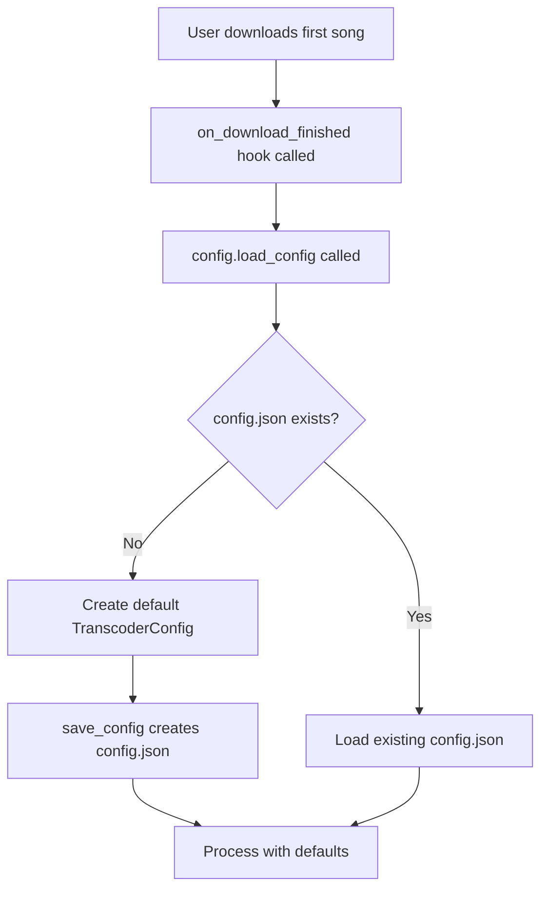
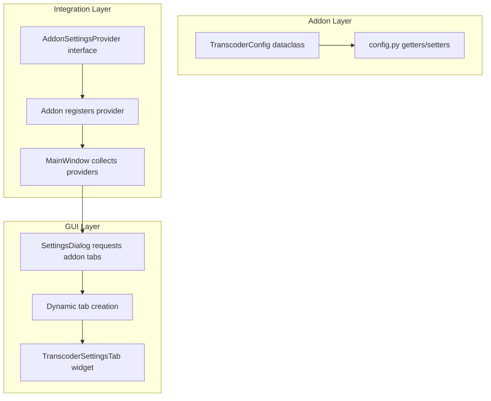
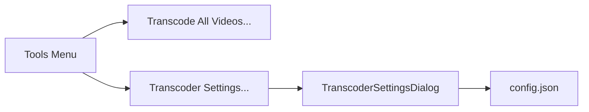
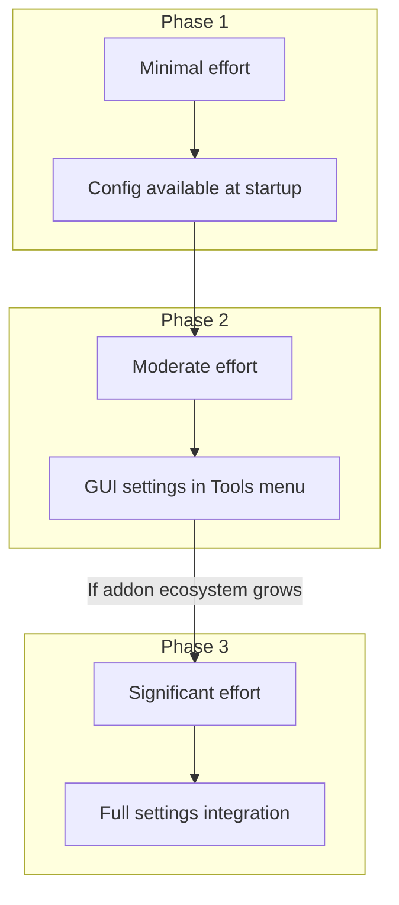
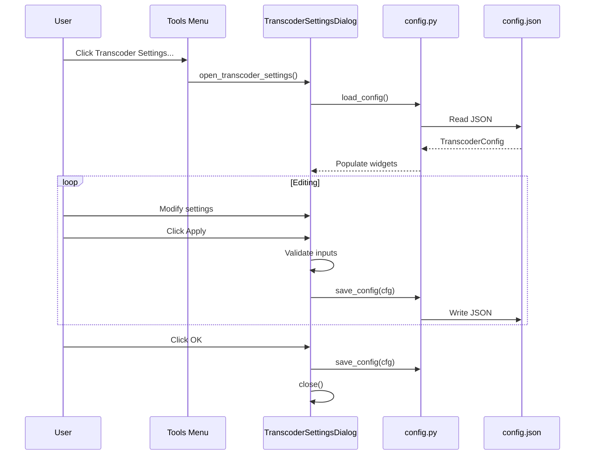

# Melody Mania Transcoder Configuration System Design

## Executive Summary

This document analyzes the configuration system for the `melody_mania_transcoder` addon and proposes solutions to enable users to configure settings before their first download. Three options are evaluated with a recommended approach.

---

## 1. Analysis of Current Config Loading Flow

### Current Implementation

The configuration loading is handled by [`load_config()`](addons/melody_mania_transcoder/config.py:94):



### Problem Statement

**The core issue**: Configuration capability is only available **after** the first download/transcode operation.

| Symptom | Impact |
|---------|--------|
| No `config.json` exists until first download | Users cannot review or customize settings proactively |
| Settings dialog-less addon | No intuitive way to discover or modify options |
| Manual JSON editing required | Technical barrier for non-developers |
| Close-edit-restart workflow | Poor UX per [CONFIGURATION.md](addons/melody_mania_transcoder/CONFIGURATION.md:8) |

### Call Flow

1. Addon loads at startup via [`addons.load_all()`](src/usdb_syncer/addons.py:11)
2. [`__init__.py`](addons/melody_mania_transcoder/__init__.py) imports modules and registers hooks
3. **No config loading at this point**
4. User triggers download → [`hooks.SongLoaderDidFinish.call()`](src/usdb_syncer/hooks.py:47)
5. [`on_download_finished()`](addons/melody_mania_transcoder/__init__.py:26) calls [`config.load_config()`](addons/melody_mania_transcoder/config.py:94)
6. Config file created if missing

---

## 2. Option 1: Simple Fix — Create Config at Addon Load Time

### Description

Move config creation from on-demand lazy loading to eager loading at addon initialization.

### Implementation Approach

Modify [`__init__.py`](addons/melody_mania_transcoder/__init__.py) to call `config.load_config()` at module import time:

```python
# addons/melody_mania_transcoder/__init__.py

from . import config, transcoder

# Ensure config exists immediately on addon load
_config = config.load_config()
```

### Pros

| Benefit | Description |
|---------|-------------|
| Minimal code change | Single line addition |
| Immediate availability | Config file created when USDB Syncer starts |
| No architectural changes | Uses existing infrastructure |
| Backwards compatible | No breaking changes |
| Low risk | Simple, well-understood change |

### Cons

| Drawback | Description |
|----------|-------------|
| Still requires JSON editing | No GUI for configuration |
| Discoverability issues | Users may not know config exists |
| No validation feedback | Syntax errors only caught at runtime |
| Restart required | Changes require application restart |

### User Experience Impact

- **Moderate improvement**: Users can now edit `config.json` before first use
- **No discovery mechanism**: Users must read documentation to know config exists

---

## 3. Option 2: GUI Integration — Add to USDB Syncer Settings Dialog

### Description

Integrate addon configuration into the existing [`SettingsDialog`](src/usdb_syncer/gui/settings_dialog.py:36) as a new tab.

### Architecture Analysis

The current settings system uses:

1. **[`SettingKey`](src/usdb_syncer/settings.py:146) enum**: Defines all setting keys with Qt storage keys
2. **[`_Settings`](src/usdb_syncer/settings.py:83) class**: Thread-safe QSettings wrapper
3. **[`SettingsDialog`](src/usdb_syncer/gui/settings_dialog.py:36)**: Qt dialog with tabbed interface
4. **[`SettingsDialog.ui`](src/usdb_syncer/gui/forms/SettingsDialog.ui)**: Qt Designer form

The dialog currently has 4 tabs: View, Download, Files, App Paths.

### Implementation Approach



#### A. Define an Addon Settings Provider Protocol

```python
# src/usdb_syncer/addon_settings.py  (new file)
from typing import Protocol
from PySide6.QtWidgets import QWidget

class AddonSettingsProvider(Protocol):
    """Protocol for addons that want to contribute settings UI."""
    
    @property
    def settings_tab_name(self) -> str:
        """Display name for the settings tab."""
        ...
    
    def create_settings_widget(self, parent: QWidget) -> QWidget:
        """Create and return the settings widget."""
        ...
    
    def load_settings(self, widget: QWidget) -> None:
        """Populate widget with current settings."""
        ...
    
    def save_settings(self, widget: QWidget) -> bool:
        """Save settings from widget. Return True on success."""
        ...
```

#### B. Registry for Addon Settings Providers

```python
# src/usdb_syncer/addon_settings.py (continued)
class AddonSettingsRegistry:
    _providers: list[AddonSettingsProvider] = []
    
    @classmethod
    def register(cls, provider: AddonSettingsProvider) -> None:
        cls._providers.append(provider)
    
    @classmethod
    def get_providers(cls) -> list[AddonSettingsProvider]:
        return cls._providers.copy()
```

#### C. Addon Implementation

```python
# addons/melody_mania_transcoder/settings_tab.py (new file)
from PySide6.QtWidgets import QWidget, QVBoxLayout, QGroupBox, QComboBox, ...
from . import config

class TranscoderSettingsProvider:
    @property
    def settings_tab_name(self) -> str:
        return "Melody Mania Transcoder"
    
    def create_settings_widget(self, parent: QWidget) -> QWidget:
        widget = QWidget(parent)
        # Build UI programmatically or use .ui file
        return widget
    
    def load_settings(self, widget: QWidget) -> None:
        cfg = config.load_config()
        # Populate UI elements
    
    def save_settings(self, widget: QWidget) -> bool:
        cfg = self._build_config_from_widget(widget)
        config.save_config(cfg)
        return True
```

#### D. SettingsDialog Modification

```python
# src/usdb_syncer/gui/settings_dialog.py (modified)
from usdb_syncer.addon_settings import AddonSettingsRegistry

class SettingsDialog(Ui_Dialog, QDialog):
    def __init__(self, parent: QWidget, song: UsdbSong | None) -> None:
        super().__init__(parent=parent)
        self.setupUi(self)
        self._addon_widgets: dict[str, tuple[AddonSettingsProvider, QWidget]] = {}
        self._add_addon_tabs()
        ...
    
    def _add_addon_tabs(self) -> None:
        for provider in AddonSettingsRegistry.get_providers():
            widget = provider.create_settings_widget(self)
            provider.load_settings(widget)
            self.tabWidget.addTab(widget, provider.settings_tab_name)
            self._addon_widgets[provider.settings_tab_name] = (provider, widget)
    
    def _save_settings(self) -> bool:
        # ... existing save logic ...
        
        # Save addon settings
        for name, (provider, widget) in self._addon_widgets.items():
            if not provider.save_settings(widget):
                return False
        return True
```

### Proposed UI Layout

```
┌─────────────────────────────────────────────────────────────────┐
│ Settings                                                    [X] │
├─────────────────────────────────────────────────────────────────┤
│ [View] [Download] [Files] [App Paths] [Melody Mania Transcoder] │
├─────────────────────────────────────────────────────────────────┤
│                                                                 │
│ ┌─ General ─────────────────────────────────────────────────┐   │
│ │ ☑ Enabled                                                 │   │
│ │ Target codec: [H.264         ▼]                           │   │
│ │ ☑ Hardware acceleration                                   │   │
│ │ ☑ Backup original files     Suffix: [.source    ]        │   │
│ └───────────────────────────────────────────────────────────┘   │
│                                                                 │
│ ┌─ H.264 Encoding ──────────────────────────────────────────┐   │
│ │ Profile: [Baseline    ▼]    Level: [3.1     ▼]            │   │
│ │ CRF: [18   ]                Preset: [slow      ▼]         │   │
│ │ ☑ Use Intel QuickSync                                     │   │
│ └───────────────────────────────────────────────────────────┘   │
│                                                                 │
│ ┌─ Limits ──────────────────────────────────────────────────┐   │
│ │ Max resolution: [None       ▼]                            │   │
│ │ Max FPS: [None              ▼]                            │   │
│ │ Max bitrate: [               ] kbps  (empty = unlimited)  │   │
│ │ ☑ Use USDB Syncer resolution setting                      │   │
│ │ ☑ Use USDB Syncer FPS setting                             │   │
│ └───────────────────────────────────────────────────────────┘   │
│                                                                 │
│ ┌─ Safety ──────────────────────────────────────────────────┐   │
│ │ ☑ Verify output files                                     │   │
│ │ Min free space: [500   ] MB                               │   │
│ │ Timeout: [600  ] seconds                                  │   │
│ └───────────────────────────────────────────────────────────┘   │
│                                                                 │
│                        [OK] [Cancel] [Apply]                    │
└─────────────────────────────────────────────────────────────────┘
```

### Pros

| Benefit | Description |
|---------|-------------|
| Native UX | Consistent with USDB Syncer settings experience |
| Discoverability | Users naturally find addon settings |
| Validation | Real-time feedback on invalid configurations |
| No restart required | Settings applied immediately |
| Professional feel | Polished, integrated experience |
| Type-safe editing | Dropdowns prevent invalid values |

### Cons

| Drawback | Description |
|----------|-------------|
| Significant implementation effort | New infrastructure required |
| Coupling | Addon now depends on GUI availability |
| Maintenance burden | UI must track config changes |
| Version compatibility | Provider interface becomes API contract |
| PySide6 dependency | Addon needs Qt knowledge |

### User Experience Impact

- **Major improvement**: Intuitive, native settings experience
- **Zero documentation required**: Self-explanatory UI

---

## 4. Option 3: Hybrid Approach — Menu-Based Settings Dialog

### Description

Create a standalone addon settings dialog accessible via the Tools menu, without modifying the core SettingsDialog.

### Implementation Approach



Leverage the existing [`MainWindowDidLoad`](src/usdb_syncer/gui/hooks.py:13) hook that the addon already uses.

```python
# addons/melody_mania_transcoder/__init__.py (modified)
def on_window_loaded(main_window) -> None:
    # Existing menu entry
    main_window.menu_tools.addAction("Transcode All Videos...", start_batch_transcode)
    
    # New settings entry
    main_window.menu_tools.addAction("Transcoder Settings...", open_transcoder_settings)

def open_transcoder_settings() -> None:
    from .settings_dialog import TranscoderSettingsDialog
    dialog = TranscoderSettingsDialog.get_instance()
    dialog.show()
    dialog.raise_()
```

### Pros

| Benefit | Description |
|---------|-------------|
| Self-contained | No core USDB Syncer changes required |
| Reusable pattern | Other addons can follow same approach |
| Lower effort than Option 2 | No provider infrastructure needed |
| Good discoverability | Menu entry visible alongside batch transcode |
| Full control | Addon controls entire dialog lifecycle |

### Cons

| Drawback | Description |
|----------|-------------|
| Inconsistent UX | Settings not in main Settings dialog |
| Two places for settings | May confuse users |
| Duplicate effort | Must build complete dialog from scratch |
| Still requires config file creation | Need Option 1 for initial config |

### User Experience Impact

- **Good improvement**: Easy to discover via menu
- **Some confusion potential**: Settings in Tools, not Settings

---

## 5. Additional Alternatives Considered

### 5a. Environment Variables

Allow overriding config via environment variables (e.g., `MM_TRANSCODER_CODEC=hevc`).

**Verdict**: Too technical for target audience. Rejected.

### 5b. Command-Line Arguments

Add CLI flags to USDB Syncer for addon configuration.

**Verdict**: Requires core application changes; overkill. Rejected.

### 5c. Shared Config Location

Store config in `~/.config/usdb_syncer/addons/` or similar platform-specific location.

**Verdict**: Makes config harder to find; no UX benefit. Rejected but could complement other options.

---

## 6. Recommendation

### Recommended Approach: Option 1 + Option 3 (Phased)

#### Phase 1: Immediate (Option 1)

**Create config at addon load time** — minimal effort, immediate benefit.

Changes required:
- Add single line to [`__init__.py`](addons/melody_mania_transcoder/__init__.py) to call `config.load_config()` at import

#### Phase 2: Near-term (Option 3)

**Add standalone settings dialog via Tools menu** — moderate effort, significant UX improvement.

Changes required:
- Create `TranscoderSettingsDialog` class with Qt form
- Add menu entry in existing `on_window_loaded` hook
- No core USDB Syncer modifications

#### Phase 3: Future (Option 2 - if warranted)

**Full settings integration** — only if multiple addons need settings UI and a common framework becomes valuable.

### Rationale



| Criterion | Option 1 | Option 3 | Option 2 |
|-----------|----------|----------|----------|
| Implementation effort | Low | Medium | High |
| UX improvement | Minor | Significant | Major |
| Core changes required | None | None | Yes |
| Maintenance burden | Minimal | Low | Medium |
| Discoverability | Poor | Good | Excellent |

---

## 7. Implementation Considerations

### For Phase 1 (Option 1)

1. **Placement**: Add config load call after imports but before hook registration
2. **Error handling**: Log any config load errors but don't fail addon initialization
3. **Testing**: Verify config.json creation on fresh install

### For Phase 2 (Option 3)

1. **Dialog persistence**: Use singleton pattern to avoid multiple dialogs
2. **Widget mapping**: Create bidirectional mapping between config dataclasses and Qt widgets
3. **Validation**: Validate numeric ranges (CRF, timeout) before saving
4. **Codec-specific sections**: Show/hide codec settings based on target_codec selection
5. **USDB integration toggles**: When enabled, disable corresponding manual limit fields
6. **Apply button**: Allow applying without closing dialog

### Code Organization

```
addons/melody_mania_transcoder/
├── __init__.py           # Hook registration, menu entries
├── config.py             # Config dataclasses, load/save
├── settings_dialog.py    # NEW: TranscoderSettingsDialog class
├── settings_form.py      # NEW: Form builder utilities (optional)
├── transcoder.py         # Transcoding logic
└── ...
```

### Testing Recommendations

1. **Unit tests**: Verify config round-trip (load → modify → save → load)
2. **Widget tests**: Verify UI widgets update config correctly
3. **Integration test**: Open settings, modify, apply, verify config.json

---

## Appendix: Settings Dialog Flow (Option 3)



---

## Summary

| Approach | Effort | UX Gain | Recommended |
|----------|--------|---------|-------------|
| Option 1: Eager config load | 1 line | Minor | ✅ Phase 1 |
| Option 3: Tools menu dialog | ~300 LOC | Significant | ✅ Phase 2 |
| Option 2: Full integration | ~500 LOC + core | Major | ⚠️ Future |

**Immediate action**: Implement Option 1 (single line change)  
**Near-term goal**: Implement Option 3 (standalone settings dialog)  
**Long-term consideration**: Option 2 if addon ecosystem warrants common infrastructure
