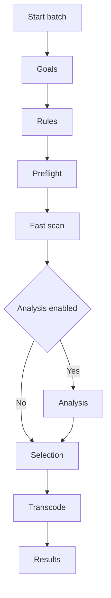

# Normalization Verification + Batch Wizard Redesign — Implementation Plan

## Executive summary (key decisions)

1. **Do not verify loudness during batch scan by default.** Batch scan stays “fast scan” (ffprobe-level) only; loudness verification is moved to an explicit, optional **Analysis** step in a wizard.
2. **Add a reusable verification layer** that can be used in three modes: verify-only, verify-then-normalize, and normalize-without-verify.
3. **Introduce an analysis cache** (persisted locally) keyed by file identity + analysis settings so repeated runs avoid re-decoding.
4. **Avoid duplicate decodes** when verifying then normalizing the same file by reusing loudnorm pass-1 measurements (and/or the cached measurement) when building loudnorm pass-2.
5. **Auto-download behavior uses USDB Syncer normalization state + addon config**:
   - If USDB Syncer is configured to normalize and addon is configured to “Match USDB defaults”, addon will **skip verify + normalize**.
   - If USDB Syncer is not normalizing but addon is normalizing, addon will **verify and normalize**.
   - If USDB Syncer is normalizing but addon targets differ, addon will **verify and transcode only when out-of-tolerance**.
6. **Default tolerance preset is Balanced** (per your guidance); advanced users can override with explicit values.

This plan references current code entry points such as [`process_audio()`](transcoder.py:41) and [`analyze_loudnorm_two_pass()`](audio_normalizer.py:134), and existing UI orchestration patterns like [`BatchTranscodeOrchestrator`](batch_orchestrator.py:224) and [`BackupDialogOrchestrator`](backup_dialog_orchestrator.py:87).

---

## A) Architecture & Design

### A1. Where to add verification logic (files/functions)

**Goal:** add loudness verification without turning batch scan into a full decode.

Proposed components:

1. **Core verification module (new)**
   - New file: `loudness_verifier.py`
   - Responsibilities:
     - Run analysis (loudnorm pass 1) with optional progress
     - Evaluate measurements against tolerances
     - Produce a structured result object used by both auto-download and batch.

2. **Cache module (new)**
   - New file: `analysis_cache.py`
   - Responsibilities:
     - Persist and load loudnorm measurements
     - Invalidate on file change / settings change
     - Provide “get-or-compute” primitives.

3. **Integration points**
   - Auto-download processing path: wherever audio processing is triggered today (likely via addon hooks; final decision requires locating the entry point in this repo).
   - Audio transcode/normalize decision: refactor [`process_audio()`](transcoder.py:41) skip logic to call verification when configured.
   - Batch scan path: keep current scan worker in [`ScanWorker.run()`](batch_orchestrator.py:129) fast; add optional analysis phase later.

Concrete code touchpoints:

- Replace “assume normalized when format matches” in [`process_audio()`](transcoder.py:41) for loudnorm with:
  - quick decision: is verification enabled?
  - if yes: verify via `loudness_verifier` (cache-backed)
  - if within tolerance: skip transcode
  - else: proceed to normalization/encode.

### A2. Reusable verification structure (verify-only vs verify-then-normalize)

Define a small set of domain dataclasses (new) to make verification reusable:

- `LoudnessTargets` (maps 1:1 to loudnorm user targets)
  - Can reuse/alias existing [`LoudnormTargets`](audio_normalizer.py:30) or wrap it to keep boundaries clear.
- `LoudnessTolerances`
  - Integrated LUFS tolerance (±)
  - True peak tolerance (allowed overshoot above target ceiling)
  - LRA tolerance (±)
- `LoudnessAnalysisResult`
  - Measurements (I/TP/LRA/thresh/offset) + metadata (analysis duration, ffmpeg version if available).
  - Can reuse existing [`LoudnormMeasurements`](audio_normalizer.py:39) inside.
- `LoudnessVerificationResult`
  - `status: within_tolerance | out_of_tolerance | unknown | failed | timeout`
  - `reasons: list[str]` (e.g., “I out of range by 2.1 LU”, “TP exceeds ceiling by 0.7 dB”)
  - includes the analysis result when available.

Key API shape:

- `analyze_loudness(path, targets, timeout, progress_cb=None) -> LoudnessAnalysisResult`
- `verify_loudness(analysis, targets, tolerances) -> LoudnessVerificationResult`
- `get_or_analyze_loudness(cache, key, compute_fn) -> LoudnessAnalysisResult`

This separates:

1) “measure” (expensive)
2) “evaluate” (cheap/pure)
3) “decide next action” (policy).

### A3. Caching design (format, keys, invalidation, location)

See section **F** for full cache spec. Summary:

- Storage: SQLite (single file) for concurrency safety and queryability.
- Key: file identity + analysis settings + loudnorm targets + tolerance preset id.
- Invalidation: on file size/mtime change and on settings hash mismatch.
- Location: addon data directory adjacent to config (same parent as [`get_config_path()`](config.py:156)).

### A4. Avoid duplicate decodes when verifying then normalizing

Current behavior:

- [`maybe_apply_audio_normalization()`](audio_normalizer.py:241) always triggers pass-1 analysis when loudnorm normalization is applied.

New behavior:

1. If verification ran first and produced a `LoudnormMeasurements`, reuse it when building pass-2 filter via [`build_loudnorm_pass2_filter()`](audio_normalizer.py:202).
2. If verification did not run but cache contains valid measurements, reuse cache.
3. Only run pass-1 if neither verification nor cache provides a valid measurement.

Implementation approach:

- Add a new overload-style helper:
  - `maybe_apply_audio_normalization(..., precomputed_meas: LoudnormMeasurements | None = None)`
  - or introduce `apply_loudnorm_pass2(..., meas)` and keep the existing function delegating.

### A5. Wizard architecture (dialogs, state, navigation)

Two viable architectures:

1. **Qt-native wizard** using `QWizard` + `QWizardPage`.
   - Pros: built-in Back/Next/Cancel, page lifecycle, validation.
   - Cons: may need styling to match existing dialogs.

2. **Orchestrator-driven wizard** following [`BackupDialogOrchestrator`](backup_dialog_orchestrator.py:87) patterns.
   - Pros: consistent with current addon architecture.
   - Cons: implementing Back requires explicit state snapshots.

Recommendation: **orchestrator-driven wizard** for consistency, but implement each “step” as a small dialog with Back/Next buttons and keep a state object.

Wizard state (new file `batch_wizard_state.py`):

- `BatchWizardState`
  - `cfg_snapshot` (copy of TranscoderConfig used for this run)
  - `scan_results` (fast scan list)
  - `candidates_by_song` (grouped structure)
  - `analysis_plan` (which files to analyze)
  - `analysis_results` (cache-backed measurements + verification result)
  - `selection` (final selected items)
  - `run_mode` (transcode-only vs verify+transcode)
  - `tolerance_preset` + optional custom tolerances
  - `cancellation_flags` (analysis canceled, run canceled)

Navigation rules:

- Back returns to prior step and reuses stored state (no re-scan unless requested).
- Next validates current step requirements (e.g., preflight must have enough disk; analysis step optional).
- Cancel cleanly aborts any running worker, closes wizard, and does not mutate library.

---

## B) Configuration & Settings

### B1. New config options

Keep config changes minimal and user-friendly. Add fields with safe defaults to keep backward compatibility (unknown fields already ignored in [`_parse_config()`](config.py:225)).

Changes to make:

1. **No verification enablement settings**
   - **Auto-download verification** is driven exclusively by the established policy matrix (USDB Syncer normalization state vs addon settings). There is no user toggle.
   - **Batch verification/analysis** is an explicit choice inside the batch wizard (user opt-in per run), not a persistent setting.

2. **Tolerance preset selector (only)**
   - Add a single preset selector (no advanced custom tolerances):
     - `audio_normalization_verification_tolerance_preset: Literal['strict','balanced','relaxed'] = 'balanced'`
   - This preset is used by:
     - auto-download verification (when verification occurs per policy)
     - batch wizard verification when the user opts into analysis.

3. **No cache control settings**
   - Cache is always on (indefinite until file changes), with no user-exposed on/off or size controls.
   - Instead, add a **log warning** when the cache becomes excessively large (see section **F6**).

### B2. Wizard preferences storage (remember last choices)

The wizard should remember last selections for convenience **without introducing global enable/disable toggles**.

Proposed: store in config under a new lightweight section:

- New dataclass `BatchWizardPreferences` under `TranscoderConfig`:
  - `last_enable_analysis: bool` (default false)
  - `last_analyze_scope: str` (e.g., analyze only audio candidates vs all matching-format audio files)
  - `last_default_selection_filter: str` (e.g., select only out-of-tolerance)

Note: tolerance preset is stored in [`AudioConfig`](config.py:67) and reused across auto-download and batch.

### B3. Configurable thresholds vs smart defaults

User-facing default is presets only; no custom numeric overrides.

Preset values (aligned to your research summary):

| Preset | Integrated LUFS tolerance | True peak tolerance | LRA tolerance |
|---|---:|---:|---:|
| Strict | ±1.0 LU | +0.3 dB | ±2 LU |
| Balanced (default) | ±1.5 LU | +0.5 dB | ±3 LU |
| Relaxed | ±2.0 LU | +0.8 dB | ±4 LU |

Interpretation rules:

- Integrated loudness: `abs(measured_I - target_I) <= tol_lufs`
- True peak: `measured_TP <= target_TP + tol_tp_db` (more negative is always OK)
- LRA: `abs(measured_LRA - target_LRA) <= tol_lra`

---

## C) Implementation phases (incremental PRs)

Complexity = implementation + testing + refactor scope. No time estimates included.

| Phase | Deliverable | Depends on | Complexity | Risk | Independently testable |
|---|---|---|---|---|---|
| 1 | Core verification API + evaluation logic | none | Medium | Medium | Yes (unit tests for evaluator) |
| 2 | Cache infrastructure (SQLite) + get-or-compute | 1 | Medium | Medium | Yes (cache hit/miss/invalidation tests) |
| 3 | Integrate into auto-download path policy | 1–2 | Medium | High | Partially (needs integration harness) |
| 4 | Refactor loudnorm normalization to reuse measurements | 1–2 | Medium | Medium | Yes (unit + small integration) |
| 5 | Wizard framework + state container + navigation (includes initial UI copy + tooltips for all new navigation controls) | none | Large | Medium | Yes (UI smoke + state unit tests) |
| 6 | Optional analysis phase worker + progress UI (includes tooltips/help text for analysis scope/options) | 5 + 1–2 | Large | High | Yes (simulated analysis) |
| 7 | Selection UI redesign (tree view grouped by song) (includes tooltips for new filters/status indicators) | 5 | Large | Medium | Yes (UI tests/manual QA) |
| 8 | Integrate wizard → transcode phase with cached analysis reuse (ensure any user-visible status text/tooltips remain accurate) | 4–7 | Large | High | Partial (end-to-end) |
| 9 | Settings UI updates for verification + presets + cache (includes tooltip updates for impacted existing settings + tooltips for new controls) | 1–2 | Medium | Low | Yes |
| 10 | Documentation updates (markdown docs + in-UI tooltips/help text review) | all relevant | Small | Low | Yes |

Documentation/tooltip integration note:

- Any phase that introduces or changes UI behavior must treat **tooltips and UI copy** as part of the deliverable (not a follow-up).
- Any phase that introduces new controls must include adding tooltips for those controls.
- Tech Writer work must include a sweep of **tooltips + UI text**, not only markdown documentation files.

---

## D) Specific code changes (files, new classes, integration)

### D1. New files to create

1. `loudness_verifier.py`
   - `@dataclass LoudnessTolerances`
   - `@dataclass LoudnessAnalysisMeta` (optional)
   - `@dataclass LoudnessVerificationResult`
   - `def evaluate_loudness(meas, targets, tolerances) -> LoudnessVerificationResult`
   - `def analyze_loudness_with_progress(...)` (optional; may delegate to existing analysis without progress initially)

2. `analysis_cache.py`
   - `class AnalysisCache` (SQLite-backed)
   - `def compute_file_fingerprint(path) -> FileFingerprint`
   - `def make_analysis_settings_hash(cfg, targets, preset/custom) -> str`

3. `batch_wizard_state.py`
   - `@dataclass BatchWizardState`
   - grouping structures for candidates-by-song

4. Wizard UI files (see section E)

### D2. Existing files to modify

1. Audio normalization + verification integration
   - Update skip logic in [`process_audio()`](transcoder.py:41)
     - Replace “assume normalized if format matches” for loudnorm with verify-if-enabled
     - Respect your USDB Syncer normalization matrix (see section E2)

2. Loudnorm analysis reuse
   - Update [`maybe_apply_audio_normalization()`](audio_normalizer.py:241)
     - Accept an optional precomputed measurement
     - Prefer cached or provided measurements to avoid rerunning pass-1

3. Config schema
   - Extend [`AudioConfig`](config.py:67)
     - Add verification + tolerance preset + cache settings
   - Keep schema version stable if possible (pre-release guidance in [`TranscoderConfig`](config.py:139)); rely on default values.

4. Settings UI
   - Update [`TranscoderSettingsDialog`](settings_gui.py:35)
     - Add “Normalization verification” section under Audio
     - Preset dropdown + advanced toggle
     - Auto-download verification checkbox
     - Cache enable toggle

5. Batch orchestration
   - Refactor [`BatchTranscodeOrchestrator.start_batch_workflow()`](batch_orchestrator.py:243)
     - Replace scan→preview→transcode with wizard entry point.
   - Keep existing batch worker and progress dialog (reuse [`BatchWorker`](batch_worker.py:77) and [`BatchProgressDialog`](batch_progress_dialog.py:25)).

### D3. Backward compatibility considerations

- Existing configs load safely because:
  - new fields have defaults
  - unknown fields are ignored in [`_parse_config()`](config.py:225)
- Avoid breaking old behavior by:
  - defaulting verification OFF on batch
  - defaulting auto-download verification OFF unless explicitly enabled.

---

## E) Wizard design details (batch)

### E1. Dialog/page classes to create

Recommended step dialogs (new files):

1. `batch_wizard_goals_dialog.py`
   - `class BatchWizardGoalsDialog(QDialog)`
   - Choose high-level goal: “Transcode only” vs “Verify normalization” vs “Verify and fix”

2. `batch_wizard_rules_dialog.py`
   - Decide decision rules + preset tolerances
   - Provide help text for presets

3. `batch_wizard_preflight_dialog.py`
   - Shows library size, estimated work, free space checks
   - Lets user opt into the Analysis phase (default OFF)

4. `batch_wizard_scan_dialog.py`
   - Runs fast scan (existing scan worker) and shows progress
   - Produces initial candidate list (codec/container mismatches, forced transcodes)

5. `batch_wizard_analysis_dialog.py`
   - Optional loudnorm analysis phase (progress UI)
   - Scope options: analyze only audio candidates vs analyze all matching-format audio files

6. `batch_wizard_selection_dialog.py`
   - Tree view grouped by song (audio/video children)
   - Default selection rules (e.g., preselect only out-of-tolerance)

7. `batch_wizard_transcode_dialog.py`
   - May reuse [`BatchProgressDialog`](batch_progress_dialog.py:25) directly rather than new dialog

8. `batch_wizard_results_dialog.py`
   - May reuse [`BatchResultsDialog`](batch_results_dialog.py:1) but extend columns for verification status if needed

### E2. Wizard state/data flow between steps

State object is created once and passed to each step:

- Step reads/writes `BatchWizardState` fields
- Orchestrator is the only controller that decides the next step.

Suggested orchestrator:

- New file: `batch_wizard_orchestrator.py`
- `class BatchWizardOrchestrator` similar to [`BatchTranscodeOrchestrator`](batch_orchestrator.py:224)

Mermaid (high-level):

### E3. Back/Next navigation

- Each wizard dialog provides:
  - Back, Next, Cancel
- Orchestrator calls `dialog.exec()` and checks which button was clicked.
- On Back:
  - go to previous step without recomputing expensive work
  - do not discard scan results unless user explicitly requests rescan.

### E4. Integration with existing orchestrator patterns

Mirror the staged workflow pattern in [`BackupDialogOrchestrator`](backup_dialog_orchestrator.py:87):

- Each step is a modal dialog.
- Long-running work uses a QThread worker + a progress dialog.

Batch differences:

- Batch wizard needs Back/Next, so dialogs must return “navigation intent” rather than only accept/reject.

### E5. Analysis progress vs transcode progress

Transcode progress today parses ffmpeg stderr in [`_execute_ffmpeg()`](transcoder.py:594).

Analysis progress options:

1. Minimal viable: show “current file / total” and an indeterminate bar per file.
2. Better: run ffmpeg analysis in streaming mode (`subprocess.Popen`) and parse `time=` lines similarly to `_execute_ffmpeg`.

Recommendation: implement (1) first for stability; add (2) as enhancement.

### E6. Preflight time estimates

Provide estimates without heavy computation:

- For analysis step: estimate `sum(duration_seconds)` assuming ~1.0x realtime **unless we have locally learned decode performance data** (see below).
- For transcode: reuse existing `BatchEstimator` where applicable.
- Optionally “calibrate” analysis speed by sampling N files (user opt-in).

#### E6a. Improve analysis ETA using locally learned decode performance (from auto-download)

Yes: the analysis step can produce significantly better ETAs by learning the machine’s typical loudnorm analysis speed over time, without any user input and without any network telemetry.

**Where the data comes from**

- Whenever the addon actually runs loudnorm analysis (ffmpeg pass 1), we already know:
  - media duration (from [`analyze_audio()`](audio_analyzer.py:43))
  - wall-clock elapsed time for analysis (measure in code around [`analyze_loudnorm_two_pass()`](audio_normalizer.py:134))
- Compute a per-file throughput metric:
  - `analysis_speed_x = media_duration_seconds / analysis_wall_seconds`
    - e.g., `0.6x` means slower than realtime; `2.0x` means faster.

**How to store the learned performance (local-only)**

- Store in the same SQLite cache file (no new user settings) as an aggregate table, e.g. `analysis_speed_stats`:
  - `count`
  - `ema_speed_x` (exponential moving average)
  - `p10_speed_x` (conservative) or a small histogram/quantile sketch
  - `updated_at`
- Optionally keep separate stats per container/codec (AAC vs MP3 can vary), but start with a single global stat to keep it simple.

**How to use it in the wizard preflight/analysis step**

- If we have enough samples (e.g., `count >= 5`):
  - estimate analysis wall time as:
    - `eta_seconds = sum(durations) / conservative_speed_x`
  - choose `conservative_speed_x` as:
    - `min(1.0, p10_speed_x)` if p10 exists, else
    - `min(1.0, ema_speed_x * 0.8)` as a conservative guard.
- If we have no samples yet:
  - fall back to `1.0x realtime` and label it as a default estimate.

**UX phrasing**

- In Preflight and Analysis steps, show:
  - “Estimated analysis time: 1h 20m (based on your machine’s previous analysis speed)”
  - or “Estimated analysis time: 1h 20m (default estimate; will improve after some processing)”.

**Why auto-download is a good source**

- Many users populate libraries via auto-download before ever running batch.
- Auto-download analysis is performed on a smaller set of files, giving early signal about CPU/IO performance.

**Edge cases**

- Ignore outliers (e.g., extremely short files, or timeouts) so the learned estimate doesn’t become pessimistic or overly optimistic.
- If the system is under heavy load, EMA will adapt; the conservative factor ensures we don’t promise too much.

#### E6b. Extend learned performance to video batch estimates

Yes, the same “learn your machine” concept can be extended to video batch ETA, but it should be treated as a **separate, later enhancement** because video speed is influenced by many more variables than loudnorm analysis.

**Recommended approach (incremental, low-risk):**

1. Keep the existing heuristic estimator in [`BatchEstimator`](batch_estimator.py:1) as the baseline.
2. Record actual observed transcode throughput for each completed video in batch runs:
   - `transcode_speed_x = duration_seconds / actual_wall_seconds`
3. Store aggregate stats keyed by a small “pipeline signature” so we don’t mix incompatible data:
   - codec + hw encode on/off + hw accel name + key quality knobs (e.g., CRF/preset) + resolution mode.
4. In wizard preflight/progress displays, adjust the heuristic estimate using a conservative learned multiplier:
   - `adjusted_eta = heuristic_eta / conservative_speed_x` (or multiply by a ratio if the heuristic is already in seconds).

**Why video needs a signature:**

- Hardware encoding vs software changes throughput dramatically.
- Preset and scaling settings strongly affect speed.

This remains compatible with the “no extra user settings” requirement and improves accuracy over time without breaking the current estimator.

---

## F) Caching system design

### F1. Storage format

**SQLite** (via Python `sqlite3`) stored as a single file:

- Safer than JSON under concurrent reads/writes.
- Supports indexed lookups.
- Easy corruption recovery (delete + rebuild).

### F2. Schema / fields

Table `loudnorm_analysis`:

- `id` (INTEGER PRIMARY KEY)
- `path` (TEXT) — resolved absolute path string
- `size_bytes` (INTEGER)
- `mtime_ns` (INTEGER)
- `settings_hash` (TEXT) — hash of targets + method + preset/custom tolerances
- `measured_I` (REAL)
- `measured_TP` (REAL)
- `measured_LRA` (REAL)
- `measured_thresh` (REAL)
- `offset` (REAL)
- `raw_json` (TEXT) — optional serialized loudnorm JSON
- `created_at` (INTEGER) — unix epoch seconds

Index:

- unique index on `(path, size_bytes, mtime_ns, settings_hash)`

Additional table `performance_stats` (universal; local-only):

- `id` (INTEGER PRIMARY KEY)
- `kind` (TEXT) — e.g., `audio_loudnorm_analysis`, `video_transcode`
- `signature` (TEXT) — empty for audio analysis, pipeline signature for video
- `count` (INTEGER)
- `ema_speed_x` (REAL)
- `p10_speed_x` (REAL, nullable) or store a small histogram blob
- `updated_at` (INTEGER)

### F3. Cache file location

**Do not store the cache inside the addon package directory.** The addon may run from a zip, and that location may be read-only.

Store the cache alongside the addon config in the **USDB Syncer application data directory** (user-writable):

- `AppPaths.db.parent / transcoder_cache.sqlite`
  - This is the same parent directory used by [`get_config_path()`](config.py:156), which resolves to `AppPaths.db.parent / transcoder_config.json`.
  - This remains writable regardless of whether the addon code is loaded from a zip.

### F4. Cache key design

`FileFingerprint`:

- real path (string)
- size in bytes
- mtime in ns

`settings_hash` inputs:

- normalization method (`loudnorm` or `replaygain`)
- loudnorm targets (I/TP/LRA)
- tolerance preset id (or explicit tolerances)
- optional: ffmpeg version string (if easily available)

### F5. Invalidation rules

Cache entry is valid if:

- path matches AND size_bytes matches AND mtime_ns matches
- settings_hash matches current run

If user changes targets or preset, hash changes and cache miss occurs.

### F6. Cache management

You requested “keep indefinitely until file changes”. Implement:

- No automatic eviction by default.
- No user-facing cache controls (no on/off, no clear button).
- Add a log warning when the cache is getting excessively large.

Suggested warning heuristics (pick one or combine):

- If cache DB file size exceeds a threshold (e.g., 250 MB), log `WARNING` with the path and size.
- If row count exceeds a threshold (e.g., 200000 entries), log `WARNING` with guidance that deleting the cache file will rebuild it.

Implementation point: this warning can run:

- once per app start
- or once per batch wizard analysis start
- or when inserting a new row.

Corruption handling:

- If SQLite open fails or schema mismatch, log warning and rebuild by renaming old file.

### F6a. Prune cache entries for deleted songs (USDB Syncer integration)

Yes, we can reduce cache bloat by pruning analysis rows for songs that no longer exist locally.

Constraints:

- We cannot modify USDB Syncer, so we should not depend on new base-project APIs.
- The addon may or may not have access to a “song deleted” hook/event.

Recommended design (works even without an explicit hook):

1. **Store `song_id` in cache rows**
   - Extend `loudnorm_analysis` table with `song_id` (TEXT or INTEGER depending on the USDB Syncer type).
   - Populate it when we have the song context (auto-download and batch both know the song).
   - If a path is analyzed without a song context, allow `song_id` to be NULL.

2. **Opportunistic pruning pass** (no hook required)
   - Add `AnalysisCache.prune_orphans()` that:
     - connects to the USDB Syncer DB (same pattern as in [`ScanWorker.run()`](batch_orchestrator.py:129))
     - builds a set of valid `song_id`s (or queries existence per id)
     - deletes cache rows where `song_id` is not present in the DB.
   - Trigger this pruning:
     - once per app launch (preferred)
     - or at the start of the batch wizard
     - and optionally on a low-frequency timer (e.g., no more than once per day).

3. **If USDB Syncer exposes a deletion hook/event** (optional enhancement)
   - Subscribe to that hook from the addon and call `AnalysisCache.delete_by_song_id(song_id)`.
   - Keep the opportunistic pruning anyway as a fallback.

4. **Secondary pruning by filesystem**
   - Independently of song deletion, delete entries whose `path` no longer exists.
   - This handles cases where files are removed outside of USDB Syncer.

Rationale:

- This preserves the “keep indefinitely until file changes” behavior for active libraries.
- It prevents the cache from accumulating stale rows when users prune their libraries.

### F8. Is the cache audio-only or universal?

Use a **single universal SQLite file** for the addon, but keep it logically separated:

- Audio loudness measurements: `loudnorm_analysis`
- Learned performance aggregates: `performance_stats`

Rationale:

- Single file simplifies deployment and avoids multiple “state files” scattered in the app data dir.
- SQLite tables isolate concerns cleanly.
- The “universal DB” still allows keeping video-related learning optional: if we never write video stats, only audio tables grow.

### F7. When the cache is populated (auto-download vs batch)

The cache is populated **whenever loudnorm analysis is actually executed**, regardless of entry point:

- **Auto-download path:** if the policy matrix in the section **Policy matrix: auto-download decision rules** causes the addon to run loudness verification (loudnorm pass 1), the resulting measurements **are written to the cache** (unless caching is disabled).
- **Batch wizard:** the cache is populated during the optional **Analysis** step (and also during transcode if normalization requires loudnorm pass 1 and no cached measurement exists).

The cache is **not** populated during the batch **Fast scan** step, because fast scan must remain ffprobe-level only (no full decode).

---

## G) Edge cases & error handling

### G1. Verification timeout (300s)

Current analysis timeout behavior is capped to 300 seconds in [`maybe_apply_audio_normalization()`](audio_normalizer.py:241).

Plan:

- Keep a separate verification timeout setting (default 300s).
- If timeout occurs:
  - mark verification status = `timeout`
  - wizard selection defaults to “include for transcode” only if the chosen goal is “verify and fix”; otherwise prompt user.

### G2. FFmpeg analysis failure

- If [`analyze_loudnorm_two_pass()`](audio_normalizer.py:134) raises:
  - treat as verification failure with reason
  - do not write cache entry
  - in batch wizard, allow user to continue (skip/force transcode).

### G3. Cache corrupted or stale

- On DB read errors: disable cache for this run, show non-blocking warning, offer “Clear cache”.
- On stale: invalidated by fingerprint/settings hash.

### G4. User changes targets between runs

- settings_hash ensures cached analysis won’t be reused incorrectly.
- Wizard should show that changing targets increases analysis work.

### G5. ReplayGain vs loudnorm verification

Policy (treat both methods as “real verification”, not just tag presence):

Verification should run for **both** normalization methods. The verification **analysis engine** is chosen based on the *target normalization method* for this run:

1. Target method = **EBU R128 loudnorm**
   - Verification analysis = run loudnorm pass-1 via [`analyze_loudnorm_two_pass()`](audio_normalizer.py:134) (analysis-only).
   - Verification evaluation = compare measured I/TP/LRA against targets using the chosen preset tolerances.

2. Target method = **ReplayGain**
   - Verification analysis = run an FFmpeg ReplayGain analysis pass using the `replaygain` filter (analysis-only).
     - The goal is to compute the canonical ReplayGain values for the file (track gain/peak and optionally album gain/peak if supported).
   - Verification evaluation = compare:
     - existing ReplayGain tags already present in the file (read via ffprobe, see [`has_replaygain_tags()`](audio_analyzer.py:240) for discovery patterns)
     - against newly computed ReplayGain values from the filter.
   - If tags are missing, corrupted, or differ beyond the preset tolerance, treat as **out-of-tolerance** and schedule “fix” (retag during transcode/tagging phase).

Design notes:

- This approach keeps behavior consistent: both methods perform an expensive “compute and compare” verification when verification is requested.
- For ReplayGain targets, the “fix” action is typically **writing/updating tags** (not rewriting audio samples), but whether that requires re-encode depends on container support; treat that as an implementation detail.

Implementation sketch (new helper)

- New function `analyze_replaygain()` (planned location: `loudness_verifier.py`) that:
  - runs `ffmpeg -i <input> -af replaygain -f null -` (or a metadata-emitting variant)
  - parses the computed gain/peak values from ffmpeg output or emitted metadata
  - returns `ReplayGainMeasurements` for caching and evaluation.

Caching implication:

- Cache needs to store both “loudnorm measurements” and “replaygain measurements” keyed by method + settings hash.

### G6. User cancels wizard midway

- Cancel during scan: stop worker, exit without changes.
- Cancel during analysis: stop analysis worker, keep already-computed results cached, return to Selection step with partial results flagged.
- Cancel during transcode: reuse existing abort mechanism via [`BatchAbortRegistry`](batch_worker.py:29) and show rollback prompt if enabled.

---

## H) Testing strategy

### H1. Verification logic tests

- Pure unit tests for evaluator:
  - within tolerance
  - out of tolerance for I/TP/LRA
  - boundary conditions (exactly at tolerance)

### H2. Cache tests

- Use a temp SQLite path:
  - cache miss → compute → write
  - cache hit returns same values without running compute
  - invalidation when mtime changes
  - invalidation when settings hash changes
  - corrupted DB file triggers rebuild behavior

### H3. Wizard navigation + state tests

- Unit test state transitions (no UI) by simulating step outputs.
- Manual QA scripts:
  - back/next does not lose scan results
  - cancel at each step leaves library unchanged

### H4. Performance testing

- Synthetic run on a small subset:
  - 20 files with known duration distribution
  - measure analysis throughput
- Batch performance budget validation:
  - confirm scan remains near-instant for format matches when analysis disabled.

### H5. Testing without huge libraries

- Add a developer-only “sample N songs” option in batch wizard (optional) to exercise flows.
- Use small audio fixtures (short MP3/AAC) committed to a test folder if repo policy allows; otherwise generate in CI.

---

## I) User experience details

### I1. Communicating verification

- In wizard preflight and analysis:
  - explain that loudness analysis requires full decode (~realtime)
  - provide an estimate and allow opt-out

### I2. Progress feedback during verification

- At minimum: “Analyzing file X of N: filename” + elapsed + ETA based on average.
- If enhanced parsing is implemented: per-file percent derived from time/duration.

### I3. Explaining tolerances (non-LUFS users)

Use plain language:

- Strict: “closest match to target loudness”
- Balanced: “recommended; differences are rarely noticeable”
- Relaxed: “fastest and least picky; good for noisy rooms”

Include tooltips referencing “audible difference threshold” rather than standards jargon.

### I6. UI text and tooltip guidelines

Tooltips and in-UI help text are **first-class documentation** for this addon.

Requirements:

1. **Tooltips must be updated where needed for existing settings affected by changes**
   - If the behavior/meaning of an existing setting changes (or it gains new constraints), update its tooltip in the same PR.

2. **Tooltips must be added to all new settings and controls**
   - Every new checkbox, dropdown, button, status badge/label, and filter control introduced by the wizard redesign must have a tooltip.

3. **Tooltip consistency**
   - Match existing addon patterns for style, format, and level of detail.
   - In this repo, tooltips are often HTML snippets with bold headers and line breaks (see examples in [`TranscoderSettingsDialog`](settings_gui.py:35)).

4. **UI voice and terminology consistency**
   - Use the same terms everywhere (settings, wizard pages, docs): e.g., “Analysis” vs “Verification”, “Tolerance preset”, “Out of tolerance”.
   - Prefer plain language first, then technical terms when needed.
   - Keep phrasing consistent across settings UI, wizard pages, and markdown docs.

5. **Scope and depth guidance**
   - Tooltip content should answer: what it does, when to use it, and a key tradeoff.
   - Avoid re-stating the label only; add the missing context.
   - Keep tooltips short enough to scan; defer deeper explanations to markdown docs.

### I4. Settings UI design

Add a compact “Verification” row under Audio Normalization:

- Dropdown: “Verification tolerance: Strict / Balanced / Relaxed”

No additional enable/disable toggles are shown in settings:

- Auto-download verification is driven by the policy matrix.
- Batch verification is opted into per run in the wizard.

### I5. Wizard UI patterns

- Keep each step short with a single decision.
- Always show “What happens next” text.
- Default choices preserve performance (analysis OFF).

---

## J) Documentation updates

Files likely needing updates:

- [`docs/AUDIO_TRANSCODING.md`](docs/AUDIO_TRANSCODING.md:1)
- [`docs/BATCH_TRANSCODING.md`](docs/BATCH_TRANSCODING.md:1)
- [`docs/CONFIGURATION.md`](docs/CONFIGURATION.md:1)

### J0. Tooltip and in-UI documentation requirements (must-do)

Tooltips are part of the user-facing documentation surface.

- **Update tooltips** where existing settings are affected by verification/wizard changes.
- **Add tooltips** for all new settings and controls.
- **Tooltip consistency:** ensure tooltip style, format, and level of detail matches existing patterns in the addon.
- **UI text consistency:** wizard page copy, settings labels, and tooltips must use consistent voice and terminology.

Where tooltips likely live today (non-exhaustive):

- Settings dialog: [`settings_gui.py`](settings_gui.py:1)
- Addon actions (menu items / toolbar actions): [`__init__.py`](__init__.py:1)
- Batch dialogs with summary/controls: [`batch_preview_dialog.py`](batch_preview_dialog.py:1), [`batch_results_dialog.py`](batch_results_dialog.py:1)
- New wizard dialogs introduced by this plan (each new dialog must define its tooltips alongside UI construction).

### J1. New/updated sections

1. Audio transcoding docs
   - “Normalization verification”
   - “Tolerance presets”
   - “Cache behavior”

2. Batch transcoding docs
   - Replace linear flow description with wizard flow
   - Explain optional analysis step and why it’s optional

3. Configuration docs
   - Document new config keys with defaults
   - Explain interaction with USDB Syncer normalization settings

### J2. Tech Writer responsibilities (docs + tooltips)

Any phase that includes Tech Writer work must include:

- Review/update markdown docs (as listed above)
- Review/update/add tooltips in the UI implementation
- Review UI strings for consistency (labels, headings, button text, status text) so the voice/terminology matches existing addon patterns

---

## Policy matrix: auto-download decision rules (USDB Syncer vs addon)

This encodes your required behavior.

Definitions:

- USDB Normalize Enabled: user enabled normalization in USDB Syncer (method/targets are USDB-defined)
- Addon Normalize Enabled: [`audio_normalization_enabled`](config.py:97) is enabled
- Addon Uses USDB Defaults: [`audio_normalization_use_usdb_defaults`](config.py:104) is true

Rules:

1. USDB Normalize Enabled AND Addon Uses USDB Defaults → **skip verify + skip normalize**
2. USDB Normalize Disabled AND Addon Normalize Enabled → **verify + normalize (if out-of-tolerance)**
3. USDB Normalize Enabled AND Addon Normalize Enabled AND Addon Uses USDB Defaults is false → **verify; transcode only if out-of-tolerance**
4. Addon Normalize Disabled → no normalization; verification can be disabled (default).

Implementation note: exact access to “USDB Normalize Enabled” must be discovered in the USDB Syncer API; likely via `usdb_syncer.settings` referenced in [`batch_orchestrator.py`](batch_orchestrator.py:15).

---

## What not to do (out of scope)

1. Do not run loudnorm pass-1 analysis during batch scan by default (violates scan performance budget).
2. Do not add migration tooling for existing users (pre-release rule); only add safe defaults.
3. Do not modify the USDB Syncer base project (per constraints).
4. Do not attempt “perfect mastering” features (multi-pass limiting, gating, album loudness, etc.).
5. Do not introduce non-standard dependencies; keep to stdlib + ffmpeg.
6. Do not add user-facing cache management UI or config toggles; only log warnings for oversized caches.
