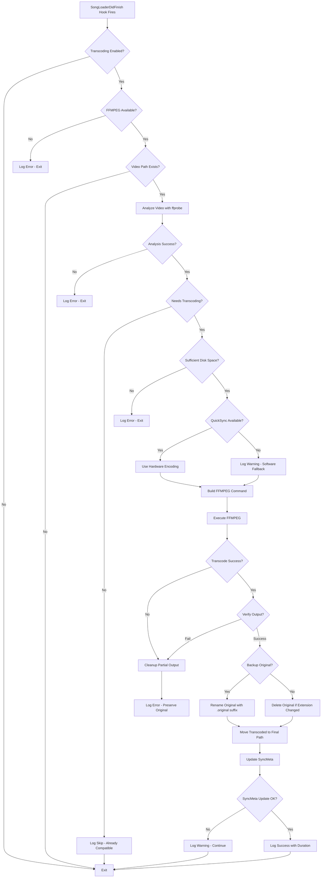

# Video Transcoder Addon Architecture for USDB_Syncer

## Executive Summary

This document defines the comprehensive architecture for a video transcoding addon that automatically converts downloaded video files to formats compatible with Unity Engine 6 (version 6000.2.9f1). The addon integrates with USDB_Syncer's hook system and leverages Intel QuickSync hardware acceleration for optimal performance.

## Key Design Decisions & Answers to Architecture Questions

### Q1: Hardware Decoders with QuickSync?
**Yes.** The architecture uses a full QSV pipeline - both decode AND encode. When transcoding H.264/H.265/VP9 input with QuickSync enabled, the corresponding QSV decoder is used (`h264_qsv`, `hevc_qsv`, `vp9_qsv`) before the QSV encoder. This provides maximum acceleration by keeping the video data in GPU memory throughout the pipeline.

### Q2: Flexibility for New Encoding Formats?
**Yes.** The architecture uses a **Codec Handler Registry** pattern with an abstract base class. Adding new codecs requires:
1. Creating a new handler class implementing `CodecHandler`
2. Registering it in the `CODEC_REGISTRY`

No modifications to core transcoding logic required.

### Q3: Integration with USDB_Syncer Encoding Settings?
**Yes.** The addon can optionally inherit settings from USDB_Syncer's [`VideoResolution`](src/usdb_syncer/settings.py:577) and [`VideoFps`](src/usdb_syncer/settings.py:625) settings. A configuration option `use_usdb_settings: true` will read max resolution and fps from USDB_Syncer settings rather than addon config.

### Q4: Batch Transcoding Existing Library?
**Yes.** The architecture includes:
- A `batch` module with functions for library-wide transcoding
- GUI integration via [`MainWindowDidLoad`](src/usdb_syncer/gui/hooks.py) hook to add a menu item
- Progress tracking and batch processing logic
- The same core transcoding engine is reused

### Q5: Reusability for Audio Transcoding?
**Yes.** The architecture separates:
- **Analysis** (ffprobe-based, media-agnostic)
- **Command Building** (codec-specific handlers)
- **Execution** (subprocess wrapper)
- **SyncMeta Updates** (resource type parameterized)

An audio transcoder addon would implement audio-specific `CodecHandler` subclasses and use similar patterns.

### Q6: Cross-Platform and Multiple Hardware Acceleration?
**Yes.** The architecture includes a **Hardware Acceleration Registry** pattern that supports:
- **Intel QuickSync** (Windows, Linux) - Primary target
- **NVIDIA NVENC** (Windows, Linux) - Future support
- **AMD AMF/VCE** (Windows, Linux) - Future support
- **Apple VideoToolbox** (macOS) - Future support
- **VAAPI** (Linux) - Future support
- **Software fallback** (all platforms) - Always available

The hardware acceleration is abstracted behind a `HardwareAccelerator` interface, allowing easy addition of new acceleration methods without changing codec handlers.

---

## 1. Addon Structure

### 1.1 File Organization

The addon uses a **package structure** for better organization and maintainability:

```
addons/
└── unity_video_transcoder/
    ├── __init__.py           # Entry point, hook registration
    ├── config.py             # Configuration management
    ├── analyzer.py           # Video/audio analysis with ffprobe
    ├── codecs/               # Codec handler registry (extensible)
    │   ├── __init__.py       # Registry and base class
    │   ├── h264.py           # H.264 codec handler
    │   ├── vp8.py            # VP8 codec handler
    │   └── hevc.py           # HEVC codec handler
    ├── transcoder.py         # Core transcoding engine
    ├── sync_meta_updater.py  # SyncMeta update logic
    ├── batch.py              # Batch transcoding for existing library
    └── config.json           # Default configuration file
```

### 1.2 Entry Point: `__init__.py`

Following the pattern from [`addons/demo.py`](addons/demo.py:1):

```python
"""Unity Video Transcoder Addon - Converts videos for Unity Engine 6 compatibility."""

from __future__ import annotations

import logging
from pathlib import Path
from typing import TYPE_CHECKING

from usdb_syncer import hooks, logger, utils
from usdb_syncer.logger import song_logger

if TYPE_CHECKING:
    from usdb_syncer.usdb_song import UsdbSong

# Import addon modules
from . import config, analyzer, transcoder, sync_meta_updater

_logger = logging.getLogger(__name__)


def on_download_finished(song: UsdbSong) -> None:
    """Process video after song download completes."""
    slog = song_logger(song.song_id)
    
    try:
        # Load configuration
        cfg = config.load_config()
        
        if not cfg.enabled:
            slog.debug("Video transcoding disabled in config")
            return
        
        # Check FFMPEG availability
        if not utils.ffmpeg_is_available():
            slog.error("FFMPEG not available - skipping video transcode")
            return
        
        # Get video path
        if not song.sync_meta:
            slog.debug("No sync_meta - skipping video transcode")
            return
            
        video_path = song.sync_meta.video_path()
        if not video_path or not video_path.exists():
            slog.debug("No video file found - skipping transcode")
            return
        
        # Analyze and potentially transcode
        from .transcoder import process_video
        process_video(song, video_path, cfg, slog)
        
    except Exception as e:
        slog.error(f"Video transcode failed: {type(e).__name__}: {e}")
        _logger.debug(None, exc_info=True)


# Register hook on module import
hooks.SongLoaderDidFinish.subscribe(on_download_finished)
_logger.info("Unity Video Transcoder addon loaded")
```

### 1.3 Module Dependencies

```python
# Required from usdb_syncer
from usdb_syncer import hooks, utils
from usdb_syncer.logger import song_logger, SongLogger
from usdb_syncer.sync_meta import SyncMeta, Resource, ResourceFile
from usdb_syncer.usdb_song import UsdbSong
from usdb_syncer.db import JobStatus

# Standard library
import subprocess
import json
import shutil
import time
from pathlib import Path
from dataclasses import dataclass
from typing import Optional
```

---

## 2. Configuration System

### 2.1 Configuration File Location

The config file is stored in the addon directory:
- Path: `{AppPaths.addons}/unity_video_transcoder/config.json`
- Alternative location if addons are in a zip: adjacent to the addon package

### 2.2 Complete Configuration Schema

```json
{
  "version": 1,
  "enabled": true,
  
  "target_codec": "h264",
  
  "h264": {
    "profile": "baseline",
    "level": "3.1",
    "pixel_format": "yuv420p",
    "crf": 18,
    "preset": "slow",
    "use_quicksync": true,
    "container": "mp4"
  },
  
  "vp8": {
    "crf": 10,
    "cpu_used": 1,
    "container": "webm"
  },
  
  "hevc": {
    "profile": "main",
    "level": "4.0",
    "pixel_format": "yuv420p",
    "crf": 22,
    "preset": "slow",
    "use_quicksync": true,
    "container": "mp4"
  },
  
  "general": {
    "hardware_acceleration": true,
    "hardware_decode": true,
    "backup_original": true,
    "backup_suffix": ".original",
    "max_resolution": null,
    "max_fps": null,
    "max_bitrate_kbps": null,
    "timeout_seconds": 600,
    "verify_output": true,
    "min_free_space_mb": 500
  },
  
  "usdb_integration": {
    "use_usdb_resolution": false,
    "use_usdb_fps": false
  }
}
```

### 2.3 USDB_Syncer Settings Integration

When `usdb_integration.use_usdb_resolution` or `use_usdb_fps` is enabled, the addon reads from USDB_Syncer settings:

```python
# Reading USDB_Syncer video settings
from usdb_syncer import settings

def get_effective_resolution(cfg: TranscoderConfig) -> tuple[int, int] | None:
    """Get max resolution from config or USDB settings."""
    if cfg.usdb_integration.use_usdb_resolution:
        res = settings.get_video_resolution()  # Returns VideoResolution enum
        return (res.width(), res.height())
    return cfg.general.max_resolution

def get_effective_fps(cfg: TranscoderConfig) -> int | None:
    """Get max FPS from config or USDB settings."""
    if cfg.usdb_integration.use_usdb_fps:
        fps = settings.get_video_fps()  # Returns VideoFps enum
        return fps.value
    return cfg.general.max_fps
```

This allows users to:
1. Use consistent settings between download and transcode
2. Override USDB settings with addon-specific values when needed

### 2.3 Configuration Data Classes

```python
# config.py
from __future__ import annotations

import json
from dataclasses import dataclass, field
from pathlib import Path
from typing import Optional, Literal
import logging

_logger = logging.getLogger(__name__)

TargetCodec = Literal["h264", "vp8", "hevc"]
H264Profile = Literal["baseline", "main", "high"]
HEVCProfile = Literal["main", "main10"]


@dataclass
class H264Config:
    profile: H264Profile = "baseline"
    level: str = "3.1"
    pixel_format: str = "yuv420p"
    crf: int = 18
    preset: str = "slow"
    use_quicksync: bool = True
    container: str = "mp4"


@dataclass
class VP8Config:
    crf: int = 10
    cpu_used: int = 1  # 0-5, lower = better quality, slower
    container: str = "webm"


@dataclass
class HEVCConfig:
    profile: HEVCProfile = "main"
    level: str = "4.0"
    pixel_format: str = "yuv420p"
    crf: int = 22
    preset: str = "slow"
    use_quicksync: bool = True
    container: str = "mp4"


@dataclass
class GeneralConfig:
    hardware_acceleration: bool = True
    backup_original: bool = True
    backup_suffix: str = ".original"
    max_resolution: Optional[tuple[int, int]] = None
    max_bitrate_kbps: Optional[int] = None
    timeout_seconds: int = 600
    verify_output: bool = True
    min_free_space_mb: int = 500


@dataclass
class TranscoderConfig:
    version: int = 1
    enabled: bool = True
    target_codec: TargetCodec = "h264"
    h264: H264Config = field(default_factory=H264Config)
    vp8: VP8Config = field(default_factory=VP8Config)
    hevc: HEVCConfig = field(default_factory=HEVCConfig)
    general: GeneralConfig = field(default_factory=GeneralConfig)


def get_config_path() -> Path:
    """Return path to config file in addon directory."""
    return Path(__file__).parent / "config.json"


def load_config() -> TranscoderConfig:
    """Load configuration from JSON file, creating defaults if needed."""
    config_path = get_config_path()
    
    if not config_path.exists():
        cfg = TranscoderConfig()
        save_config(cfg)
        _logger.info(f"Created default config at {config_path}")
        return cfg
    
    try:
        with config_path.open("r", encoding="utf-8") as f:
            data = json.load(f)
        return _parse_config(data)
    except (json.JSONDecodeError, KeyError, TypeError) as e:
        _logger.warning(f"Config parse error, using defaults: {e}")
        return TranscoderConfig()


def save_config(cfg: TranscoderConfig) -> None:
    """Save configuration to JSON file."""
    config_path = get_config_path()
    with config_path.open("w", encoding="utf-8") as f:
        json.dump(_config_to_dict(cfg), f, indent=2)


def _parse_config(data: dict) -> TranscoderConfig:
    """Parse raw JSON dict into TranscoderConfig."""
    return TranscoderConfig(
        version=data.get("version", 1),
        enabled=data.get("enabled", True),
        target_codec=data.get("target_codec", "h264"),
        h264=H264Config(**data.get("h264", {})),
        vp8=VP8Config(**data.get("vp8", {})),
        hevc=HEVCConfig(**data.get("hevc", {})),
        general=GeneralConfig(**data.get("general", {})),
    )


def _config_to_dict(cfg: TranscoderConfig) -> dict:
    """Convert TranscoderConfig to JSON-serializable dict."""
    from dataclasses import asdict
    return asdict(cfg)
```

---

## 3. Codec Handler Registry (Extensibility)

### 3.1 Abstract Base Class

The codec handler pattern enables easy addition of new encoding formats:

```python
# codecs/__init__.py
"""Codec handler registry for extensible format support."""
from __future__ import annotations

from abc import ABC, abstractmethod
from dataclasses import dataclass
from pathlib import Path
from typing import TYPE_CHECKING, Dict, Type

if TYPE_CHECKING:
    from ..analyzer import VideoInfo
    from ..config import TranscoderConfig


@dataclass
class CodecCapabilities:
    """Describes a codec handler's capabilities."""
    name: str                          # e.g., "h264", "vp8", "hevc"
    display_name: str                  # e.g., "H.264/AVC"
    container: str                     # Default container extension
    supports_quicksync_encode: bool    # Can use QSV encoder
    supports_quicksync_decode: bool    # Can use QSV decoder for this format
    unity_compatible: bool             # Supported by Unity 6 VideoPlayer


class CodecHandler(ABC):
    """Abstract base class for codec handlers."""
    
    @classmethod
    @abstractmethod
    def capabilities(cls) -> CodecCapabilities:
        """Return codec capabilities."""
        ...
    
    @classmethod
    @abstractmethod
    def build_encode_command(
        cls,
        input_path: Path,
        output_path: Path,
        video_info: "VideoInfo",
        cfg: "TranscoderConfig",
        use_hw_accel: bool,
    ) -> list[str]:
        """Build FFMPEG command for encoding to this codec."""
        ...
    
    @classmethod
    @abstractmethod
    def is_compatible(cls, video_info: "VideoInfo") -> bool:
        """Check if input video is already in this codec's target format."""
        ...
    
    @classmethod
    def get_qsv_decoder(cls, video_info: "VideoInfo") -> str | None:
        """Return QSV decoder name for input codec, or None."""
        codec_to_decoder = {
            "h264": "h264_qsv",
            "hevc": "hevc_qsv",
            "h265": "hevc_qsv",
            "vp9": "vp9_qsv",
            "mpeg2video": "mpeg2_qsv",
            "vc1": "vc1_qsv",
            "av1": "av1_qsv",  # Newer Intel GPUs
            "mjpeg": "mjpeg_qsv",
        }
        return codec_to_decoder.get(video_info.codec_name.lower())


# Global codec registry
CODEC_REGISTRY: Dict[str, Type[CodecHandler]] = {}


def register_codec(handler: Type[CodecHandler]) -> Type[CodecHandler]:
    """Decorator to register a codec handler."""
    caps = handler.capabilities()
    CODEC_REGISTRY[caps.name] = handler
    return handler


def get_codec_handler(codec_name: str) -> Type[CodecHandler] | None:
    """Get handler for a codec by name."""
    return CODEC_REGISTRY.get(codec_name)


def list_available_codecs() -> list[CodecCapabilities]:
    """List all registered codec capabilities."""
    return [h.capabilities() for h in CODEC_REGISTRY.values()]
```

### 3.2 Example H.264 Handler Implementation

```python
# codecs/h264.py
"""H.264/AVC codec handler."""
from pathlib import Path
from typing import TYPE_CHECKING

from . import CodecHandler, CodecCapabilities, register_codec

if TYPE_CHECKING:
    from ..analyzer import VideoInfo
    from ..config import TranscoderConfig


@register_codec
class H264Handler(CodecHandler):
    """Handler for H.264/AVC encoding."""
    
    @classmethod
    def capabilities(cls) -> CodecCapabilities:
        return CodecCapabilities(
            name="h264",
            display_name="H.264/AVC",
            container="mp4",
            supports_quicksync_encode=True,
            supports_quicksync_decode=True,
            unity_compatible=True,
        )
    
    @classmethod
    def is_compatible(cls, video_info: "VideoInfo") -> bool:
        """Check if already H.264 with Unity-compatible settings."""
        if video_info.codec_name.lower() not in ("h264", "avc"):
            return False
        if video_info.pixel_format != "yuv420p":
            return False
        if video_info.profile and video_info.profile.lower() not in ("baseline", "main", "high"):
            return False
        return True
    
    @classmethod
    def build_encode_command(
        cls,
        input_path: Path,
        output_path: Path,
        video_info: "VideoInfo",
        cfg: "TranscoderConfig",
        use_hw_accel: bool,
    ) -> list[str]:
        h264_cfg = cfg.h264
        cmd = ["ffmpeg", "-y", "-hide_banner"]
        
        # Hardware decoder if available and enabled
        if use_hw_accel and cfg.general.hardware_decode:
            if qsv_decoder := cls.get_qsv_decoder(video_info):
                cmd.extend(["-c:v", qsv_decoder])
        
        cmd.extend(["-i", str(input_path)])
        
        # Encoder selection
        if use_hw_accel and h264_cfg.use_quicksync:
            cmd.extend([
                "-c:v", "h264_qsv",
                "-preset", h264_cfg.preset,
                "-profile:v", h264_cfg.profile,
                "-level", h264_cfg.level,
                "-global_quality", str(h264_cfg.crf),
                "-look_ahead", "1",
            ])
        else:
            cmd.extend([
                "-c:v", "libx264",
                "-preset", h264_cfg.preset,
                "-profile:v", h264_cfg.profile,
                "-level:v", h264_cfg.level,
                "-crf", str(h264_cfg.crf),
            ])
        
        # Common settings for Unity compatibility
        cmd.extend([
            "-pix_fmt", h264_cfg.pixel_format,
            "-vsync", "cfr",
            "-video_track_timescale", "90000",
        ])
        
        # Audio handling
        if video_info.has_audio:
            cmd.extend(["-c:a", "copy"])
        else:
            cmd.extend(["-an"])
        
        cmd.extend(["-movflags", "+faststart", str(output_path)])
        return cmd
```

### 3.3 Adding a New Codec

To add support for a new codec (e.g., AV1):

```python
# codecs/av1.py
"""AV1 codec handler - Example of adding new format support."""
from pathlib import Path
from typing import TYPE_CHECKING

from . import CodecHandler, CodecCapabilities, register_codec

if TYPE_CHECKING:
    from ..analyzer import VideoInfo
    from ..config import TranscoderConfig


@register_codec
class AV1Handler(CodecHandler):
    """Handler for AV1 encoding."""
    
    @classmethod
    def capabilities(cls) -> CodecCapabilities:
        return CodecCapabilities(
            name="av1",
            display_name="AV1",
            container="mp4",
            supports_quicksync_encode=True,  # Arc GPUs and newer
            supports_quicksync_decode=True,
            unity_compatible=False,  # Not supported by Unity 6
        )
    
    @classmethod
    def is_compatible(cls, video_info: "VideoInfo") -> bool:
        return video_info.codec_name.lower() == "av1"
    
    @classmethod
    def build_encode_command(
        cls,
        input_path: Path,
        output_path: Path,
        video_info: "VideoInfo",
        cfg: "TranscoderConfig",
        use_hw_accel: bool,
    ) -> list[str]:
        # Implementation for AV1 encoding
        cmd = ["ffmpeg", "-y", "-hide_banner"]
        
        if use_hw_accel and cfg.general.hardware_decode:
            if qsv_decoder := cls.get_qsv_decoder(video_info):
                cmd.extend(["-c:v", qsv_decoder])
        
        cmd.extend(["-i", str(input_path)])
        
        if use_hw_accel:
            cmd.extend(["-c:v", "av1_qsv", "-preset", "slow"])
        else:
            cmd.extend(["-c:v", "libaom-av1", "-crf", "30", "-cpu-used", "4"])
        
        # Audio and output
        if video_info.has_audio:
            cmd.extend(["-c:a", "copy"])
        else:
            cmd.extend(["-an"])
        
        cmd.extend(["-movflags", "+faststart", str(output_path)])
        return cmd
```

Then import in `codecs/__init__.py`:
```python
# Auto-register codecs via decorator
from . import h264, vp8, hevc  # av1 if needed
```

---

## 3B. Hardware Acceleration Registry (Cross-Platform)

### 3B.1 Supported Hardware Acceleration APIs

| API | Platform | GPU Vendor | Encoder Suffix | Decoder Suffix |
|-----|----------|------------|----------------|----------------|
| **QuickSync** | Windows, Linux | Intel | `_qsv` | `_qsv` |
| **NVENC/NVDEC** | Windows, Linux | NVIDIA | `_nvenc` | `_cuvid` |
| **AMF/VCE** | Windows, Linux | AMD | `_amf` | `_amf` |
| **VideoToolbox** | macOS | Apple Silicon/Intel | `_videotoolbox` | `_videotoolbox` |
| **VAAPI** | Linux | Intel/AMD | `_vaapi` | `_vaapi` |
| **Software** | All | CPU | `lib*` | auto |

### 3B.2 Hardware Accelerator Abstract Class

```python
# hwaccel/__init__.py
"""Hardware acceleration registry for cross-platform support."""
from __future__ import annotations

from abc import ABC, abstractmethod
from dataclasses import dataclass
from typing import Dict, Type, TYPE_CHECKING
import sys

if TYPE_CHECKING:
    from ..analyzer import VideoInfo


@dataclass
class HWAccelCapabilities:
    """Describes a hardware accelerator's capabilities."""
    name: str                          # e.g., "quicksync", "nvenc", "videotoolbox"
    display_name: str                  # e.g., "Intel QuickSync"
    platforms: tuple[str, ...]         # e.g., "win32", "linux"
    h264_encoder: str | None           # e.g., "h264_qsv"
    hevc_encoder: str | None           # e.g., "hevc_qsv"
    vp8_encoder: str | None            # VP8 hardware support is rare
    vp9_encoder: str | None            # e.g., "vp9_qsv"
    av1_encoder: str | None            # e.g., "av1_qsv" for newer hardware


class HardwareAccelerator(ABC):
    """Abstract base class for hardware acceleration backends."""
    
    @classmethod
    @abstractmethod
    def capabilities(cls) -> HWAccelCapabilities:
        """Return accelerator capabilities."""
        ...
    
    @classmethod
    @abstractmethod
    def is_available(cls) -> bool:
        """Check if this accelerator is available on current system."""
        ...
    
    @classmethod
    @abstractmethod
    def get_decoder(cls, video_info: "VideoInfo") -> str | None:
        """Get hardware decoder for input codec, or None if unsupported."""
        ...
    
    @classmethod
    def supports_platform(cls) -> bool:
        """Check if current platform is supported."""
        caps = cls.capabilities()
        return sys.platform in caps.platforms


# Global registry
HWACCEL_REGISTRY: Dict[str, Type[HardwareAccelerator]] = {}


def register_hwaccel(accel: Type[HardwareAccelerator]) -> Type[HardwareAccelerator]:
    """Decorator to register a hardware accelerator."""
    caps = accel.capabilities()
    HWACCEL_REGISTRY[caps.name] = accel
    return accel


def detect_available_accelerators() -> list[HWAccelCapabilities]:
    """Detect all available hardware accelerators on this system."""
    available = []
    for accel in HWACCEL_REGISTRY.values():
        if accel.supports_platform() and accel.is_available():
            available.append(accel.capabilities())
    return available


def get_best_accelerator(codec: str) -> Type[HardwareAccelerator] | None:
    """Get the best available accelerator for a codec.
    
    Priority order: QuickSync > NVENC > AMF > VideoToolbox > VAAPI > None
    """
    priority = ["quicksync", "nvenc", "amf", "videotoolbox", "vaapi"]
    
    for name in priority:
        if accel := HWACCEL_REGISTRY.get(name):
            if accel.supports_platform() and accel.is_available():
                caps = accel.capabilities()
                encoder = getattr(caps, f"{codec}_encoder", None)
                if encoder:
                    return accel
    return None
```

### 3B.3 QuickSync Accelerator Implementation

```python
# hwaccel/quicksync.py
"""Intel QuickSync hardware acceleration."""
import subprocess
from typing import TYPE_CHECKING

from usdb_syncer.utils import LinuxEnvCleaner
from . import HardwareAccelerator, HWAccelCapabilities, register_hwaccel

if TYPE_CHECKING:
    from ..analyzer import VideoInfo

# Cache availability check
_qsv_available: bool | None = None


@register_hwaccel
class QuickSyncAccelerator(HardwareAccelerator):
    """Intel QuickSync Video hardware acceleration."""
    
    @classmethod
    def capabilities(cls) -> HWAccelCapabilities:
        return HWAccelCapabilities(
            name="quicksync",
            display_name="Intel QuickSync",
            platforms=("win32", "linux"),
            h264_encoder="h264_qsv",
            hevc_encoder="hevc_qsv",
            vp8_encoder=None,  # VP8 QSV encode not widely supported
            vp9_encoder="vp9_qsv",  # Limited support
            av1_encoder="av1_qsv",  # Arc GPUs and newer
        )
    
    @classmethod
    def is_available(cls) -> bool:
        global _qsv_available
        if _qsv_available is not None:
            return _qsv_available
        
        # Test h264_qsv encoder
        cmd = [
            "ffmpeg", "-hide_banner",
            "-f", "lavfi", "-i", "nullsrc=s=64x64:d=0.1",
            "-c:v", "h264_qsv",
            "-f", "null", "-"
        ]
        try:
            with LinuxEnvCleaner() as env:
                result = subprocess.run(cmd, capture_output=True, timeout=10, env=env)
            _qsv_available = result.returncode == 0
        except Exception:
            _qsv_available = False
        
        return _qsv_available
    
    @classmethod
    def get_decoder(cls, video_info: "VideoInfo") -> str | None:
        codec_map = {
            "h264": "h264_qsv",
            "hevc": "hevc_qsv",
            "h265": "hevc_qsv",
            "vp9": "vp9_qsv",
            "av1": "av1_qsv",
            "mpeg2video": "mpeg2_qsv",
            "vc1": "vc1_qsv",
            "mjpeg": "mjpeg_qsv",
        }
        return codec_map.get(video_info.codec_name.lower())
```

### 3B.4 NVIDIA NVENC Accelerator (Future)

```python
# hwaccel/nvenc.py
"""NVIDIA NVENC hardware acceleration."""
from . import HardwareAccelerator, HWAccelCapabilities, register_hwaccel


@register_hwaccel
class NVENCAccelerator(HardwareAccelerator):
    """NVIDIA NVENC/NVDEC hardware acceleration."""
    
    @classmethod
    def capabilities(cls) -> HWAccelCapabilities:
        return HWAccelCapabilities(
            name="nvenc",
            display_name="NVIDIA NVENC",
            platforms=("win32", "linux"),
            h264_encoder="h264_nvenc",
            hevc_encoder="hevc_nvenc",
            vp8_encoder=None,
            vp9_encoder=None,  # NVENC doesn't support VP9
            av1_encoder="av1_nvenc",  # RTX 40 series
        )
    
    @classmethod
    def is_available(cls) -> bool:
        # Test h264_nvenc encoder
        cmd = [
            "ffmpeg", "-hide_banner",
            "-f", "lavfi", "-i", "nullsrc=s=64x64:d=0.1",
            "-c:v", "h264_nvenc",
            "-f", "null", "-"
        ]
        try:
            from usdb_syncer.utils import LinuxEnvCleaner
            with LinuxEnvCleaner() as env:
                import subprocess
                result = subprocess.run(cmd, capture_output=True, timeout=10, env=env)
            return result.returncode == 0
        except Exception:
            return False
    
    @classmethod
    def get_decoder(cls, video_info) -> str | None:
        # NVDEC uses cuvid decoders
        codec_map = {
            "h264": "h264_cuvid",
            "hevc": "hevc_cuvid",
            "h265": "hevc_cuvid",
            "vp9": "vp9_cuvid",
            "av1": "av1_cuvid",
            "mpeg2video": "mpeg2_cuvid",
            "vc1": "vc1_cuvid",
        }
        return codec_map.get(video_info.codec_name.lower())
```

### 3B.5 Apple VideoToolbox Accelerator (macOS)

```python
# hwaccel/videotoolbox.py
"""Apple VideoToolbox hardware acceleration."""
from . import HardwareAccelerator, HWAccelCapabilities, register_hwaccel


@register_hwaccel
class VideoToolboxAccelerator(HardwareAccelerator):
    """Apple VideoToolbox hardware acceleration for macOS."""
    
    @classmethod
    def capabilities(cls) -> HWAccelCapabilities:
        return HWAccelCapabilities(
            name="videotoolbox",
            display_name="Apple VideoToolbox",
            platforms=("darwin",),
            h264_encoder="h264_videotoolbox",
            hevc_encoder="hevc_videotoolbox",
            vp8_encoder=None,
            vp9_encoder=None,
            av1_encoder=None,  # Not yet supported
        )
    
    @classmethod
    def is_available(cls) -> bool:
        import sys
        if sys.platform != "darwin":
            return False
        
        cmd = [
            "ffmpeg", "-hide_banner",
            "-f", "lavfi", "-i", "nullsrc=s=64x64:d=0.1",
            "-c:v", "h264_videotoolbox",
            "-f", "null", "-"
        ]
        try:
            import subprocess
            result = subprocess.run(cmd, capture_output=True, timeout=10)
            return result.returncode == 0
        except Exception:
            return False
    
    @classmethod
    def get_decoder(cls, video_info) -> str | None:
        # VideoToolbox uses same name for decode
        codec_map = {
            "h264": "h264_videotoolbox",
            "hevc": "hevc_videotoolbox",
            "h265": "hevc_videotoolbox",
        }
        return codec_map.get(video_info.codec_name.lower())
```

### 3B.6 Updated Configuration for Multi-Platform Hardware Acceleration

```json
{
  "general": {
    "hardware_acceleration": true,
    "hardware_decode": true,
    "preferred_accelerator": "auto",
    "accelerator_priority": ["quicksync", "nvenc", "amf", "videotoolbox", "vaapi"],
    "fallback_to_software": true
  }
}
```

### 3B.7 File Organization Update

```
addons/
└── unity_video_transcoder/
    ├── __init__.py
    ├── config.py
    ├── analyzer.py
    ├── codecs/
    │   ├── __init__.py
    │   ├── h264.py
    │   ├── vp8.py
    │   └── hevc.py
    ├── hwaccel/               # NEW: Hardware acceleration backends
    │   ├── __init__.py        # Registry and base class
    │   ├── quicksync.py       # Intel QuickSync
    │   ├── nvenc.py           # NVIDIA NVENC (future)
    │   ├── videotoolbox.py    # Apple VideoToolbox (future)
    │   ├── amf.py             # AMD AMF (future)
    │   └── vaapi.py           # Linux VAAPI (future)
    ├── transcoder.py
    ├── sync_meta_updater.py
    ├── batch.py
    └── config.json
```

---

## 5. Core Transcoding Engine

### 5.1 Video Analysis Module (`analyzer.py`)

```python
"""Video analysis using ffprobe."""
from __future__ import annotations

import subprocess
import json
import logging
from dataclasses import dataclass
from pathlib import Path
from typing import Optional

from usdb_syncer.utils import LinuxEnvCleaner

_logger = logging.getLogger(__name__)


@dataclass
class VideoInfo:
    """Information about a video file."""
    codec_name: str                    # e.g., "h264", "vp9", "hevc"
    codec_long_name: str               # e.g., "H.264 / AVC"
    container: str                     # e.g., "mp4", "webm", "mkv"
    width: int
    height: int
    pixel_format: str                  # e.g., "yuv420p"
    frame_rate: float                  # fps
    duration_seconds: float
    bitrate_kbps: Optional[int]        # may be N/A for some formats
    has_audio: bool
    audio_codec: Optional[str]         # e.g., "aac", "opus", "vorbis"
    profile: Optional[str]             # e.g., "Main", "Baseline"
    level: Optional[str]               # e.g., "3.1"

    @property 
    def is_h264(self) -> bool:
        return self.codec_name.lower() in ("h264", "avc")
    
    @property
    def is_vp8(self) -> bool:
        return self.codec_name.lower() == "vp8"
    
    @property
    def is_vp9(self) -> bool:
        return self.codec_name.lower() == "vp9"
    
    @property
    def is_hevc(self) -> bool:
        return self.codec_name.lower() in ("hevc", "h265")
    
    @property
    def is_av1(self) -> bool:
        return self.codec_name.lower() == "av1"


def analyze_video(path: Path) -> Optional[VideoInfo]:
    """Analyze video file with ffprobe.
    
    Returns None if analysis fails or file is not a valid video.
    """
    cmd = [
        "ffprobe",
        "-v", "quiet",
        "-print_format", "json",
        "-show_format",
        "-show_streams",
        str(path)
    ]
    
    try:
        with LinuxEnvCleaner() as env:
            result = subprocess.run(
                cmd,
                capture_output=True,
                text=True,
                timeout=30,
                env=env
            )
        
        if result.returncode != 0:
            _logger.warning(f"ffprobe failed for {path}: {result.stderr}")
            return None
        
        data = json.loads(result.stdout)
        return _parse_ffprobe_output(data, path)
        
    except subprocess.TimeoutExpired:
        _logger.error(f"ffprobe timeout for {path}")
        return None
    except json.JSONDecodeError as e:
        _logger.error(f"ffprobe output parse error: {e}")
        return None
    except Exception as e:
        _logger.error(f"ffprobe error: {type(e).__name__}: {e}")
        return None


def _parse_ffprobe_output(data: dict, path: Path) -> Optional[VideoInfo]:
    """Parse ffprobe JSON output into VideoInfo."""
    streams = data.get("streams", [])
    format_info = data.get("format", {})
    
    # Find video stream
    video_stream = None
    audio_stream = None
    
    for stream in streams:
        codec_type = stream.get("codec_type")
        if codec_type == "video" and not video_stream:
            video_stream = stream
        elif codec_type == "audio" and not audio_stream:
            audio_stream = stream
    
    if not video_stream:
        _logger.warning(f"No video stream found in {path}")
        return None
    
    # Parse frame rate (handle fractions like "30000/1001")
    fps_str = video_stream.get("r_frame_rate", "0/1")
    try:
        num, den = map(int, fps_str.split("/"))
        frame_rate = num / den if den != 0 else 0.0
    except (ValueError, ZeroDivisionError):
        frame_rate = 0.0
    
    # Parse bitrate
    bitrate = None
    if "bit_rate" in video_stream:
        try:
            bitrate = int(video_stream["bit_rate"]) // 1000
        except (ValueError, TypeError):
            pass
    elif "bit_rate" in format_info:
        try:
            bitrate = int(format_info["bit_rate"]) // 1000
        except (ValueError, TypeError):
            pass
    
    # Duration
    duration = 0.0
    if "duration" in format_info:
        try:
            duration = float(format_info["duration"])
        except (ValueError, TypeError):
            pass
    
    # Container from filename extension
    container = path.suffix.lstrip(".").lower()
    
    return VideoInfo(
        codec_name=video_stream.get("codec_name", "unknown"),
        codec_long_name=video_stream.get("codec_long_name", "Unknown"),
        container=container,
        width=int(video_stream.get("width", 0)),
        height=int(video_stream.get("height", 0)),
        pixel_format=video_stream.get("pix_fmt", "unknown"),
        frame_rate=frame_rate,
        duration_seconds=duration,
        bitrate_kbps=bitrate,
        has_audio=audio_stream is not None,
        audio_codec=audio_stream.get("codec_name") if audio_stream else None,
        profile=video_stream.get("profile"),
        level=str(video_stream.get("level")) if video_stream.get("level") else None,
    )


def needs_transcoding(info: VideoInfo, target_codec: str) -> bool:
    """Determine if video needs transcoding for target codec.
    
    Returns True if video should be transcoded.
    """
    if target_codec == "h264":
        # Already H.264 with Unity-compatible settings
        if info.is_h264 and info.pixel_format == "yuv420p":
            if info.profile and info.profile.lower() in ("baseline", "main", "high"):
                return False  # Already compatible
        return True
    
    elif target_codec == "vp8":
        # Already VP8
        if info.is_vp8:
            return False
        return True
    
    elif target_codec == "hevc":
        # Already HEVC with compatible settings
        if info.is_hevc and info.pixel_format == "yuv420p":
            return False
        return True
    
    return True
```

### 5.2 FFMPEG Command Builder (`transcoder.py`)

```python
"""FFMPEG transcoding engine with QuickSync support."""
from __future__ import annotations

import subprocess
import shutil
import time
import os
import logging
from pathlib import Path
from typing import Optional, TYPE_CHECKING
from dataclasses import dataclass

from usdb_syncer.utils import LinuxEnvCleaner, get_mtime

if TYPE_CHECKING:
    from usdb_syncer.usdb_song import UsdbSong
    from usdb_syncer.logger import SongLogger
    from .config import TranscoderConfig
    from .analyzer import VideoInfo

_logger = logging.getLogger(__name__)


@dataclass
class TranscodeResult:
    """Result of a transcode operation."""
    success: bool
    output_path: Optional[Path]
    original_backed_up: bool
    backup_path: Optional[Path]
    duration_seconds: float
    error_message: Optional[str]


# Cache QuickSync availability
_quicksync_available: Optional[bool] = None


def check_quicksync_available() -> bool:
    """Check if Intel QuickSync is available on this system."""
    global _quicksync_available
    
    if _quicksync_available is not None:
        return _quicksync_available
    
    # Test h264_qsv encoder availability
    cmd = [
        "ffmpeg",
        "-hide_banner",
        "-f", "lavfi",
        "-i", "nullsrc=s=256x256:d=1",
        "-c:v", "h264_qsv",
        "-f", "null",
        "-"
    ]
    
    try:
        with LinuxEnvCleaner() as env:
            result = subprocess.run(
                cmd,
                capture_output=True,
                timeout=10,
                env=env
            )
        _quicksync_available = result.returncode == 0
    except Exception:
        _quicksync_available = False
    
    _logger.info(f"QuickSync available: {_quicksync_available}")
    return _quicksync_available


def build_h264_command(
    input_path: Path,
    output_path: Path,
    video_info: VideoInfo,
    cfg: TranscoderConfig,
) -> list[str]:
    """Build FFMPEG command for H.264 encoding."""
    h264_cfg = cfg.h264
    use_qsv = cfg.general.hardware_acceleration and h264_cfg.use_quicksync and check_quicksync_available()
    
    cmd = ["ffmpeg", "-y", "-hide_banner"]
    
    # Hardware-accelerated decoding if using QSV
    if use_qsv and video_info.is_h264:
        cmd.extend(["-c:v", "h264_qsv"])  # QSV decoder for H.264 input
    elif use_qsv and video_info.is_hevc:
        cmd.extend(["-c:v", "hevc_qsv"])  # QSV decoder for HEVC input
    
    cmd.extend(["-i", str(input_path)])
    
    # Video encoding
    if use_qsv:
        cmd.extend([
            "-c:v", "h264_qsv",
            "-preset", h264_cfg.preset,
            "-profile:v", h264_cfg.profile,
            "-level", h264_cfg.level,
            "-global_quality", str(h264_cfg.crf),  # QSV uses global_quality instead of CRF
        ])
    else:
        # Software encoding fallback
        cmd.extend([
            "-c:v", "libx264",
            "-preset", h264_cfg.preset,
            "-profile:v", h264_cfg.profile,
            "-level:v", h264_cfg.level,
            "-crf", str(h264_cfg.crf),
        ])
    
    # Common video settings for Unity compatibility
    cmd.extend([
        "-pix_fmt", h264_cfg.pixel_format,
        "-vsync", "cfr",           # Constant frame rate required
        "-video_track_timescale", "90000",  # Standard timescale
    ])
    
    # Bitrate cap if configured
    if cfg.general.max_bitrate_kbps:
        cmd.extend(["-maxrate", f"{cfg.general.max_bitrate_kbps}k", "-bufsize", f"{cfg.general.max_bitrate_kbps * 2}k"])
    
    # Resolution cap if configured
    if cfg.general.max_resolution:
        max_w, max_h = cfg.general.max_resolution
        cmd.extend(["-vf", f"scale='min({max_w},iw)':min'({max_h},ih)':force_original_aspect_ratio=decrease"])
    
    # Audio handling - passthrough if exists
    if video_info.has_audio:
        cmd.extend(["-c:a", "copy"])
    else:
        cmd.extend(["-an"])  # No audio stream
    
    # Output container settings
    cmd.extend([
        "-movflags", "+faststart",  # Enable streaming/seeking
        str(output_path)
    ])
    
    return cmd


def build_vp8_command(
    input_path: Path,
    output_path: Path,
    video_info: VideoInfo,
    cfg: TranscoderConfig,
) -> list[str]:
    """Build FFMPEG command for VP8 encoding.
    
    Note: VP8 QuickSync support is very limited, typically software-only.
    """
    vp8_cfg = cfg.vp8
    
    cmd = ["ffmpeg", "-y", "-hide_banner"]
    cmd.extend(["-i", str(input_path)])
    
    # VP8 encoding (libvpx)
    cmd.extend([
        "-c:v", "libvpx",
        "-crf", str(vp8_cfg.crf),
        "-b:v", "0",              # Required for CRF mode
        "-cpu-used", str(vp8_cfg.cpu_used),
        "-deadline", "good",       # Balance quality/speed
        "-auto-alt-ref", "1",
        "-lag-in-frames", "16",
    ])
    
    # Bitrate cap if configured
    if cfg.general.max_bitrate_kbps:
        cmd.extend(["-maxrate", f"{cfg.general.max_bitrate_kbps}k", "-bufsize", f"{cfg.general.max_bitrate_kbps * 2}k"])
    
    # Audio - VP8/WebM typically uses Vorbis or Opus
    if video_info.has_audio:
        if video_info.audio_codec in ("vorbis", "opus"):
            cmd.extend(["-c:a", "copy"])
        else:
            cmd.extend(["-c:a", "libvorbis", "-q:a", "4"])
    else:
        cmd.extend(["-an"])
    
    cmd.append(str(output_path))
    return cmd


def build_hevc_command(
    input_path: Path,
    output_path: Path,
    video_info: VideoInfo,
    cfg: TranscoderConfig,
) -> list[str]:
    """Build FFMPEG command for HEVC/H.265 encoding."""
    hevc_cfg = cfg.hevc
    use_qsv = cfg.general.hardware_acceleration and hevc_cfg.use_quicksync and check_quicksync_available()
    
    cmd = ["ffmpeg", "-y", "-hide_banner"]
    
    # Hardware-accelerated decoding if using QSV
    if use_qsv and video_info.is_hevc:
        cmd.extend(["-c:v", "hevc_qsv"])
    elif use_qsv and video_info.is_h264:
        cmd.extend(["-c:v", "h264_qsv"])
    
    cmd.extend(["-i", str(input_path)])
    
    # Video encoding
    if use_qsv:
        cmd.extend([
            "-c:v", "hevc_qsv",
            "-preset", hevc_cfg.preset,
            "-profile:v", hevc_cfg.profile,
            "-global_quality", str(hevc_cfg.crf),
        ])
    else:
        cmd.extend([
            "-c:v", "libx265",
            "-preset", hevc_cfg.preset,
            "-profile:v", hevc_cfg.profile,
            "-crf", str(hevc_cfg.crf),
            "-tag:v", "hvc1",  # Apple compatibility tag
        ])
    
    # Common video settings
    cmd.extend([
        "-pix_fmt", hevc_cfg.pixel_format,
    ])
    
    # Bitrate cap
    if cfg.general.max_bitrate_kbps:
        cmd.extend(["-maxrate", f"{cfg.general.max_bitrate_kbps}k", "-bufsize", f"{cfg.general.max_bitrate_kbps * 2}k"])
    
    # Audio passthrough
    if video_info.has_audio:
        cmd.extend(["-c:a", "copy"])
    else:
        cmd.extend(["-an"])
    
    cmd.extend([
        "-movflags", "+faststart",
        str(output_path)
    ])
    
    return cmd


def process_video(
    song: UsdbSong,
    video_path: Path,
    cfg: TranscoderConfig,
    slog: SongLogger
) -> TranscodeResult:
    """Main entry point for video processing."""
    from .analyzer import analyze_video, needs_transcoding
    from .sync_meta_updater import update_sync_meta_video
    
    start_time = time.time()
    
    # Analyze video
    slog.info(f"Analyzing video: {video_path.name}")
    video_info = analyze_video(video_path)
    
    if not video_info:
        return TranscodeResult(
            success=False,
            output_path=None,
            original_backed_up=False,
            backup_path=None,
            duration_seconds=0,
            error_message="Failed to analyze video file"
        )
    
    slog.debug(f"Video analysis: codec={video_info.codec_name}, "
               f"resolution={video_info.width}x{video_info.height}, "
               f"has_audio={video_info.has_audio}")
    
    # Check if transcoding needed
    if not needs_transcoding(video_info, cfg.target_codec):
        slog.info(f"Video already in {cfg.target_codec} format - skipping transcode")
        return TranscodeResult(
            success=True,
            output_path=video_path,
            original_backed_up=False,
            backup_path=None,
            duration_seconds=time.time() - start_time,
            error_message=None
        )
    
    # Check disk space
    if not _check_disk_space(video_path, cfg.general.min_free_space_mb):
        return TranscodeResult(
            success=False,
            output_path=None,
            original_backed_up=False,
            backup_path=None,
            duration_seconds=0,
            error_message="Insufficient disk space for transcoding"
        )
    
    # Determine output path and container
    codec_cfg = getattr(cfg, cfg.target_codec)
    new_ext = f".{codec_cfg.container}"
    output_path = video_path.with_suffix(f".transcoding{new_ext}")
    
    # Build command
    cmd = _build_command(video_path, output_path, video_info, cfg)
    slog.debug(f"FFMPEG command: {' '.join(cmd)}")
    
    # Execute transcode
    try:
        result = _execute_ffmpeg(cmd, cfg.general.timeout_seconds, slog)
    except Exception as e:
        # Cleanup partial output
        if output_path.exists():
            output_path.unlink()
        return TranscodeResult(
            success=False,
            output_path=None,
            original_backed_up=False,
            backup_path=None,
            duration_seconds=time.time() - start_time,
            error_message=str(e)
        )
    
    if not result:
        if output_path.exists():
            output_path.unlink()
        return TranscodeResult(
            success=False,
            output_path=None,
            original_backed_up=False,
            backup_path=None,
            duration_seconds=time.time() - start_time,
            error_message="FFMPEG encoding failed"
        )
    
    # Verify output if configured
    if cfg.general.verify_output:
        output_info = analyze_video(output_path)
        if not output_info:
            output_path.unlink()
            return TranscodeResult(
                success=False,
                output_path=None,
                original_backed_up=False,
                backup_path=None,
                duration_seconds=time.time() - start_time,
                error_message="Transcoded output verification failed"
            )
    
    # Backup original if configured
    backup_path = None
    if cfg.general.backup_original:
        backup_path = video_path.with_suffix(video_path.suffix + cfg.general.backup_suffix)
        try:
            shutil.move(str(video_path), str(backup_path))
        except OSError as e:
            slog.warning(f"Could not backup original: {e}")
            backup_path = None
    
    # Move transcoded file to final location
    final_path = video_path.with_suffix(new_ext)
    
    # If not backing up and extension differs, remove original
    if not backup_path and video_path.suffix != new_ext and video_path.exists():
        video_path.unlink()
    
    shutil.move(str(output_path), str(final_path))
    
    # Update SyncMeta
    update_sync_meta_video(song, final_path, slog)
    
    duration = time.time() - start_time
    slog.info(f"Transcode completed in {duration:.1f}s: {final_path.name}")
    
    return TranscodeResult(
        success=True,
        output_path=final_path,
        original_backed_up=backup_path is not None,
        backup_path=backup_path,
        duration_seconds=duration,
        error_message=None
    )


def _build_command(
    input_path: Path,
    output_path: Path,
    video_info: VideoInfo,
    cfg: TranscoderConfig
) -> list[str]:
    """Build appropriate FFMPEG command based on target codec."""
    if cfg.target_codec == "h264":
        return build_h264_command(input_path, output_path, video_info, cfg)
    elif cfg.target_codec == "vp8":
        return build_vp8_command(input_path, output_path, video_info, cfg)
    elif cfg.target_codec == "hevc":
        return build_hevc_command(input_path, output_path, video_info, cfg)
    else:
        raise ValueError(f"Unknown target codec: {cfg.target_codec}")


def _execute_ffmpeg(cmd: list[str], timeout: int, slog: SongLogger) -> bool:
    """Execute FFMPEG command and handle output."""
    try:
        with LinuxEnvCleaner() as env:
            process = subprocess.run(
                cmd,
                capture_output=True,
                text=True,
                timeout=timeout,
                env=env
            )
        
        if process.returncode != 0:
            slog.error(f"FFMPEG failed with code {process.returncode}")
            if process.stderr:
                # Log last 500 chars of stderr
                slog.debug(f"FFMPEG stderr: {process.stderr[-500:]}")
            return False
        
        return True
        
    except subprocess.TimeoutExpired:
        slog.error(f"FFMPEG timeout after {timeout}s")
        return False


def _check_disk_space(video_path: Path, min_mb: int) -> bool:
    """Check if sufficient disk space is available."""
    try:
        stat = os.statvfs(video_path.parent)
        free_mb = (stat.f_bavail * stat.f_frsize) // (1024 * 1024)
        return free_mb >= min_mb
    except OSError:
        return True  # Assume OK if we can't check
```

---

## 4. CRITICAL: Sync Tracking Integration

> ⚠️ **CRITICAL SECTION**: This section describes how USDB_Syncer tracks file synchronization. **Failure to properly update sync metadata after transcoding will cause re-download loops.** All addon developers MUST understand and implement this correctly.

### 4.1 Understanding USDB_Syncer's Sync Tracking Mechanism

USDB_Syncer determines whether a resource file is "in sync" using **mtime-based comparison only**. There is NO content hashing or checksum verification.

#### How Sync Detection Works

From [`sync_meta.py`](src/usdb_syncer/sync_meta.py:63):

```python
def is_in_sync(self, folder: Path) -> bool:
    """True if this file exists in the given folder and is in sync."""
    path = folder.joinpath(self.fname)
    return (
        path.exists()
        and abs(utils.get_mtime(path) - self.mtime) / 1_000_000
        < MTIME_TOLERANCE_SECS  # 2 seconds tolerance
    )
```

A resource is considered "in sync" if and only if:
1. **File exists** with the filename stored in [`ResourceFile.fname`](src/usdb_syncer/sync_meta.py:36)
2. **mtime matches** within ±2 seconds (see [`MTIME_TOLERANCE_SECS`](src/usdb_syncer/sync_meta.py:22))

#### ResourceFile Structure

The [`ResourceFile`](src/usdb_syncer/sync_meta.py:32) dataclass tracks each resource:

```python
@attrs.define
class ResourceFile:
    fname: str      # Local filename (e.g., "video.webm")
    mtime: int      # File modification time in MICROSECONDS
    resource: str   # Remote resource identifier (URL/ID from source)
```

**Key points:**
- [`fname`](src/usdb_syncer/sync_meta.py:36): The local filename that USDB_Syncer expects to find
- [`mtime`](src/usdb_syncer/sync_meta.py:37): Stored in **microseconds** via [`utils.get_mtime()`](src/usdb_syncer/utils.py:292)
- [`resource`](src/usdb_syncer/sync_meta.py:38): The remote resource identifier (URL, video ID, etc.) - used to detect when source changes

### 4.2 Why This Is CRITICAL for Transcoding Addons

**Problem**: If an addon modifies a tracked video file (or replaces it) without updating sync metadata:

1. The file's mtime changes (new file has different timestamp)
2. On next sync check, mtime won't match stored value
3. USDB_Syncer treats the file as "not in sync" / "not reusable"
4. USDB_Syncer re-downloads the original video from source
5. The addon transcodes it again
6. **Infinite loop!**

**Solution**: After transcoding, the addon MUST update:
1. [`sync_meta.video.file.fname`](src/usdb_syncer/sync_meta.py:36) → transcoded filename
2. [`sync_meta.video.file.mtime`](src/usdb_syncer/sync_meta.py:37) → transcoded file's mtime
3. **Keep** [`sync_meta.video.file.resource`](src/usdb_syncer/sync_meta.py:38) **unchanged** (original remote ID)
4. Persist via [`SyncMeta.synchronize_to_file()`](src/usdb_syncer/sync_meta.py:304)

### 4.3 USDB Update Behavior

When a song is updated on USDB (e.g., video URL changes):

1. USDB_Syncer detects this via `usdb_mtime` comparison
2. Downloads the new video from the new URL
3. **Hook fires again**: [`hooks.SongLoaderDidFinish`](src/usdb_syncer/hooks.py:47) fires on re-download
4. Addon transcodes the new video (this is correct behavior)

**Important**: The addon hook fires whenever a song finishes loading, whether:
- Initial download
- Re-download due to USDB update
- Re-download due to sync mismatch (which we must prevent)

### 4.4 The #VIDEO Header Update Requirement

After transcoding, the addon must also update the song's `.txt` file to reference the transcoded video:

```
#TITLE:My Song
#ARTIST:The Artist
#VIDEO:video.mp4        <-- Must point to transcoded file!
#MP3:audio.mp3
...
```

Without this, the karaoke game will attempt to load the wrong video file.

### 4.5 Using custom_data for Transcoding Metadata

USDB_Syncer provides [`SyncMeta.custom_data`](src/usdb_syncer/sync_meta.py:137) for addon-specific metadata storage. This is a [`CustomData`](src/usdb_syncer/custom_data.py:11) object that stores **string key-value pairs**.

**Important**: Both keys and values in `custom_data` are strings. Complex data must be serialized.

Recommended transcoding metadata keys:
- `"transcoder.source_fname"`: Original downloaded filename
- `"transcoder.output_fname"`: Transcoded output filename
- `"transcoder.codec"`: Target codec used (e.g., "h264")
- `"transcoder.profile"`: Encoding profile (e.g., "baseline")
- `"transcoder.timestamp"`: When transcoding occurred (Unix timestamp as string)

This enables:
- Smart re-transcode decisions (skip if already transcoded with same settings)
- Cleanup of source files if needed
- Debugging and audit trail

### 4.6 Complete Post-Transcode Workflow

After successful transcoding, the addon MUST perform these steps **in order**:

```python
# After successful transcode from video.webm to video.mp4:

import time
from pathlib import Path
from usdb_syncer import utils
from usdb_syncer.sync_meta import Resource, ResourceFile
from usdb_syncer.db import JobStatus

def update_after_transcode(
    song: UsdbSong,
    original_video_path: Path,    # e.g., /songs/Artist - Title/video.webm
    transcoded_video_path: Path,  # e.g., /songs/Artist - Title/video.mp4
    codec: str,
    profile: str,
    slog: SongLogger,
) -> bool:
    """Update all tracking after successful transcode."""
    
    sync_meta = song.sync_meta
    if not sync_meta:
        slog.error("No sync_meta available")
        return False
    
    # Step 1: Rename original video to preserve as source
    source_backup_path = original_video_path.with_suffix(
        f".source{original_video_path.suffix}"
    )
    original_video_path.rename(source_backup_path)
    slog.debug(f"Preserved source: {source_backup_path.name}")
    
    # Step 2: Get the ORIGINAL remote resource identifier (KEEP THIS!)
    original_resource_id = ""
    if sync_meta.video and sync_meta.video.file:
        original_resource_id = sync_meta.video.file.resource
    
    # Step 3: Create new ResourceFile pointing to transcoded video
    new_resource_file = ResourceFile(
        fname=transcoded_video_path.name,                    # "video.mp4"
        mtime=utils.get_mtime(transcoded_video_path),        # Current mtime in microseconds
        resource=original_resource_id,                        # KEEP ORIGINAL - critical!
    )
    
    # Step 4: Update the video resource
    sync_meta.video = Resource(
        status=JobStatus.SUCCESS,
        file=new_resource_file,
    )
    
    # Step 5: Store transcoding metadata in custom_data
    sync_meta.custom_data.set("transcoder.source_fname", source_backup_path.name)
    sync_meta.custom_data.set("transcoder.output_fname", transcoded_video_path.name)
    sync_meta.custom_data.set("transcoder.codec", codec)
    sync_meta.custom_data.set("transcoder.profile", profile)
    sync_meta.custom_data.set("transcoder.timestamp", str(time.time()))
    
    # Step 6: Update the .txt file #VIDEO header
    txt_path = sync_meta.txt_path()
    if txt_path and txt_path.exists():
        _update_txt_video_header(txt_path, transcoded_video_path.name, slog)
    
    # Step 7: Persist sync_meta to file AND database
    try:
        sync_meta.synchronize_to_file()  # Writes JSON, updates mtime
        sync_meta.upsert()               # Updates database
        slog.info(f"Sync meta updated: {transcoded_video_path.name}")
        return True
    except Exception as e:
        slog.error(f"Failed to persist sync_meta: {e}")
        return False


def _update_txt_video_header(txt_path: Path, video_filename: str, slog: SongLogger) -> bool:
    """Update #VIDEO: tag in the .txt file."""
    try:
        content = txt_path.read_text(encoding="utf-8")
        lines = content.splitlines()
        updated = False
        
        for i, line in enumerate(lines):
            if line.startswith("#VIDEO:"):
                lines[i] = f"#VIDEO:{video_filename}"
                updated = True
                break
        
        if not updated:
            # Insert #VIDEO tag after other header tags
            for i, line in enumerate(lines):
                if not line.startswith("#"):
                    lines.insert(i, f"#VIDEO:{video_filename}")
                    updated = True
                    break
        
        if updated:
            txt_path.write_text("\n".join(lines), encoding="utf-8")
            slog.debug(f"Updated #VIDEO header to: {video_filename}")
            return True
        return False
        
    except Exception as e:
        slog.warning(f"Could not update .txt file: {e}")
        return False
```

### 4.7 Scenarios: Correct vs Incorrect Implementation

#### ❌ WRONG: Not Updating Sync Meta

```python
def bad_transcode_handler(song: UsdbSong) -> None:
    video_path = song.sync_meta.video_path()
    transcoded = transcode_video(video_path, "output.mp4")
    # WRONG: Just leaving the file there without updating sync meta
    # Next sync will re-download!
```

**Result**:
1. Original: `video.webm` (mtime=1000)
2. After transcode: `video.mp4` exists, but sync_meta still says `video.webm` mtime=1000
3. On next sync: "video.webm doesn't exist or mtime wrong" → re-download
4. Infinite loop!

#### ❌ WRONG: Updating fname but Not mtime

```python
def bad_transcode_handler(song: UsdbSong) -> None:
    video_path = song.sync_meta.video_path()
    transcoded = transcode_video(video_path, "output.mp4")
    
    # Partially wrong: updated fname but forgot mtime
    song.sync_meta.video.file.fname = "output.mp4"
    # mtime still points to original file's mtime!
    song.sync_meta.synchronize_to_file()
```

**Result**: mtime mismatch causes re-download on next sync.

#### ❌ WRONG: Not Preserving resource Identifier

```python
def bad_transcode_handler(song: UsdbSong) -> None:
    video_path = song.sync_meta.video_path()
    transcoded = transcode_video(video_path, "output.mp4")
    
    # WRONG: Creating new ResourceFile without original resource ID
    new_file = ResourceFile(
        fname="output.mp4",
        mtime=utils.get_mtime(transcoded),
        resource=""  # Lost the original URL!
    )
```

**Result**: USDB_Syncer can't detect if the remote source changes, breaking update detection.

#### ✅ CORRECT: Full Sync Meta Update

```python
def correct_transcode_handler(song: UsdbSong) -> None:
    sync_meta = song.sync_meta
    video_path = sync_meta.video_path()
    
    # Transcode
    transcoded_path = transcode_video(video_path, "output.mp4")
    
    # Rename original to preserve
    video_path.rename(video_path.with_suffix(".source.webm"))
    
    # Preserve original resource identifier
    original_resource = sync_meta.video.file.resource
    
    # Create properly configured ResourceFile
    new_file = ResourceFile(
        fname=transcoded_path.name,
        mtime=utils.get_mtime(transcoded_path),
        resource=original_resource,  # KEPT!
    )
    
    # Update sync_meta
    sync_meta.video = Resource(status=JobStatus.SUCCESS, file=new_file)
    
    # Store metadata
    sync_meta.custom_data.set("transcoder.source_fname", "video.source.webm")
    sync_meta.custom_data.set("transcoder.output_fname", "output.mp4")
    
    # Update .txt file
    update_txt_video_header(sync_meta.txt_path(), "output.mp4")
    
    # Persist everything
    sync_meta.synchronize_to_file()
    sync_meta.upsert()
```

**Result**:
- Sync meta tracks transcoded file → no re-download
- Original resource ID preserved → updates detected correctly
- .txt file updated → game loads correct video
- Source preserved → can re-transcode if needed

### 4.8 Checking if Already Transcoded

Before transcoding, check if this video was already processed:

```python
def should_transcode(song: UsdbSong, target_codec: str) -> bool:
    """Check if video needs transcoding."""
    sync_meta = song.sync_meta
    
    # Check custom_data for previous transcode
    previous_codec = sync_meta.custom_data.get("transcoder.codec")
    if previous_codec == target_codec:
        # Already transcoded to this codec
        output_fname = sync_meta.custom_data.get("transcoder.output_fname")
        if output_fname:
            output_path = sync_meta.path.parent / output_fname
            if output_path.exists():
                return False  # Already done!
    
    return True  # Needs transcoding
```

---

## 5. SyncMeta Update Module Implementation

### 5.1 Update Logic (`sync_meta_updater.py`)

This module implements the critical sync tracking workflow described in Section 4.

```python
"""SyncMeta update logic after transcoding.

CRITICAL: This module MUST properly update sync metadata to prevent re-download loops.
See Section 4 "Critical: Sync Tracking Integration" in the architecture document.
"""
from __future__ import annotations

import logging
import time
from pathlib import Path
from typing import TYPE_CHECKING

from usdb_syncer.sync_meta import Resource, ResourceFile
from usdb_syncer.db import JobStatus
from usdb_syncer.utils import get_mtime

if TYPE_CHECKING:
    from usdb_syncer.usdb_song import UsdbSong
    from usdb_syncer.logger import SongLogger

_logger = logging.getLogger(__name__)


def update_sync_meta_video(
    song: UsdbSong,
    original_video_path: Path,
    transcoded_video_path: Path,
    codec: str,
    profile: str,
    slog: SongLogger,
    backup_source: bool = True,
) -> bool:
    """Update SyncMeta with transcoded video file information.
    
    CRITICAL: This function MUST be called after successful transcoding to prevent
    re-download loops. It updates fname, mtime, preserves resource ID, and persists.
    
    Args:
        song: The UsdbSong object with sync_meta
        original_video_path: Path to the original downloaded video
        transcoded_video_path: Path to the transcoded video file
        codec: Codec used for transcoding (e.g., "h264")
        profile: Encoding profile used (e.g., "baseline")
        slog: Song-specific logger
        backup_source: If True, rename original to .source.<ext>
        
    Returns:
        True if update succeeded, False otherwise
    """
    if not song.sync_meta:
        slog.error("Cannot update SyncMeta - no sync_meta present")
        return False
    
    # Verify transcoded file exists
    if not transcoded_video_path.exists():
        slog.error(f"Cannot update SyncMeta - transcoded file not found: {transcoded_video_path}")
        return False
    
    sync_meta = song.sync_meta
    
    # CRITICAL: Get the ORIGINAL resource identifier - must preserve this!
    original_resource_id = ""
    if sync_meta.video and sync_meta.video.file:
        original_resource_id = sync_meta.video.file.resource
        slog.debug(f"Preserving original resource ID: {original_resource_id[:50]}...")
    
    # Backup original if requested
    source_backup_name = None
    if backup_source and original_video_path.exists():
        # Rename to .source.<ext> pattern
        source_backup_path = original_video_path.with_suffix(
            f".source{original_video_path.suffix}"
        )
        try:
            original_video_path.rename(source_backup_path)
            source_backup_name = source_backup_path.name
            slog.debug(f"Preserved source video: {source_backup_name}")
        except OSError as e:
            slog.warning(f"Could not backup source video: {e}")
    
    # Create new ResourceFile with CORRECT values
    new_resource_file = ResourceFile(
        fname=transcoded_video_path.name,             # NEW filename
        mtime=get_mtime(transcoded_video_path),        # NEW mtime in microseconds
        resource=original_resource_id,                 # PRESERVED resource ID
    )
    
    # Create new Resource with the file
    new_resource = Resource(
        status=JobStatus.SUCCESS,
        file=new_resource_file,
    )
    
    # Update the video resource in sync_meta
    sync_meta.video = new_resource
    
    # Store transcoding metadata in custom_data (values must be strings!)
    sync_meta.custom_data.set("transcoder.source_fname", source_backup_name or original_video_path.name)
    sync_meta.custom_data.set("transcoder.output_fname", transcoded_video_path.name)
    sync_meta.custom_data.set("transcoder.codec", codec)
    sync_meta.custom_data.set("transcoder.profile", profile)
    sync_meta.custom_data.set("transcoder.timestamp", str(time.time()))
    
    # Update .txt file #VIDEO header
    txt_path = sync_meta.txt_path()
    if txt_path and txt_path.exists():
        if not update_txt_video_header(txt_path, transcoded_video_path.name, slog):
            slog.warning("Could not update .txt #VIDEO header")
    
    try:
        # CRITICAL: Persist to file first (writes JSON, updates mtime)
        sync_meta.synchronize_to_file()
        
        # Then update database
        sync_meta.upsert()
        
        slog.info(f"SyncMeta updated: {transcoded_video_path.name} "
                  f"(mtime={new_resource_file.mtime})")
        return True
        
    except Exception as e:
        slog.error(f"Failed to update SyncMeta: {type(e).__name__}: {e}")
        _logger.debug(None, exc_info=True)
        return False


def update_txt_video_header(txt_path: Path, video_filename: str, slog: SongLogger) -> bool:
    """Update #VIDEO: tag in the song's .txt file.
    
    Args:
        txt_path: Path to the .txt file
        video_filename: New video filename to set
        slog: Song-specific logger
        
    Returns:
        True if updated successfully
    """
    try:
        content = txt_path.read_text(encoding="utf-8")
        lines = content.splitlines()
        updated = False
        
        for i, line in enumerate(lines):
            if line.upper().startswith("#VIDEO:"):
                lines[i] = f"#VIDEO:{video_filename}"
                updated = True
                slog.debug(f"Updated #VIDEO header: {video_filename}")
                break
        
        if not updated:
            # Insert #VIDEO tag - find first non-header line
            insert_idx = 0
            for i, line in enumerate(lines):
                if line and not line.startswith("#"):
                    insert_idx = i
                    break
                insert_idx = i + 1
            
            lines.insert(insert_idx, f"#VIDEO:{video_filename}")
            slog.debug(f"Inserted #VIDEO header: {video_filename}")
            updated = True
        
        if updated:
            txt_path.write_text("\n".join(lines) + "\n", encoding="utf-8")
            return True
        
        return False
        
    except Exception as e:
        slog.warning(f"Could not update .txt file: {type(e).__name__}: {e}")
        return False


def check_already_transcoded(song: UsdbSong, target_codec: str) -> bool:
    """Check if video was already transcoded to target codec.
    
    Args:
        song: The UsdbSong to check
        target_codec: Target codec to check for
        
    Returns:
        True if already transcoded and output file exists
    """
    if not song.sync_meta:
        return False
    
    sync_meta = song.sync_meta
    
    # Check custom_data for previous transcode
    previous_codec = sync_meta.custom_data.get("transcoder.codec")
    if previous_codec != target_codec:
        return False
    
    # Verify output file still exists
    output_fname = sync_meta.custom_data.get("transcoder.output_fname")
    if not output_fname:
        return False
    
    output_path = sync_meta.path.parent / output_fname
    return output_path.exists()
```

---

## 6. Hook Integration Workflow

### 6.1 Complete Workflow Diagram



### 6.2 Thread Safety Considerations

The hook executes in a Qt thread pool worker. The following are thread-safe:
- File system operations (each song has isolated files)
- Subprocess execution
- Logging via `song_logger()`
- Configuration loading (read-only)

The following require care:
- [`SyncMeta.upsert()`](src/usdb_syncer/sync_meta.py:229) - Thread-safe due to database connection per thread
- [`SyncMeta.synchronize_to_file()`](src/usdb_syncer/sync_meta.py:304) - Thread-safe (atomic file write)

---

## 7. Edge Case Handling

### 7.1 Comprehensive Edge Cases

| Scenario | Detection | Handling |
|----------|-----------|----------|
| **Already target format** | `needs_transcoding()` returns False | Log INFO, skip processing |
| **No video file** | `video_path()` returns None | Log DEBUG, exit gracefully |
| **Video-only file** | `VideoInfo.has_audio == False` | Use `-an` flag, proceed normally |
| **Video with audio** | `VideoInfo.has_audio == True` | Passthrough with `-c:a copy` |
| **FFMPEG unavailable** | `utils.ffmpeg_is_available()` | Log ERROR, skip song |
| **QuickSync unavailable** | `check_quicksync_available()` | Log WARNING, use software encoder |
| **Insufficient disk space** | `_check_disk_space()` | Log ERROR, skip transcoding |
| **Backup enabled** | Config setting | Rename to `.original` suffix |
| **Transcode fails** | Non-zero return code | Capture stderr, cleanup, preserve original |
| **Corrupted output** | `analyze_video()` on output fails | Delete output, preserve original |
| **Unsupported container** | `.flv`, `.3gp`, etc. | Try transcoding, handle FFMPEG errors |
| **Permission error** | OSError during file ops | Log ERROR, skip gracefully |
| **Timeout** | subprocess.TimeoutExpired | Log ERROR, cleanup partial |
| **Extension change** | `.webm` → `.mp4` | Handle old file cleanup properly |
| **Fragmented MP4** | DASH/HLS source | FFMPEG handles automatically |

### 7.2 Error Recovery Code Pattern

```python
def safe_transcode(song: UsdbSong, video_path: Path, cfg: TranscoderConfig, slog: SongLogger) -> bool:
    """Wrapper with comprehensive error handling."""
    output_path = None
    
    try:
        result = process_video(song, video_path, cfg, slog)
        return result.success
        
    except PermissionError as e:
        slog.error(f"Permission denied: {e}")
        return False
        
    except OSError as e:
        slog.error(f"File system error: {e}")
        return False
        
    except subprocess.SubprocessError as e:
        slog.error(f"Subprocess error: {e}")
        return False
        
    except Exception as e:
        slog.error(f"Unexpected error: {type(e).__name__}: {e}")
        _logger.debug(None, exc_info=True)
        return False
        
    finally:
        # Cleanup any temporary files
        if output_path and output_path.exists() and ".transcoding" in output_path.name:
            try:
                output_path.unlink()
            except OSError:
                pass
```

---

## 8. Logging Strategy

### 8.1 Log Level Guidelines

Following [`logger.py`](src/usdb_syncer/logger.py:1) documentation:

| Level | Usage | Examples |
|-------|-------|----------|
| **DEBUG** | Diagnostic details | FFMPEG commands, ffprobe output, analysis results |
| **INFO** | User-relevant events | Transcode started, completed, skipped |
| **WARNING** | Recoverable issues | QuickSync unavailable, low disk space |
| **ERROR** | Operation failures | FFMPEG not found, transcode failed |

### 8.2 Logging Implementation

```python
# Using song_logger for all per-song messages
slog = song_logger(song.song_id)

# DEBUG - Detailed diagnostic info
slog.debug(f"FFMPEG command: {' '.join(cmd)}")
slog.debug(f"Video analysis: codec={info.codec_name}, resolution={info.width}x{info.height}")
slog.debug(f"QuickSync encoder test result: {available}")

# INFO - User-relevant events
slog.info(f"Transcoding video: {video_path.name} ({info.codec_name} → {target_codec})")
slog.info(f"Transcode completed in {duration:.1f}s: {output_path.name}")
slog.info(f"Video already in {target_codec} format - skipping transcode")

# WARNING - Recoverable issues
slog.warning(f"QuickSync not available, using software encoding (slower)")
slog.warning(f"Low disk space ({free_mb}MB), transcode may fail")
slog.warning(f"Could not backup original file: {e}")

# ERROR - Operation failures
slog.error(f"FFMPEG not available - skipping video transcode")
slog.error(f"Video transcode failed: {error_message}")
slog.error(f"FFMPEG failed with code {returncode}")
```

---

## 9. Performance Optimizations

### 9.1 Hardware Acceleration Strategy

```python
# Full QSV pipeline - decode AND encode
def build_qsv_h264_command(input_path: Path, output_path: Path, video_info: VideoInfo) -> list[str]:
    cmd = ["ffmpeg", "-y", "-hide_banner"]
    
    # Hardware decoder for supported input codecs
    if video_info.is_h264:
        cmd.extend(["-c:v", "h264_qsv"])      # H.264 QSV decoder
    elif video_info.is_hevc:
        cmd.extend(["-c:v", "hevc_qsv"])      # HEVC QSV decoder
    elif video_info.is_vp9:
        cmd.extend(["-c:v", "vp9_qsv"])       # VP9 QSV decoder (if available)
    # For other codecs, let FFMPEG auto-select decoder
    
    cmd.extend(["-i", str(input_path)])
    
    # Hardware encoder
    cmd.extend([
        "-c:v", "h264_qsv",
        "-preset", "slow",                    # Best quality
        "-profile:v", "baseline",
        "-level", "3.1",
        "-global_quality", "18",              # Near-lossless
        "-look_ahead", "1",                   # Enable lookahead for quality
        "-pix_fmt", "yuv420p",
        "-vsync", "cfr",
    ])
    
    return cmd
```

### 9.2 Quality vs Speed Settings

| Setting | Near-Lossless | Balanced | Fast |
|---------|---------------|----------|------|
| H.264 CRF/global_quality | 18 | 22 | 26 |
| H.264 preset | slow | medium | fast |
| VP8 CRF | 10 | 15 | 20 |
| VP8 cpu-used | 1 | 2 | 4 |
| HEVC CRF | 20 | 24 | 28 |
| HEVC preset | slow | medium | fast |

### 9.3 Single-Pass vs Two-Pass

**Recommendation: Single-pass only** for this addon:
- Two-pass doubles encoding time
- Single-pass with CRF achieves near-lossless quality
- Video length is typically 3-5 minutes
- User experience prioritizes speed

---

## 10. Example FFMPEG Commands

### 10.1 H.264 with QuickSync (Primary Use Case)

```bash
# VP9 WebM input → H.264 MP4 with QuickSync
ffmpeg -y -hide_banner \
  -i input.webm \
  -c:v h264_qsv \
  -preset slow \
  -profile:v baseline \
  -level 3.1 \
  -global_quality 18 \
  -pix_fmt yuv420p \
  -vsync cfr \
  -video_track_timescale 90000 \
  -an \
  -movflags +faststart \
  output.mp4
```

### 10.2 H.264 Software Fallback

```bash
ffmpeg -y -hide_banner \
  -i input.webm \
  -c:v libx264 \
  -preset slow \
  -profile:v baseline \
  -level:v 3.1 \
  -crf 18 \
  -pix_fmt yuv420p \
  -vsync cfr \
  -an \
  -movflags +faststart \
  output.mp4
```

### 10.3 VP8 Output

```bash
ffmpeg -y -hide_banner \
  -i input.mp4 \
  -c:v libvpx \
  -crf 10 \
  -b:v 0 \
  -cpu-used 1 \
  -deadline good \
  -auto-alt-ref 1 \
  -lag-in-frames 16 \
  -an \
  output.webm
```

### 10.4 HEVC with QuickSync

```bash
ffmpeg -y -hide_banner \
  -c:v h264_qsv \
  -i input.mp4 \
  -c:v hevc_qsv \
  -preset slow \
  -profile:v main \
  -global_quality 22 \
  -pix_fmt yuv420p \
  -an \
  -movflags +faststart \
  output.mp4
```

### 10.5 With Audio Passthrough

```bash
# If source has audio, pass through unchanged
ffmpeg -y -hide_banner \
  -i input_with_audio.webm \
  -c:v h264_qsv \
  -preset slow \
  -profile:v baseline \
  -level 3.1 \
  -global_quality 18 \
  -pix_fmt yuv420p \
  -vsync cfr \
  -c:a copy \
  -movflags +faststart \
  output.mp4
```

---

## 11. Testing Considerations

### 11.1 Unit Testing Without Full Integration

```python
# test_transcoder.py
import pytest
from pathlib import Path
from unittest.mock import Mock, patch, MagicMock
from dataclasses import dataclass

# Mock the usdb_syncer imports
@pytest.fixture
def mock_usdb_syncer(monkeypatch):
    """Mock USDB_Syncer modules for isolated testing."""
    mock_hooks = Mock()
    mock_utils = Mock()
    mock_utils.ffmpeg_is_available.return_value = True
    mock_utils.LinuxEnvCleaner = MagicMock()
    mock_utils.get_mtime.return_value = 1234567890
    
    monkeypatch.setattr("usdb_syncer.hooks", mock_hooks)
    monkeypatch.setattr("usdb_syncer.utils", mock_utils)


@pytest.fixture
def sample_video_info():
    """Return sample VideoInfo for various formats."""
    from unity_video_transcoder.analyzer import VideoInfo
    
    return {
        "h264": VideoInfo(
            codec_name="h264",
            codec_long_name="H.264 / AVC",
            container="mp4",
            width=1920, height=1080,
            pixel_format="yuv420p",
            frame_rate=30.0,
            duration_seconds=180.0,
            bitrate_kbps=5000,
            has_audio=False,
            audio_codec=None,
            profile="Main",
            level="4.0"
        ),
        "vp9": VideoInfo(
            codec_name="vp9",
            codec_long_name="VP9",
            container="webm",
            width=1920, height=1080,
            pixel_format="yuv420p",
            frame_rate=30.0,
            duration_seconds=180.0,
            bitrate_kbps=4000,
            has_audio=False,
            audio_codec=None,
            profile=None,
            level=None
        ),
    }


def test_needs_transcoding_h264_to_h264(sample_video_info):
    """Test that compatible H.264 is not re-transcoded."""
    from unity_video_transcoder.analyzer import needs_transcoding
    
    info = sample_video_info["h264"]
    assert needs_transcoding(info, "h264") == False


def test_needs_transcoding_vp9_to_h264(sample_video_info):
    """Test that VP9 requires transcoding to H.264."""
    from unity_video_transcoder.analyzer import needs_transcoding
    
    info = sample_video_info["vp9"]
    assert needs_transcoding(info, "h264") == True


def test_build_h264_command():
    """Test H.264 command building."""
    from unity_video_transcoder.transcoder import build_h264_command
    from unity_video_transcoder.config import TranscoderConfig
    
    cfg = TranscoderConfig()
    input_path = Path("/tmp/input.webm")
    output_path = Path("/tmp/output.mp4")
    
    # Mock VideoInfo
    info = Mock()
    info.is_h264 = False
    info.is_hevc = False
    info.has_audio = False
    
    # Mock QuickSync as unavailable for predictable testing
    with patch("unity_video_transcoder.transcoder.check_quicksync_available", return_value=False):
        cmd = build_h264_command(input_path, output_path, info, cfg)
    
    assert "libx264" in cmd
    assert "-crf" in cmd
    assert "-profile:v" in cmd
    assert "baseline" in cmd


def test_config_load_defaults():
    """Test default configuration loading."""
    from unity_video_transcoder.config import TranscoderConfig
    
    cfg = TranscoderConfig()
    assert cfg.enabled == True
    assert cfg.target_codec == "h264"
    assert cfg.h264.profile == "baseline"
    assert cfg.h264.crf == 18
```

### 11.2 Integration Testing

```python
# test_integration.py
"""Integration tests requiring actual FFMPEG."""
import pytest
import subprocess
from pathlib import Path

@pytest.fixture
def ffmpeg_available():
    """Skip test if ffmpeg not available."""
    try:
        subprocess.run(["ffmpeg", "-version"], capture_output=True, check=True)
        return True
    except (subprocess.CalledProcessError, FileNotFoundError):
        pytest.skip("FFMPEG not available")


@pytest.fixture
def sample_video(tmp_path, ffmpeg_available):
    """Create a test video file."""
    output = tmp_path / "test.mp4"
    subprocess.run([
        "ffmpeg", "-y",
        "-f", "lavfi", "-i", "testsrc=d=1:s=320x240:r=30",
        "-c:v", "libx264", "-preset", "ultrafast",
        str(output)
    ], capture_output=True, check=True)
    return output


def test_analyze_video(sample_video):
    """Test video analysis with real file."""
    from unity_video_transcoder.analyzer import analyze_video
    
    info = analyze_video(sample_video)
    assert info is not None
    assert info.codec_name == "h264"
    assert info.width == 320
    assert info.height == 240


def test_full_transcode_workflow(sample_video, tmp_path):
    """Test complete transcode workflow."""
    from unity_video_transcoder.config import TranscoderConfig
    from unity_video_transcoder.analyzer import analyze_video
    from unity_video_transcoder.transcoder import build_h264_command
    
    cfg = TranscoderConfig()
    cfg.h264.crf = 28  # Fast for testing
    cfg.h264.preset = "ultrafast"
    
    info = analyze_video(sample_video)
    output = tmp_path / "output.mp4"
    
    with patch("unity_video_transcoder.transcoder.check_quicksync_available", return_value=False):
        cmd = build_h264_command(sample_video, output, info, cfg)
    
    subprocess.run(cmd, check=True, capture_output=True)
    assert output.exists()
    
    # Verify output
    output_info = analyze_video(output)
    assert output_info.codec_name == "h264"
```

### 11.3 Test Matrix

| Input Format | Target | QuickSync | Audio | Expected Result |
|--------------|--------|-----------|-------|-----------------|
| H.264 MP4 | H.264 | Any | No | Skip (already compatible) |
| H.264 (High profile) | H.264 | Any | No | Transcode to Baseline |
| VP9 WebM | H.264 | Yes | No | QSV transcode |
| VP9 WebM | H.264 | No | No | Software transcode |
| HEVC MP4 | H.264 | Yes | No | QSV decode + encode |
| AV1 WebM | H.264 | No | No | Software transcode |
| Any | VP8 | N/A | No | Software VP8 encode |
| Any | HEVC | Yes | No | QSV HEVC encode |
| H.264 MP4 | H.264 | Any | Yes | Audio passthrough |
| VP9 WebM | VP8 | N/A | Vorbis | Skip (compatible audio) |

---

## 12. Implementation Checklist

### Phase 1: Core Infrastructure
- [ ] Create addon package structure
- [ ] Implement configuration loading/saving
- [ ] Implement configuration validation

### Phase 2: Video Analysis
- [ ] Implement ffprobe wrapper
- [ ] Implement VideoInfo parsing
- [ ] Implement `needs_transcoding()` logic

### Phase 3: Transcoding Engine
- [ ] Implement QuickSync detection
- [ ] Implement H.264 command builder
- [ ] Implement VP8 command builder
- [ ] Implement HEVC command builder
- [ ] Implement FFMPEG execution wrapper

### Phase 4: Integration
- [ ] Implement hook handler
- [ ] Implement SyncMeta update logic
- [ ] Implement backup/cleanup logic

### Phase 5: Error Handling
- [ ] Implement disk space checking
- [ ] Implement output verification
- [ ] Implement comprehensive error logging

### Phase 6: Testing
- [ ] Write unit tests for each module
- [ ] Write integration tests
- [ ] Test on Intel N100 with QuickSync

---

## 13. Configuration Reference

### Default config.json

```json
{
  "version": 1,
  "enabled": true,
  "target_codec": "h264",
  "h264": {
    "profile": "baseline",
    "level": "3.1",
    "pixel_format": "yuv420p",
    "crf": 18,
    "preset": "slow",
    "use_quicksync": true,
    "container": "mp4"
  },
  "vp8": {
    "crf": 10,
    "cpu_used": 1,
    "container": "webm"
  },
  "hevc": {
    "profile": "main",
    "level": "4.0",
    "pixel_format": "yuv420p",
    "crf": 22,
    "preset": "slow",
    "use_quicksync": true,
    "container": "mp4"
  },
  "general": {
    "hardware_acceleration": true,
    "backup_original": true,
    "backup_suffix": ".original",
    "max_resolution": null,
    "max_bitrate_kbps": null,
    "timeout_seconds": 600,
    "verify_output": true,
    "min_free_space_mb": 500
  }
}
```

---

## 14. Batch Processing Module (Existing Library)

### 14.1 Architecture Overview

The batch module enables transcoding of videos already downloaded and managed by USDB_Syncer:

```python
# batch.py
"""Batch transcoding for existing video library."""
from __future__ import annotations

import logging
from pathlib import Path
from typing import TYPE_CHECKING, Iterator, Callable
from dataclasses import dataclass

from usdb_syncer import db, settings
from usdb_syncer.sync_meta import SyncMeta
from usdb_syncer.logger import song_logger

if TYPE_CHECKING:
    from .config import TranscoderConfig
    from .analyzer import VideoInfo

_logger = logging.getLogger(__name__)


@dataclass
class BatchProgress:
    """Progress information for batch operations."""
    total: int
    processed: int
    skipped: int
    failed: int
    current_song: str
    
    @property
    def percent(self) -> float:
        return (self.processed / self.total * 100) if self.total > 0 else 0


@dataclass
class BatchResult:
    """Result of a batch transcoding operation."""
    total_processed: int
    successful: int
    skipped: int
    failed: int
    errors: list[tuple[int, str]]  # song_id, error_message


def find_videos_needing_transcode(
    cfg: TranscoderConfig,
    song_dir: Path | None = None,
) -> Iterator[tuple[SyncMeta, Path, VideoInfo]]:
    """Find all videos in the library that need transcoding.
    
    Yields sync_meta, video_path, video_info tuples for videos
    that should be transcoded based on current config.
    """
    from .analyzer import analyze_video, needs_transcoding
    
    if song_dir is None:
        song_dir = settings.get_song_dir()
    
    # Get all sync_metas from database
    for sync_meta in SyncMeta.get_in_folder(song_dir):
        video_path = sync_meta.video_path()
        if not video_path or not video_path.exists():
            continue
        
        # Analyze video
        video_info = analyze_video(video_path)
        if not video_info:
            _logger.warning(f"Could not analyze video: {video_path}")
            continue
        
        # Check if transcoding needed
        if needs_transcoding(video_info, cfg.target_codec):
            yield sync_meta, video_path, video_info


def count_videos_needing_transcode(cfg: TranscoderConfig) -> int:
    """Count videos that would be transcoded with current settings."""
    return sum(1 for _ in find_videos_needing_transcode(cfg))


def batch_transcode(
    cfg: TranscoderConfig,
    progress_callback: Callable[[BatchProgress], None] | None = None,
    cancel_check: Callable[[], bool] | None = None,
) -> BatchResult:
    """Transcode all videos in library that need it.
    
    Args:
        cfg: Transcoder configuration
        progress_callback: Called with BatchProgress after each video
        cancel_check: Called before each video, return True to cancel
    
    Returns:
        BatchResult with statistics
    """
    from .transcoder import process_video
    from usdb_syncer.usdb_song import UsdbSong
    
    # Collect all videos needing transcode
    videos = list(find_videos_needing_transcode(cfg))
    total = len(videos)
    
    progress = BatchProgress(
        total=total,
        processed=0,
        skipped=0,
        failed=0,
        current_song=""
    )
    errors: list[tuple[int, str]] = []
    successful = 0
    
    for sync_meta, video_path, video_info in videos:
        # Check for cancellation
        if cancel_check and cancel_check():
            _logger.info("Batch transcode cancelled by user")
            break
        
        progress.current_song = f"{video_path.parent.name}/{video_path.name}"
        
        # Get the UsdbSong for this sync_meta
        song = UsdbSong.get(sync_meta.song_id)
        if not song:
            progress.skipped += 1
            progress.processed += 1
            if progress_callback:
                progress_callback(progress)
            continue
        
        slog = song_logger(song.song_id)
        
        try:
            result = process_video(song, video_path, cfg, slog)
            if result.success:
                successful += 1
            else:
                progress.failed += 1
                if result.error_message:
                    errors.append((sync_meta.song_id, result.error_message))
        except Exception as e:
            progress.failed += 1
            errors.append((sync_meta.song_id, str(e)))
            slog.error(f"Batch transcode error: {e}")
        
        progress.processed += 1
        if progress_callback:
            progress_callback(progress)
    
    return BatchResult(
        total_processed=progress.processed,
        successful=successful,
        skipped=progress.skipped,
        failed=progress.failed,
        errors=errors,
    )
```

### 14.2 GUI Integration

Add a menu item for batch transcoding via the MainWindowDidLoad hook:

```python
# In __init__.py, add GUI hook for menu integration
from usdb_syncer import gui

def on_window_loaded(main_window) -> None:
    """Add batch transcode menu item."""
    from PySide6.QtWidgets import QMessageBox, QProgressDialog
    from PySide6.QtCore import Qt
    
    def start_batch_transcode():
        cfg = config.load_config()
        
        # Count videos first
        from .batch import count_videos_needing_transcode
        count = count_videos_needing_transcode(cfg)
        
        if count == 0:
            QMessageBox.information(
                main_window,
                "Batch Transcode",
                "No videos need transcoding with current settings."
            )
            return
        
        # Confirm
        reply = QMessageBox.question(
            main_window,
            "Batch Transcode",
            f"Found {count} videos to transcode to {cfg.target_codec}.\n\n"
            "This may take a while. Continue?",
            QMessageBox.Yes | QMessageBox.No
        )
        
        if reply != QMessageBox.Yes:
            return
        
        # Create progress dialog
        progress = QProgressDialog(
            "Transcoding videos...",
            "Cancel",
            0, count,
            main_window
        )
        progress.setWindowModality(Qt.WindowModal)
        progress.setAutoClose(True)
        cancelled = False
        
        def on_progress(p):
            progress.setValue(p.processed)
            progress.setLabelText(
                f"Transcoding: {p.current_song}\n"
                f"Processed: {p.processed}/{p.total}"
            )
        
        def check_cancel():
            nonlocal cancelled
            if progress.wasCanceled():
                cancelled = True
            return cancelled
        
        # Run batch transcode
        from .batch import batch_transcode
        result = batch_transcode(cfg, on_progress, check_cancel)
        
        # Show result
        QMessageBox.information(
            main_window,
            "Batch Transcode Complete",
            f"Processed: {result.total_processed}\n"
            f"Successful: {result.successful}\n"
            f"Skipped: {result.skipped}\n"
            f"Failed: {result.failed}"
        )
    
    # Add to Tools menu
    main_window.menu_tools.addAction(
        "Transcode All Videos...",
        start_batch_transcode
    )

# Register GUI hook
gui.hooks.MainWindowDidLoad.subscribe(on_window_loaded)
```

---

## 15. Audio Transcoding Addon - Reusability Notes

### 15.1 Pattern Reusability

The architecture is designed to be reusable for an audio transcoding addon:

| Component | Video Addon | Audio Addon Equivalent |
|-----------|-------------|------------------------|
| `analyzer.py` | VideoInfo dataclass | AudioInfo dataclass |
| `codecs/` | H264Handler, VP8Handler | AACHandler, OpusHandler, MP3Handler |
| `transcoder.py` | process_video | process_audio |
| `sync_meta_updater.py` | update_sync_meta_video | update_sync_meta_audio |
| `batch.py` | find_videos_needing_transcode | find_audio_needing_transcode |

### 15.2 Shared Components

These components can be shared or abstracted:

```python
# shared/ffmpeg_utils.py - Could be a separate utility module
"""Shared FFMPEG utilities for transcoding addons."""
from pathlib import Path
from typing import Optional
import subprocess

from usdb_syncer.utils import LinuxEnvCleaner


def execute_ffmpeg(cmd: list[str], timeout: int) -> tuple[bool, str]:
    """Execute FFMPEG command with error handling.
    
    Returns: success flag, error message if failed
    """
    try:
        with LinuxEnvCleaner() as env:
            result = subprocess.run(
                cmd,
                capture_output=True,
                text=True,
                timeout=timeout,
                env=env
            )
        if result.returncode != 0:
            return False, result.stderr[-500:] if result.stderr else "Unknown error"
        return True, ""
    except subprocess.TimeoutExpired:
        return False, f"Timeout after {timeout}s"
    except Exception as e:
        return False, str(e)


def check_encoder_available(encoder: str) -> bool:
    """Check if an encoder is available in FFMPEG."""
    cmd = [
        "ffmpeg", "-hide_banner",
        "-f", "lavfi", "-i", "nullsrc=s=2x2:d=0.1",
        "-c:v", encoder,
        "-f", "null", "-"
    ]
    try:
        with LinuxEnvCleaner() as env:
            result = subprocess.run(cmd, capture_output=True, timeout=5, env=env)
        return result.returncode == 0
    except Exception:
        return False
```

### 15.3 Audio-Specific Considerations

For an audio transcoder addon:

1. **Target formats for Unity**: AAC in .m4a, MP3, Ogg Vorbis, WAV
2. **Hardware acceleration**: Generally not needed for audio
3. **Quality settings**: Bitrate-based like 128-320 kbps rather than CRF
4. **USDB_Syncer integration**: Uses [`settings.get_audio_format()`](src/usdb_syncer/settings.py:800) and [`settings.get_audio_bitrate()`](src/usdb_syncer/settings.py:808)
5. **Normalization**: May want to integrate with existing [`AudioNormalization`](src/usdb_syncer/settings.py:423) setting

---

## Appendix A: Unity 6 VideoPlayer Compatibility Notes

### Supported Formats (Import)
- **H.264 (AVC)**: Baseline, Main, High profiles - yuv420p required
- **VP8**: Supported natively in WebM container
- **H.265 (HEVC)**: Windows 11 with HEVC Video Extensions installed

### Not Supported (Import)
- **VP9**: Not supported for video import
- **AV1**: Not supported
- **ProRes**: macOS editor only

### Key Requirements
- Constant Frame Rate (CFR) strongly recommended
- yuv420p pixel format for maximum compatibility
- Proper timestamps and metadata
- faststart flag for MP4 streaming

---

## Appendix B: Intel QuickSync Codec Support

### Encoders
- `h264_qsv` - H.264/AVC encoding
- `hevc_qsv` - H.265/HEVC encoding
- `vp9_qsv` - VP9 encoding (limited availability)

### Decoders
- `h264_qsv` - H.264/AVC decoding
- `hevc_qsv` - H.265/HEVC decoding
- `vp9_qsv` - VP9 decoding

### Intel N100 Capabilities
- Supports H.264 encode/decode
- Supports HEVC encode/decode
- Supports VP9 decode (encode limited)
- Fixed-function hardware, efficient for video

---

*Document Version: 1.1*
*Last Updated: 2026-01-03*
*Version 1.1: Added critical Section 4 "Sync Tracking Integration" with detailed findings about USDB_Syncer's mtime-based sync tracking mechanism and required addon behavior.*
