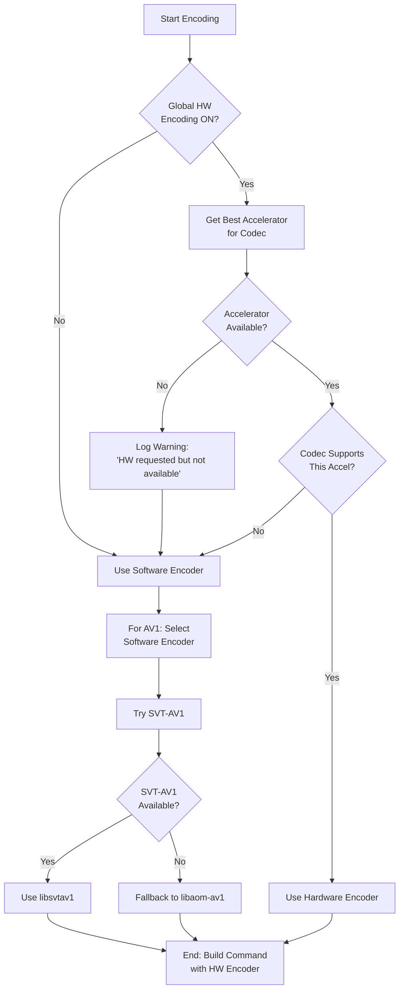
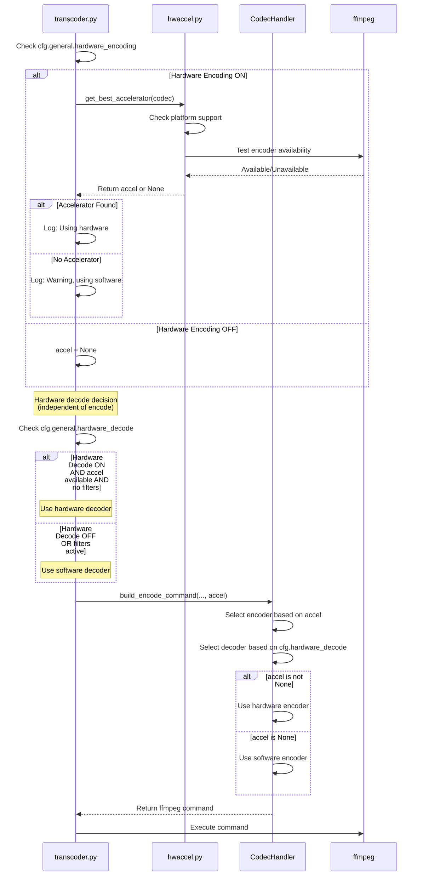

# Video Transcoder Hardware Acceleration Simplified Design

## Executive Summary

This document describes a simplified hardware encoding/decoding architecture for the video_transcoder addon that eliminates per-codec hardware toggles in favor of global settings with automatic encoder selection.

### Key Changes
- **Remove**: Per-codec `use_quicksync`/`use_hardware` toggles
- **Remove**: AV1 `encoder` dropdown (manual selection)
- **Add**: Automatic hardware/software encoder selection based on global settings
- **Preserve**: QuickSync-only implementation for first release
- **Design**: Extensible architecture for future accelerators (NVENC, VideoToolbox, VAAPI)

---

## 1. Configuration Schema Changes

### 1.1 Current State Analysis

**Problems Identified:**
- H.264 and HEVC use `use_quicksync: bool` (line 10, 23 in config.json)
- VP9 and AV1 use `use_hardware: bool` (line 30, 38 in config.json)
- AV1 has manual `encoder: str` selection (svt-av1, aom, qsv)
- Inconsistent naming creates confusion and bugs

**Current Config Structure:**
```json
{
  "h264": { "use_quicksync": true },
  "hevc": { "use_quicksync": true },
  "vp9": { "use_hardware": true },
  "av1": { "use_hardware": true, "encoder": "svt-av1" },
  "general": {
    "hardware_encoding": true,
    "hardware_decode": true
  }
}
```

### 1.2 Proposed Schema (config.json)

**Remove from all codec configs:**
- `h264.use_quicksync`
- `hevc.use_quicksync`
- `vp9.use_hardware`
- `av1.use_hardware`
- `av1.encoder`

**Keep in codec configs:**
- Quality settings (crf, preset, cpu_used)
- Profile settings (profile, pixel_format)
- Container settings (container)

**Result:**
```json
{
  "version": 1,
  "enabled": true,
  "target_codec": "h264",
  "h264": {
    "profile": "high",
    "pixel_format": "yuv420p",
    "crf": 18,
    "preset": "fast",
    "container": "mp4"
  },
  "vp8": {
    "crf": 10,
    "cpu_used": 4,
    "container": "webm"
  },
  "hevc": {
    "profile": "main",
    "pixel_format": "yuv420p",
    "crf": 18,
    "preset": "faster",
    "container": "mp4"
  },
  "vp9": {
    "crf": 20,
    "cpu_used": 4,
    "deadline": "good",
    "container": "webm"
  },
  "av1": {
    "crf": 20,
    "cpu_used": 8,
    "container": "mkv"
  },
  "general": {
    "hardware_encoding": true,
    "hardware_decode": true,
    "backup_original": true,
    "backup_suffix": "-source",
    "timeout_seconds": 600,
    "verify_output": true,
    "min_free_space_mb": 500,
    "max_resolution": null,
    "max_fps": null,
    "max_bitrate_kbps": null
  },
  "usdb_integration": {
    "use_usdb_resolution": true,
    "use_usdb_fps": true
  }
}
```

### 1.3 Proposed Schema (config.py)

**Remove from dataclasses:**
```python
# DELETE these fields:
class H264Config:
    use_quicksync: bool = True  # DELETE

class HEVCConfig:
    use_quicksync: bool = True  # DELETE

class VP9Config:
    use_hardware: bool = True  # DELETE

class AV1Config:
    encoder: str = "svt-av1"  # DELETE
    use_hardware: bool = True  # DELETE
```

**Updated dataclasses:**
```python
@dataclass
class H264Config:
    """Configuration for H.264 encoding."""
    profile: H264Profile = "high"
    pixel_format: str = "yuv420p"
    crf: int = 18
    preset: str = "fast"
    container: str = "mp4"

@dataclass
class HEVCConfig:
    """Configuration for HEVC encoding."""
    profile: HEVCProfile = "main"
    pixel_format: str = "yuv420p"
    crf: int = 18
    preset: str = "faster"
    container: str = "mp4"

@dataclass
class VP9Config:
    """Configuration for VP9 encoding."""
    crf: int = 20
    cpu_used: int = 4
    deadline: str = "good"
    container: str = "webm"

@dataclass
class AV1Config:
    """Configuration for AV1 encoding."""
    crf: int = 20
    cpu_used: int = 8
    container: str = "mkv"

@dataclass
class GeneralConfig:
    """General transcoding settings."""
    hardware_encoding: bool = True
    hardware_decode: bool = True
    # ... rest unchanged
```

---

## 2. Codec Handler Encoder Selection Logic

### 2.1 Current State Issues

**Current logic in transcoder.py (lines 108-119):**
```python
codec_cfg = getattr(cfg, cfg.target_codec)
codec_allows_hw = bool(getattr(codec_cfg, "use_quicksync", False))
if cfg.general.hardware_encoding and codec_allows_hw:
    accel = get_best_accelerator(cfg.target_codec)
```

**Problems:**
- Each codec has different field names (`use_quicksync` vs `use_hardware`)
- Per-codec gating prevents global control
- AV1 handler manually checks `encoder` field

### 2.2 Proposed Auto-Selection Algorithm

**Decision Flow:**



### 2.3 Handler Implementation Pattern

**Each codec handler should follow this pattern:**

```python
@classmethod
def build_encode_command(
    cls,
    input_path: Path,
    output_path: Path,
    video_info: VideoInfo,
    cfg: TranscoderConfig,
    accel: Type[HardwareAccelerator] | None,
) -> list[str]:
    """Build FFMPEG command with automatic encoder selection."""
    
    # Step 1: Determine encoder based on accel parameter
    # If accel is not None, hardware is available and requested
    if accel is not None:
        # Use hardware encoder
        encoder = cls._get_hardware_encoder(accel)
        params = cls._get_hardware_params(cfg)
    else:
        # Use software encoder
        encoder = cls._get_software_encoder()
        params = cls._get_software_params(cfg)
    
    # Step 2: Build command with selected encoder
    cmd = cls._build_command(encoder, params, ...)
    return cmd
```

### 2.4 Codec-Specific Selection Rules

#### H.264 Handler
```python
def _get_hardware_encoder(accel):
    caps = accel.capabilities()
    return caps.h264_encoder  # "h264_qsv" for QuickSync

def _get_software_encoder():
    return "libx264"
```

#### HEVC Handler
```python
def _get_hardware_encoder(accel):
    caps = accel.capabilities()
    return caps.hevc_encoder  # "hevc_qsv" for QuickSync

def _get_software_encoder():
    return "libx265"
```

#### VP9 Handler
```python
def _get_hardware_encoder(accel):
    caps = accel.capabilities()
    return caps.vp9_encoder  # "vp9_qsv" for QuickSync

def _get_software_encoder():
    return "libvpx-vp9"
```

#### AV1 Handler (Most Complex)
```python
def _get_hardware_encoder(accel):
    caps = accel.capabilities()
    return caps.av1_encoder  # "av1_qsv" for QuickSync

def _get_software_encoder():
    """Auto-select best available software encoder.
    
    Priority: SVT-AV1 > libaom-av1
    SVT-AV1 is faster and produces similar quality.
    """
    # For now, always prefer SVT-AV1 if installed
    # Future: Could probe with ffmpeg -encoders
    return "libsvtav1"  # Fallback to libaom-av1 if build fails

def _get_software_encoder_fallback():
    """Fallback if SVT-AV1 not available."""
    return "libaom-av1"
```

**Note:** For first release, we'll assume SVT-AV1 is available. Future enhancement could probe available encoders.

### 2.5 VP8 Handler (No Hardware)

VP8 has no hardware support in QuickSync or most accelerators:

```python
def _get_hardware_encoder(accel):
    # VP8 has no hardware support
    return None

def _get_software_encoder():
    return "libvpx"
```

The transcoder will never pass `accel` to VP8 handler because `get_best_accelerator("vp8")` returns `None`.

---

## 3. Hardware Accelerator Selection Redesign

### 3.1 Current State (transcoder.py lines 108-119)

**Problems:**
- Per-codec gating: `codec_allows_hw = bool(getattr(codec_cfg, "use_quicksync", False))`
- Uses `getattr` with fallback, hiding missing fields
- Inconsistent field names across codecs

### 3.2 Proposed Flow (Simplified)

**New logic for process_video():**

```python
def process_video(...) -> TranscodeResult:
    # ... existing analysis code ...
    
    # Get codec handler
    handler = get_codec_handler(cfg.target_codec)
    
    # Hardware accelerator selection (SIMPLIFIED)
    accel = None
    if cfg.general.hardware_encoding:
        accel = get_best_accelerator(cfg.target_codec)
        if accel:
            slog.debug(f"Using hardware acceleration: {accel.capabilities().display_name}")
        else:
            slog.warning(
                f"Hardware encoding enabled but no accelerator supports {cfg.target_codec}. "
                "Using software encoder."
            )
    
    # Hardware decode gating (unchanged, still conditional on filters)
    if accel is not None and cfg.general.hardware_decode:
        if cfg.general.max_resolution or cfg.general.max_fps:
            slog.debug(
                "Disabling hardware decode (filters requested); using hardware encode only."
            )
            cfg = replace(cfg, general=replace(cfg.general, hardware_decode=False))
    
    # Build command - handler decides encoder based on accel
    cmd = handler.build_encode_command(video_path, temp_output_path, video_info, cfg, accel)
    
    # ... rest unchanged ...
```

**Key Changes:**
1. Remove per-codec `use_quicksync`/`use_hardware` check
2. Always call `get_best_accelerator(codec)` if global setting ON
3. Handler decides actual encoder to use
4. Cleaner separation of concerns

**Important: Hardware Encode/Decode Independence**

The two settings are **independent** with smart defaults:
- User can enable hardware encoding only (decode in software)
- User can enable hardware decoding only (encode in software)
- User can enable both (most efficient)
- User can disable both (pure software pipeline)

However, there's one **conditional dependency** for correctness:
- When using video filters (resolution/fps changes), hardware decode is automatically disabled even if enabled globally
- This prevents ffmpeg pipeline issues with hardware surfaces and filters
- This is already implemented in the current code (lines 123-128) and preserved in this design

### 3.3 Updated Logic Flow



---

## 4. Hardware Encoding vs Decoding Independence

### 4.1 Configuration Independence

The two global settings are **fully independent**:

```python
@dataclass
class GeneralConfig:
    hardware_encoding: bool = True   # Enable hardware video encoding
    hardware_decode: bool = True     # Enable hardware video decoding
```

### 4.2 Valid Combinations

All four combinations are valid and supported:

| Hardware Encoding | Hardware Decode | Result | Use Case |
|-------------------|-----------------|--------|----------|
| ✅ ON | ✅ ON | Full hardware pipeline | Maximum performance, lowest CPU usage |
| ✅ ON | ❌ OFF | Hardware encode only | Useful when filters needed, or decode issues |
| ❌ OFF | ✅ ON | Hardware decode only | Reduce decode CPU load, full encode control |
| ❌ OFF | ❌ OFF | Pure software | Maximum compatibility, full quality control |

### 4.3 Smart Conditional Logic

While the settings are independent, there's **one smart override** for correctness:

**Filter Safety Override:**
```python
# From transcoder.py lines 123-128 (preserved in this design)
if accel is not None and cfg.general.hardware_decode:
    if cfg.general.max_resolution or cfg.general.max_fps:
        slog.debug(
            "Disabling hardware decode (filters requested); using hardware encode only."
        )
        cfg = replace(cfg, general=replace(cfg.general, hardware_decode=False))
```

**Why this override exists:**
- FFmpeg hardware surfaces don't always work with video filters (scale, fps)
- Hardware decode → filter → hardware encode pipeline can fail
- Solution: Use software decode when filters are active
- Hardware encoding still works (software decode → filter → hardware encode)

### 4.4 Decision Flow Examples

**Example 1: Hardware Encoding ON, Hardware Decode ON, No Filters**
```
Input: [H.264 video]
↓ Hardware Decoder (h264_qsv)
↓ No filters
↓ Hardware Encoder (hevc_qsv)
Output: [HEVC video]
Result: Full hardware pipeline, maximum speed
```

**Example 2: Hardware Encoding ON, Hardware Decode ON, With Filters**
```
Input: [H.264 video]
↓ Software Decoder (override: filters active)
↓ Scale filter (1080p → 720p)
↓ Hardware Encoder (hevc_qsv)
Output: [HEVC video]
Result: Hybrid pipeline, still faster than pure software
```

**Example 3: Hardware Encoding OFF, Hardware Decode ON**
```
Input: [H.264 video]
↓ Hardware Decoder (h264_qsv)
↓ Optional filters (works because encode is software)
↓ Software Encoder (libx265)
Output: [HEVC video]
Result: Fast decode, full software encode control
```

**Example 4: Hardware Encoding ON, Hardware Decode OFF (User Choice)**
```
Input: [H.264 video]
↓ Software Decoder (user preference)
↓ Optional filters
↓ Hardware Encoder (hevc_qsv)
Output: [HEVC video]
Result: User wants software decode quality, hardware encode speed
```

### 4.5 Implementation in Codec Handlers

Each handler checks settings independently:

```python
@classmethod
def build_encode_command(..., accel):
    cmd = ["ffmpeg", "-y", "-hide_banner"]
    
    # Hardware DECODE: Independent check
    if cfg.general.hardware_decode:
        if decoder := cls.get_hw_decoder(video_info, accel):
            cmd.extend(["-c:v", decoder])
    # If not enabled or not available, ffmpeg uses default software decoder
    
    cmd.extend(["-i", str(input_path)])
    
    # Hardware ENCODE: Independent check
    if accel is not None:
        # Use hardware encoder
        encoder = accel.capabilities().h264_encoder
        cmd.extend(["-c:v", encoder, ...])
    else:
        # Use software encoder
        cmd.extend(["-c:v", "libx264", ...])
    
    return cmd
```

**Note:** The `accel` parameter being `None` means hardware encoding is not available (either disabled globally or no accelerator found). Hardware decoding can still be enabled independently via `cfg.general.hardware_decode`.

### 4.6 Why Independent Settings?

**User Control:**
- Some users may have hardware that's good at encoding but poor at decoding
- Some users may want to disable decode for quality reasons but keep encode for speed
- Filters may be needed, requiring software decode but benefiting from hardware encode

**Debugging:**
- If hardware encode fails, user can disable just that
- If hardware decode has issues, user can disable just that
- No need to disable entire hardware pipeline to debug one component

**Future Flexibility:**
- Different accelerators may be better at encode vs decode
- Allows mixing accelerators in the future (decode with one, encode with another)

---

## 5. Extensibility Pattern for Future Accelerators

### 5.1 Current Architecture Strengths

The current hwaccel.py already has a good foundation:
- Registry pattern with `@register_hwaccel` decorator
- Abstract `HardwareAccelerator` base class
- Capabilities dataclass describes supported codecs
- `get_best_accelerator()` with priority ordering

### 5.2 Adding New Accelerators (Design Pattern)

**To add NVENC support in the future:**

```python
@register_hwaccel
class NVENCAccelerator(HardwareAccelerator):
    """NVIDIA NVENC hardware acceleration."""
    
    @classmethod
    def capabilities(cls) -> HWAccelCapabilities:
        return HWAccelCapabilities(
            name="nvenc",
            display_name="NVIDIA NVENC",
            platforms=("win32", "linux"),
            h264_encoder="h264_nvenc",
            hevc_encoder="hevc_nvenc",
            vp8_encoder=None,
            vp9_encoder=None,  # VP9 support is rare
            av1_encoder="av1_nvenc",  # RTX 40-series+
        )
    
    @classmethod
    def is_available(cls) -> bool:
        """Test NVENC availability."""
        cmd = [
            "ffmpeg", "-hide_banner",
            "-f", "lavfi", "-i", "nullsrc=s=64x64:d=0.1",
            "-c:v", "h264_nvenc",
            "-f", "null", "-"
        ]
        try:
            result = subprocess.run(cmd, capture_output=True, timeout=10)
            return result.returncode == 0
        except Exception:
            return False
    
    @classmethod
    def get_decoder(cls, video_info: VideoInfo) -> str | None:
        """Get NVDEC decoder for input codec."""
        codec_map = {
            "h264": "h264_cuvid",
            "hevc": "hevc_cuvid",
            "h265": "hevc_cuvid",
            "vp9": "vp9_cuvid",
            "av1": "av1_cuvid",
            "mpeg2video": "mpeg2_cuvid",
            "vc1": "vc1_cuvid",
            "mjpeg": "mjpeg_cuvid",
        }
        return codec_map.get(video_info.codec_name.lower())
```

**That's it!** No changes needed to:
- Codec handlers (they already use `accel.capabilities()`)
- Transcoder logic (already calls `get_best_accelerator()`)
- Configuration (already global)

### 5.3 Priority Ordering

Priority is defined in `get_best_accelerator()` (hwaccel.py line 79):

```python
def get_best_accelerator(codec: str) -> Type[HardwareAccelerator] | None:
    """Get the best available accelerator for a codec.
    
    Priority order: QuickSync > NVENC > AMF > VideoToolbox > VAAPI > None
    """
    priority = ["quicksync", "nvenc", "amf", "videotoolbox", "vaapi"]
    
    for name in priority:
        if accel := HWACCEL_REGISTRY.get(name):
            if accel.supports_platform() and accel.is_available():
                caps = accel.capabilities()
                encoder = getattr(caps, f"{codec}_encoder", None)
                if encoder:
                    return accel
    return None
```

**Future consideration:** Allow users to override priority via config:

```json
{
  "general": {
    "hardware_encoding": true,
    "hardware_decode": true,
    "accelerator_priority": ["nvenc", "quicksync", "videotoolbox"]  // Optional override
  }
}
```

### 5.4 Codec Handler Future-Proofing

Handlers already receive `accel` parameter and call:
```python
caps = accel.capabilities()
encoder = caps.h264_encoder  # Or hevc_encoder, vp9_encoder, etc.
```

This means handlers are **already accelerator-agnostic**. No code changes needed when adding NVENC, VideoToolbox, etc.

### 5.5 Documentation Updates (Future)

When adding new accelerators, update only:

1. **README.md** - Add to supported accelerators list
2. **CONFIGURATION.md** - Document new accelerator
3. **TROUBLESHOOTING.md** - Add accelerator-specific debugging

No code changes required in codec handlers or transcoder.

---

## 6. Implementation Checklist

### 6.1 Phase 1: Configuration Schema

- [ ] Remove fields from config dataclasses (config.py):
  - [ ] `H264Config.use_quicksync`
  - [ ] `HEVCConfig.use_quicksync`
  - [ ] `VP9Config.use_hardware`
  - [ ] `AV1Config.use_hardware`
  - [ ] `AV1Config.encoder`

- [ ] Update default config.json in addon directory

### 6.2 Phase 2: Transcoder Logic

- [ ] Simplify `process_video()` accelerator selection (transcoder.py lines 108-119):
  - [ ] Remove `getattr(codec_cfg, "use_quicksync", False)` check
  - [ ] Always call `get_best_accelerator(codec)` if global setting ON
  - [ ] Update log messages

- [ ] Keep hardware decode filtering logic unchanged

### 6.3 Phase 3: Codec Handlers

- [ ] Refactor H264Handler.build_encode_command():
  - [ ] Remove `h264_cfg.use_quicksync` check
  - [ ] Use `accel` parameter directly for encoder selection

- [ ] Refactor HEVCHandler.build_encode_command():
  - [ ] Remove `hevc_cfg.use_quicksync` check
  - [ ] Use `accel` parameter directly

- [ ] Refactor VP9Handler.build_encode_command():
  - [ ] Remove `vp9_cfg.use_hardware` check
  - [ ] Use `accel` parameter directly

- [ ] Refactor AV1Handler.build_encode_command():
  - [ ] Remove `av1_cfg.use_hardware` check
  - [ ] Remove `av1_cfg.encoder` check
  - [ ] Implement auto-selection: `accel` → qsv, else svt-av1
  - [ ] Add SVT-AV1 availability detection (future enhancement)

### 6.4 Phase 4: UI Updates

- [ ] Update settings GUI (settings_gui.py):
  - [ ] Remove per-codec hardware checkboxes/options
  - [ ] Keep only global hardware encoding toggle
  - [ ] Update tooltips to explain auto-selection

- [ ] Update codec-specific UI sections:
  - [ ] Remove AV1 encoder dropdown
  - [ ] Update AV1 help text: "Encoder selected automatically"

### 6.5 Phase 5: Documentation

- [ ] Update README.md:
  - [ ] Document simplified hardware settings
  - [ ] Explain auto-selection behavior
  - [ ] Remove references to per-codec settings

- [ ] Update CONFIGURATION.md:
  - [ ] Remove per-codec hardware documentation
  - [ ] Add global hardware settings section
  - [ ] Add auto-selection explanation
  - [ ] Add AV1 encoder priority explanation

- [ ] Update CHANGELOG.md:
  - [ ] Document new simplified hardware architecture
  - [ ] Note this is pre-release, no migration needed

### 6.6 Phase 6: Testing

- [ ] Test with hardware encoding ON:
  - [ ] H.264 encoding
  - [ ] HEVC encoding
  - [ ] VP9 encoding
  - [ ] AV1 encoding

- [ ] Test with hardware encoding OFF:
  - [ ] All codecs fall back to software

- [ ] Test AV1 software encoder fallback:
  - [ ] SVT-AV1 if available
  - [ ] libaom-av1 fallback

- [ ] Test on systems without QuickSync:
  - [ ] Graceful fallback to software
  - [ ] Warning logged

---

## 7. Benefits Summary

### 7.1 User Experience
- **Simpler**: One toggle instead of 4-5 per-codec settings
- **Clearer**: "Enable hardware encoding" is self-explanatory
- **Smarter**: System picks best encoder automatically
- **Safer**: No invalid combinations (e.g., QSV selected but not available)

### 7.2 Maintainability
- **Less code**: Removed per-codec gating logic
- **Consistent**: All codecs follow same pattern
- **Debuggable**: Clear decision path in logs
- **Testable**: Fewer branches to test

### 7.3 Extensibility
- **Accelerator-agnostic**: Handlers don't hard-code accelerator names
- **Drop-in support**: New accelerators register and work immediately
- **Future-proof**: No breaking changes needed for NVENC/VideoToolbox

### 7.4 Bug Fixes
- **Resolved**: VP9/AV1 `use_hardware` vs `use_quicksync` inconsistency
- **Resolved**: AV1 manual encoder selection complexity
- **Prevented**: Future per-codec/per-accelerator combinatorial explosion

---

## 8. Risk Assessment

### 8.1 Software Encoder Detection
**Risk**: Assuming SVT-AV1 is available may fail on some systems

**Mitigation**:
- Fallback to libaom-av1 built into handler
- Future enhancement: Probe available encoders with `ffmpeg -encoders`
- Document recommended ffmpeg build in README

### 8.2 Platform Differences
**Risk**: Accelerator availability varies by platform/hardware

**Mitigation**:
- Already handled by `is_available()` checks
- Graceful fallback to software built-in
- Clear warning messages when hardware unavailable

---

## 9. Future Enhancements

### 9.1 Short-term (Next Release)
1. **Probe available encoders**: Check `ffmpeg -encoders` output to validate availability
2. **Better error messages**: Specific guidance when hardware not available
3. **Settings UI polish**: Add "Detected: QuickSync" status indicator

### 9.2 Medium-term
1. **NVENC support**: Add NVIDIA accelerator (reference implementation provided)
2. **VideoToolbox support**: Add macOS accelerator
3. **Accelerator priority override**: Let users prefer NVENC over QuickSync

### 9.3 Long-term
1. **Multi-accelerator systems**: Use different accelerators for different codecs
2. **Quality profiles**: Preset bundles (fast/balanced/quality) that adjust all settings
3. **Encoder benchmarking**: Auto-select based on speed/quality measurements

---

## 10. Appendix: Code Examples

### 10.1 Simplified Transcoder Logic (Before/After)

**BEFORE (complex, per-codec gating):**
```python
codec_cfg = getattr(cfg, cfg.target_codec)
codec_allows_hw = bool(getattr(codec_cfg, "use_quicksync", False))
if cfg.general.hardware_encoding and codec_allows_hw:
    accel = get_best_accelerator(cfg.target_codec)
```

**AFTER (simple, global gating):**
```python
accel = None
if cfg.general.hardware_encoding:
    accel = get_best_accelerator(cfg.target_codec)
    if not accel:
        slog.warning("Hardware encoding requested but unavailable. Using software.")
```

### 10.2 Simplified Handler Logic (Before/After)

**BEFORE (AV1 handler, manual selection):**
```python
if accel is not None and av1_cfg.use_hardware and av1_cfg.encoder == "qsv":
    cmd.extend(["-c:v", "av1_qsv"])
elif av1_cfg.encoder == "svt-av1":
    cmd.extend(["-c:v", "libsvtav1"])
else:
    cmd.extend(["-c:v", "libaom-av1"])
```

**AFTER (automatic selection):**
```python
if accel is not None:
    # Hardware encoding available and enabled globally
    caps = accel.capabilities()
    cmd.extend(["-c:v", caps.av1_encoder])  # "av1_qsv" for QuickSync
else:
    # Software encoding (prefer SVT-AV1)
    cmd.extend(["-c:v", "libsvtav1"])
```

---

## 11. Conclusion

This design simplifies the hardware acceleration architecture by:
1. Removing per-codec complexity
2. Enabling global, user-friendly control
3. Maintaining extensibility for future accelerators
4. Clean implementation with no legacy baggage (pre-release status)

The implementation is low-risk due to:
- Simple, straightforward changes
- Graceful fallbacks throughout
- No behavior changes when hardware unavailable

The architecture is future-proof because:
- Accelerator registry pattern is already established
- Codec handlers are accelerator-agnostic
- New accelerators require zero handler changes

**Recommendation**: Proceed with implementation following the checklist in Section 6.
