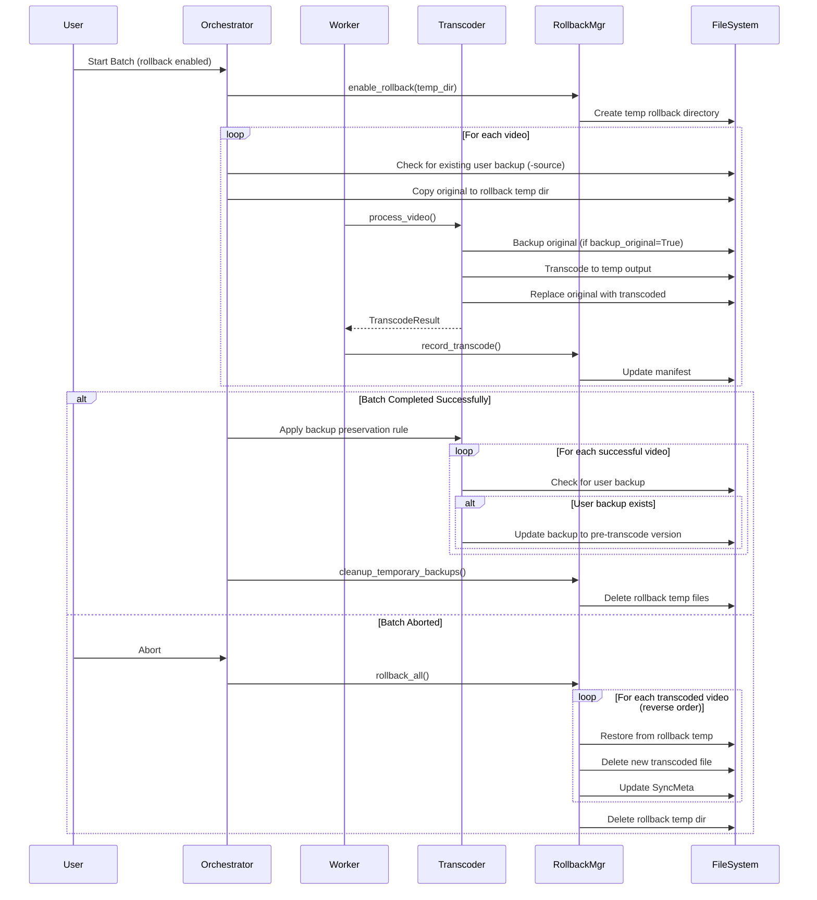

# Video Transcoder Rollback System Redesign

## Executive Summary

This design separates rollback functionality from user backup features by storing rollback backups in a temporary directory and implementing a "backup preservation rule" that maintains user backups as rolling checkpoints, always one revision behind the current video.

## 1. Rollback Backup File Naming and Storage

### 1.1 Storage Location
```
{system_temp_dir}/usdb_syncer_transcoder/rollback_{timestamp}/
├── rollback_manifest_{timestamp}.json
├── video_{song_id}_{original_stem}.{original_ext}
├── video_{song_id}_{original_stem}.{original_ext}
└── ...
```

- **Base directory**: `tempfile.gettempdir() / "usdb_syncer_transcoder" / f"rollback_{timestamp}"`
- **Benefits**: Completely isolated from user files, automatic OS cleanup, clear separation of concerns

### 1.2 Rollback Backup Naming Convention
```python
rollback_filename = f"video_{song_id}_{original_stem}.{original_ext}"
```

**Example**: For `MyVideo.mp4` with `song_id=12345`:
```
video_12345_MyVideo.mp4
```

This naming ensures:
- No naming conflicts (song_id uniqueness)
- Easy identification in logs
- Traceability to original file

## 2. Rollback Lifecycle Flow

### 2.1 Sequence Diagram



### 2.2 Detailed Flow Description

#### Phase 1: Batch Initialization (with Rollback Enabled)
1. User starts batch transcode with rollback enabled
2. Orchestrator creates `RollbackManager` instance
3. RollbackManager creates unique temp directory: `{temp}/usdb_syncer_transcoder/rollback_{timestamp}/`
4. Orchestrator creates empty manifest in temp directory
5. For each selected video, orchestrator records whether user backup already exists

#### Phase 2: Pre-Transcode Backup (Before Each Video)
1. **Before** calling `process_video()`, orchestrator copies original file to rollback temp directory
2. Naming: `video_{song_id}_{stem}.{ext}`
3. This copy is ONLY for rollback purposes
4. User backups (`-source` files) are NOT touched during this phase

#### Phase 3: Transcoding (Per Video)
1. `process_video()` executes normally
2. If `backup_original=True`, it creates/updates backup in the video directory (user backup)
3. Transcoded file replaces original
4. On success, orchestrator records transcode in rollback manifest with temp backup path

#### Phase 4A: Successful Completion
1. **Backup Preservation Rule Applied** (BEFORE cleanup):
   - For each successfully transcoded video:
     - Check if user backup exists (e.g., `MyVideo-source.mp4`)
     - If exists, copy the rollback backup (pre-transcode version) to the user backup location
     - This keeps the backup exactly one revision behind
2. Orchestrator calls `rollback_manager.cleanup_rollback_data()`
3. All rollback temp files deleted
4. Rollback manifest deleted

#### Phase 4B: Aborted Batch
1. User clicks abort or error occurs
2. Orchestrator prompts user: "Roll back changes?"
3. If yes:
   - For each transcoded video (reverse order):
     - Copy rollback temp backup back to original location
     - Delete transcoded file
     - Update SyncMeta to point to original
4. Delete rollback temp directory
5. User backups remain untouched

## 3. Specific File Changes

### 3.1 [`rollback.py`](addons/video_transcoder/rollback.py)

#### Changes to `RollbackEntry`
```python
@dataclass
class RollbackEntry:
    song_id: SongId
    original_path: Path  # Original video path in user directory
    rollback_backup_path: Path  # Backup in temp directory (NEW)
    new_output_path: Path  # Path to transcoded file
    transcoded_at: float
    user_backup_existed: bool  # Whether user backup existed before batch (NEW)
```

**Key Changes**:
- Add `rollback_backup_path`: Points to temp directory copy
- Remove `is_temporary_backup`: No longer needed
- Add `user_backup_existed`: Needed for backup preservation rule

#### Changes to `RollbackManager.__init__`
```python
def __init__(self, cfg: TranscoderConfig):
    self.cfg = cfg
    self.entries: list[RollbackEntry] = []
    self._manifest_path: Optional[Path] = None
    self._rollback_dir: Optional[Path] = None  # NEW
```

**Removed**: `temporary_backups` parameter (no longer relevant)

#### Changes to `RollbackManager.enable_rollback`
```python
def enable_rollback(self) -> Path:
    """Enable rollback and create temp directory.
    
    Returns:
        Path to rollback temp directory for pre-transcode backups
    """
    import tempfile
    timestamp = int(time.time())
    
    # Create unique rollback directory in system temp
    self._rollback_dir = Path(tempfile.gettempdir()) / "usdb_syncer_transcoder" / f"rollback_{timestamp}"
    self._rollback_dir.mkdir(parents=True, exist_ok=True)
    
    self._manifest_path = self._rollback_dir / f"rollback_manifest_{timestamp}.json"
    _logger.info(f"Rollback enabled. Directory: {self._rollback_dir}")
    
    return self._rollback_dir
```

**Key Changes**:
- No longer takes `manifest_dir` parameter (creates its own)
- Returns rollback directory path for orchestrator to use
- Creates timestamped subdirectory for uniqueness

#### New Method: `get_rollback_backup_path`
```python
def get_rollback_backup_path(self, song_id: SongId, original_path: Path) -> Path:
    """Generate rollback backup path for a video.
    
    Args:
        song_id: Song ID
        original_path: Original video path
        
    Returns:
        Path where rollback backup should be stored
    """
    if not self._rollback_dir:
        raise RuntimeError("Rollback not enabled")
    
    filename = f"video_{song_id}_{original_path.stem}{original_path.suffix}"
    return self._rollback_dir / filename
```

#### Changes to `record_transcode`
```python
def record_transcode(
    self,
    song_id: SongId,
    original_path: Path,
    rollback_backup_path: Path,
    new_output_path: Path,
    user_backup_existed: bool
) -> None:
    """Record a successful transcode.
    
    Args:
        song_id: Song ID
        original_path: Original video path in user directory
        rollback_backup_path: Path to rollback backup in temp dir
        new_output_path: Path to new transcoded file
        user_backup_existed: Whether user backup existed before batch
    """
    entry = RollbackEntry(
        song_id=song_id,
        original_path=original_path,
        rollback_backup_path=rollback_backup_path,
        new_output_path=new_output_path,
        transcoded_at=time.time(),
        user_backup_existed=user_backup_existed
    )
    self.entries.append(entry)
    self._save_manifest()
```

#### Changes to `rollback_all`
```python
def rollback_all(self) -> tuple[int, int]:
    """Rollback all transcodes using temp backups.
    
    Returns:
        (success_count, failure_count)
    """
    success = 0
    failed = 0

    # Rollback in reverse order
    for entry in reversed(self.entries):
        try:
            _logger.info(f"Rolling back transcode for song {entry.song_id}")
            
            # 1. Restore original from rollback temp backup
            if not entry.rollback_backup_path.exists():
                _logger.error(f"Rollback backup missing: {entry.rollback_backup_path}")
                failed += 1
                continue
            
            # If transcoded file exists at original location, remove it
            if entry.original_path.exists():
                entry.original_path.unlink()
            
            # Copy rollback backup back to original location
            shutil.copy2(str(entry.rollback_backup_path), str(entry.original_path))
            
            # 2. Delete new output if different from original location
            if entry.new_output_path.exists() and entry.new_output_path != entry.original_path:
                entry.new_output_path.unlink()
            
            # 3. Update SyncMeta to point back to original
            self._update_sync_meta_for_rollback(entry)
            
            success += 1
        except Exception as e:
            _logger.error(f"Rollback failed for {entry.song_id}: {e}")
            failed += 1

    self._cleanup_rollback_directory()
    return success, failed
```

**Key Changes**:
- Use `rollback_backup_path` from temp directory
- Use `shutil.copy2` instead of `shutil.move` (preserve rollback backup until full cleanup)
- Don't touch user backups during rollback

#### Changes to `cleanup_temporary_backups`
```python
def cleanup_rollback_data(self) -> None:
    """Clean up rollback temp directory and manifest after successful batch."""
    _logger.info("Cleaning up rollback data...")
    self._cleanup_rollback_directory()

def _cleanup_rollback_directory(self) -> None:
    """Remove entire rollback directory."""
    if self._rollback_dir and self._rollback_dir.exists():
        try:
            shutil.rmtree(self._rollback_dir)
            _logger.info(f"Deleted rollback directory: {self._rollback_dir}")
        except Exception as e:
            _logger.warning(f"Failed to delete rollback directory {self._rollback_dir}: {e}")
```

**Key Changes**:
- Renamed to be clearer about what's being cleaned
- Deletes entire rollback directory instead of individual files
- Simpler since everything is in one temp directory

### 3.2 [`batch_orchestrator.py`](addons/video_transcoder/batch_orchestrator.py)

#### Changes to `BatchTranscodeOrchestrator.__init__`
```python
def __init__(self, parent: QMainWindow, cfg: TranscoderConfig):
    self.parent = parent
    self.cfg = cfg
    self.candidates: list[BatchTranscodeCandidate] = []
    self.summary: Optional[BatchTranscodeSummary] = None
    self.rollback_manager: Optional[RollbackManager] = None
    self._existing_user_backups: dict[SongId, Path] = {}  # CHANGED
    self._rollback_dir: Optional[Path] = None  # NEW
    self._abort_flag = False
    self._worker: Optional[BatchWorker] = None
    self._progress_dialog: Optional[BatchProgressDialog] = None
```

**Key Changes**:
- Rename `_existing_backups` to `_existing_user_backups` (clarity)
- Change from set to dict to store backup paths
- Add `_rollback_dir` to track rollback directory

#### Changes to `_execute_batch`
```python
def _execute_batch(self) -> None:
    """Execute batch transcode with progress monitoring."""
    if not self.summary:
        return
    selected_candidates = [c for c in self.candidates if c.selected]
    if not selected_candidates:
        return
        
    # Initialize rollback manager if enabled
    if self.summary.rollback_enabled:
        self.rollback_manager = RollbackManager(self.cfg)
        self._rollback_dir = self.rollback_manager.enable_rollback()
        
        # Record which videos already have user backups
        self._existing_user_backups.clear()
        for candidate in selected_candidates:
            user_backup_path = candidate.video_path.with_name(
                f"{candidate.video_path.stem}{self.cfg.general.backup_suffix}{candidate.video_path.suffix}"
            )
            if user_backup_path.exists():
                self._existing_user_backups[candidate.song_id] = user_backup_path
        
        # Create pre-transcode backups in rollback temp directory
        _logger.info("Creating pre-transcode rollback backups...")
        for candidate in selected_candidates:
            rollback_backup_path = self.rollback_manager.get_rollback_backup_path(
                candidate.song_id, 
                candidate.video_path
            )
            try:
                shutil.copy2(str(candidate.video_path), str(rollback_backup_path))
                _logger.debug(f"Created rollback backup: {rollback_backup_path}")
            except Exception as e:
                _logger.error(f"Failed to create rollback backup for {candidate.song_title}: {e}")
                # Ask user if they want to continue without rollback for this video
                reply = QtWidgets.QMessageBox.critical(
                    self.parent,
                    "Rollback Backup Failed",
                    f"Failed to create rollback backup for {candidate.song_title}:\n{e}\n\nContinue batch without rollback protection?",
                    QtWidgets.QMessageBox.StandardButton.Yes | QtWidgets.QMessageBox.StandardButton.No,
                    QtWidgets.QMessageBox.StandardButton.No
                )
                if reply == QtWidgets.QMessageBox.StandardButton.No:
                    return
    
    # Create and show progress dialog
    self._progress_dialog = BatchProgressDialog(self.parent, len(selected_candidates))
    self._progress_dialog.abort_requested.connect(self.abort_batch)
    
    # Use original config (no modification needed for rollback)
    self._worker = BatchWorker(
        self.candidates,
        self.cfg,
        on_video_success=self._on_video_success
    )
    
    # Connect signals
    self._worker.video_started.connect(self._progress_dialog.update_current_video)
    self._worker.video_progress.connect(self._progress_dialog.update_video_progress)
    self._worker.video_completed.connect(lambda idx, res: self._progress_dialog.update_overall_progress(self._get_completed_count()) if self._progress_dialog else None)
    self._worker.batch_completed.connect(self._progress_dialog.accept)
    self._worker.batch_aborted.connect(self._progress_dialog.reject)
    
    # Start worker
    self._worker.start()
    
    # Show dialog (modal)
    if self._progress_dialog:
        self._progress_dialog.exec()
    
    # Wait for worker to finish
    self._worker.wait()
    
    # Handle abort/rollback
    if self._abort_flag:
        self._handle_abort()
    elif self.rollback_manager:
        # Success! Apply backup preservation rule FIRST (needs rollback backups)
        self._apply_backup_preservation_rule()
        
        # THEN clean up rollback data
        self.rollback_manager.cleanup_rollback_data()
```

**Key Changes**:
- Initialize rollback manager without parameters
- Store rollback directory path
- Create pre-transcode backups BEFORE starting worker
- Handle backup creation failures gracefully
- Remove config modification logic (no longer needed)
- Add call to backup preservation rule after success (BEFORE cleanup)

#### New Method: `_apply_backup_preservation_rule`
```python
def _apply_backup_preservation_rule(self) -> None:
    """Apply backup preservation rule after successful batch.
    
    For any video where a user backup exists (e.g., MyVideo-source.mp4),
    update it to contain the pre-transcode version. This keeps backups
    one revision behind regardless of settings.
    """
    if not self.rollback_manager:
        return
    
    _logger.info("Applying backup preservation rule...")
    
    for entry in self.rollback_manager.entries:
        candidate = next((c for c in self.candidates if c.song_id == entry.song_id), None)
        if not candidate or not candidate.result or not candidate.result.success:
            continue
        
        # Determine user backup path
        user_backup_path = entry.original_path.with_name(
            f"{entry.original_path.stem}{self.cfg.general.backup_suffix}{entry.original_path.suffix}"
        )
        
        # If user backup exists, update it to pre-transcode version
        if user_backup_path.exists():
            try:
                # The rollback backup contains the pre-transcode version
                if entry.rollback_backup_path.exists():
                    # Replace user backup with pre-transcode version
                    shutil.copy2(str(entry.rollback_backup_path), str(user_backup_path))
                    _logger.info(f"Updated user backup for {candidate.song_title}")
                else:
                    _logger.warning(f"Rollback backup missing, cannot update user backup for {candidate.song_title}")
            except Exception as e:
                _logger.error(f"Failed to update user backup for {candidate.song_title}: {e}")
```

#### Changes to `_on_video_success`
```python
def _on_video_success(self, candidate: BatchTranscodeCandidate) -> None:
    """Called by worker when a video is successfully transcoded."""
    if self.rollback_manager and candidate.result and candidate.result.output_path:
        rollback_backup_path = self.rollback_manager.get_rollback_backup_path(
            candidate.song_id,
            candidate.video_path
        )
        
        # Check if rollback backup exists (should if we created it pre-transcode)
        if not rollback_backup_path.exists():
            _logger.warning(f"Rollback backup missing for {candidate.song_title}")
            return
        
        # Check if user backup existed before batch
        user_backup_existed = candidate.song_id in self._existing_user_backups
        
        self.rollback_manager.record_transcode(
            candidate.song_id,
            candidate.video_path,
            rollback_backup_path,
            candidate.result.output_path,
            user_backup_existed
        )
```

**Key Changes**:
- Get rollback backup path from manager
- Pass `user_backup_existed` flag to record_transcode
- Simplified logic (no need to check backup_original setting)

### 3.3 [`transcoder.py`](addons/video_transcoder/transcoder.py)

**NO CHANGES NEEDED** - The existing backup logic works fine! The preservation rule is handled entirely by the orchestrator after batch completion.

### 3.4 [`batch_worker.py`](addons/video_transcoder/batch_worker.py)

**NO CHANGES NEEDED** - The worker just calls `process_video` and reports results back to the orchestrator.

## 4. Backup Preservation Rule Implementation

### 4.1 The Rule

**After any successful batch transcode**:
1. For each video that was successfully transcoded:
2. Check if a user backup exists (e.g., `MyVideo-source.mp4`)
3. If it exists:
   - Copy the rollback backup (pre-transcode version) to the user backup location
   - This keeps the backup exactly one revision behind
4. This applies regardless of:
   - Whether "Backup Original Files" is currently ON or OFF
   - Whether rollback was enabled or disabled
   - Whether the backup was created by this batch, by a previous batch, or manually

### 4.2 Example Scenarios

#### Scenario 1: Backup exists, backup_original=True
```
Before batch:
  MyVideo.mp4 (v1)
  MyVideo-source.mp4 (v0)

During batch:
  Rollback backup: video_123_MyVideo.mp4 (v1) [temp]
  process_video creates: MyVideo-source.mp4 (v1) [overwrites]
  Transcode: MyVideo.mp4 (v2)

After batch (preservation rule):
  Copy rollback to user backup: MyVideo-source.mp4 (v1)
  Result:
    MyVideo.mp4 (v2)
    MyVideo-source.mp4 (v1) [one revision behind]
```

#### Scenario 2: Backup exists, backup_original=False
```
Before batch:
  MyVideo.mp4 (v1)
  MyVideo-source.mp4 (v0) [user created manually]

During batch:
  Rollback backup: video_123_MyVideo.mp4 (v1) [temp]
  process_video does NOT create backup
  Transcode: MyVideo.mp4 (v2)

After batch (preservation rule):
  Copy rollback to user backup: MyVideo-source.mp4 (v1)
  Result:
    MyVideo.mp4 (v2)
    MyVideo-source.mp4 (v1) [preserved and updated]
```

#### Scenario 3: No backup, backup_original=True
```
Before batch:
  MyVideo.mp4 (v1)

During batch:
  Rollback backup: video_123_MyVideo.mp4 (v1) [temp]
  process_video creates: MyVideo-source.mp4 (v1)
  Transcode: MyVideo.mp4 (v2)

After batch:
  No preservation needed (backup already correct)
  Result:
    MyVideo.mp4 (v2)
    MyVideo-source.mp4 (v1)
```

#### Scenario 4: No backup, backup_original=False
```
Before batch:
  MyVideo.mp4 (v1)

During batch:
  Rollback backup: video_123_MyVideo.mp4 (v1) [temp]
  process_video does NOT create backup
  Transcode: MyVideo.mp4 (v2)

After batch:
  No preservation needed (no backup to update)
  Result:
    MyVideo.mp4 (v2)
```

## 5. Error Handling Considerations

### 5.1 Pre-Transcode Backup Creation Failures

**Scenario**: Unable to copy original to rollback temp directory

**Handling**:
1. Show error dialog: "Failed to create rollback backup for [video]. Continue without rollback protection?"
2. If user selects "No": Abort entire batch before any transcoding starts
3. If user selects "Yes": Continue but disable rollback for that specific video
4. Log warning and continue batch

**Implementation**: In `_execute_batch()` during pre-transcode backup loop

### 5.2 Disk Space Issues in Temp Directory

**Scenario**: Insufficient space in temp directory for rollback backups

**Handling**:
1. Check available space in temp directory before batch starts
2. Calculate space needed: Sum of all selected video sizes
3. If insufficient, show warning: "Insufficient disk space in temp directory. Rollback requires X GB but only Y GB available."
4. Offer to disable rollback and continue
5. Log warning if user continues

**Implementation**: Add check to `_execute_batch()` before creating rollback manager

### 5.3 Rollback Backup Missing During Rollback

**Scenario**: Rollback temp file doesn't exist when trying to roll back

**Handling**:
1. Log error: "Rollback backup missing for song {song_id}"
2. Skip that video's rollback
3. Continue with other videos
4. Report failure count to user at end

**Implementation**: Already handled in updated `rollback_all()` method

### 5.4 Temp Directory Cleanup Failures

**Scenario**: Unable to delete rollback temp directory after completion

**Handling**:
1. Log warning (not error - batch succeeded)
2. Continue normally
3. OS will eventually clean up temp directory
4. Don't block user workflow

**Implementation**: Already handled in `_cleanup_rollback_directory()` with try/except

### 5.5 Backup Preservation Rule Failures

**Scenario**: Unable to copy rollback backup to user backup during preservation

**Handling**:
1. Log error: "Failed to update user backup for {song_title}: {error}"
2. Continue with other videos
3. Don't fail the batch - it completed successfully
4. User backup remains in its previous state (not ideal but not catastrophic)

**Implementation**: Already handled in `_apply_backup_preservation_rule()` with try/except

### 5.6 Concurrent Batch Operations

**Scenario**: User starts second batch while first is running

**Handling**:
1. Each batch gets unique timestamped rollback directory
2. No conflicts between batches
3. Each manifest is independent

**Implementation**: Already handled by timestamp in directory name

## 6. Edge Cases and Considerations

### 6.1 User Manually Deletes Rollback Temp Directory During Batch

**Impact**: Rollback will fail for already-transcoded videos

**Mitigation**:
- Use system temp directory (users rarely manually clean)
- Check for rollback backup existence before recording transcode
- Log warnings if backups missing

### 6.2 System Crashes During Batch

**Impact**: 
- Partial transcodes may exist
- Rollback temp directory remains in system temp
- Manifest may be incomplete

**Mitigation**:
- Next app start could detect orphaned rollback directories
- Consider adding cleanup of old rollback dirs on startup
- Manifest includes timestamps for age detection

**Future Enhancement**: Add startup cleanup for rollback dirs older than 7 days

### 6.3 Video File Renamed/Moved During Batch

**Impact**: Rollback paths become invalid

**Mitigation**:
- Unlikely during batch (files locked by FFMPEG)
- If detected, log error and skip that video during rollback
- Existing error handling covers this case

### 6.4 Multiple Transcodes of Same Video in One Batch

**Impact**: Same video appears multiple times (shouldn't happen with current design)

**Mitigation**:
- Candidate selection prevents duplicates by song_id
- If it somehow occurs, rollback backup naming includes song_id
- Later transcode would overwrite earlier rollback backup

### 6.5 User Backup Suffix Conflicts

**Scenario**: User has file named `MyVideo-source-source.mp4`

**Impact**: No conflict - each video gets one backup with configured suffix

**Mitigation**: None needed - naming is deterministic

### 6.6 Container Format Changes During Transcode

**Scenario**: `MyVideo.avi` → `MyVideo.mp4`

**Current Behavior**:
- Original: `MyVideo.avi`
- Rollback backup: `video_123_MyVideo.avi`
- User backup (if created): `MyVideo-source.avi`
- Transcoded: `MyVideo.mp4`

**Preservation Rule**:
- User backup `MyVideo-source.avi` exists
- Copy `video_123_MyVideo.avi` → `MyVideo-source.avi` ✓

**Result**: Works correctly! Extension preserved in backup.

### 6.7 Extremely Large Video Files

**Scenario**: 50GB 4K video, temp directory on small SSD

**Impact**: May fill temp directory

**Mitigation**:
- Pre-batch disk space check (see 5.2)
- Clear warning to user before batch
- Option to disable rollback

### 6.8 Permission Issues in Temp Directory

**Scenario**: Temp directory not writable

**Impact**: Cannot create rollback backups

**Mitigation**:
- Try to create rollback directory in `enable_rollback()`
- If fails, raise exception before batch starts
- User gets clear error: "Cannot create rollback directory: permission denied"

## 7. Testing Checklist

### 7.1 Basic Functionality
- [ ] Rollback enabled: Verify temp directory created
- [ ] Rollback enabled: Verify pre-transcode backups created
- [ ] Rollback enabled: Verify manifest updated after each video
- [ ] Successful batch: Verify rollback temp deleted
- [ ] Aborted batch: Verify rollback prompt appears
- [ ] Aborted batch + rollback yes: Verify originals restored
- [ ] Aborted batch + rollback no: Verify transcoded files remain

### 7.2 Backup Preservation Rule
- [ ] Backup exists, backup_original=True: Verify backup updated to v-1
- [ ] Backup exists, backup_original=False: Verify backup updated to v-1
- [ ] No backup, backup_original=True: Verify backup created normally
- [ ] No backup, backup_original=False: Verify no backup created
- [ ] Multiple videos: Verify each backup handled independently

### 7.3 Error Conditions
- [ ] Pre-backup fails: Verify user prompt and abort option
- [ ] Insufficient temp space: Verify warning and continue option
- [ ] Rollback backup missing during rollback: Verify skip and continue
- [ ] Preservation rule fails: Verify log error and continue
- [ ] Temp cleanup fails: Verify log warning and continue

### 7.4 Edge Cases
- [ ] Container format change: Verify backup extensions correct
- [ ] Very large file: Verify disk space handling
- [ ] Concurrent batches: Verify separate temp directories
- [ ] System crash recovery: Verify temp cleanup on restart (future)

## 8. Migration Notes

**Pre-release Product**: No migration logic needed per requirements.

**Clean Start**:
- New rollback system completely separate from old
- Old behavior: Backups created during transcode
- New behavior: Backups created before transcode in temp
- No compatibility issues since no persistent state

## 9. Performance Implications

### 9.1 Additional Disk I/O
- **Pre-batch**: Copy all videos to temp (one-time cost)
- **Per-video**: No additional I/O during transcode
- **Post-batch**: Copy rollback backups to user backups (preservation rule)

**Impact**: ~2x disk I/O (one copy in, one copy back for preserved backups)

**Mitigation**: Copies are fast (same disk, no encoding), minimal user impact

### 9.2 Disk Space Usage
- **Peak usage**: Original + Transcoded + Rollback backups
- **Typical**: Rollback backups deleted after batch
- **Temp directory**: Usually on fast SSD, good OS cleanup

**Impact**: Temporary 2x space usage during batch

**Mitigation**: Pre-batch disk space check

### 9.3 Batch Start Delay
- **Pre-batch**: Copy all videos to temp
- **Delay**: Depends on video count and size
- **Example**: 10 videos × 100MB = 1GB copy ≈ 10-30 seconds

**Impact**: Slight delay before transcode starts

**Mitigation**: Show progress: "Preparing rollback backups..."

## 10. Future Enhancements

### 10.1 Startup Cleanup
Add orphaned rollback directory cleanup:
```python
def cleanup_old_rollback_dirs(max_age_days: int = 7) -> None:
    """Clean up old rollback directories from system crashes."""
    temp_base = Path(tempfile.gettempdir()) / "usdb_syncer_transcoder"
    if not temp_base.exists():
        return
    
    cutoff = time.time() - (max_age_days * 86400)
    for rollback_dir in temp_base.glob("rollback_*"):
        try:
            # Extract timestamp from directory name
            timestamp = int(rollback_dir.name.split("_")[1])
            if timestamp < cutoff:
                shutil.rmtree(rollback_dir)
                _logger.info(f"Cleaned up old rollback directory: {rollback_dir}")
        except (ValueError, OSError) as e:
            _logger.warning(f"Could not clean up {rollback_dir}: {e}")
```

### 10.2 Configurable Temp Location
Allow user to specify rollback temp directory location:
```python
@dataclass
class GeneralConfig:
    ...
    rollback_temp_dir: Optional[Path] = None  # None = system default
```

### 10.3 Rollback History
Keep last N rollback manifests for forensics:
```python
def archive_manifest(self) -> None:
    """Archive manifest instead of deleting."""
    archive_dir = self._rollback_dir.parent / "manifests"
    archive_dir.mkdir(exist_ok=True)
    shutil.move(str(self._manifest_path), str(archive_dir / self._manifest_path.name))
```

## 11. Summary of Changes

### Files Modified

| File | Changes | Complexity |
|------|---------|-----------|
| [`rollback.py`](addons/video_transcoder/rollback.py) | Major refactor: new fields, temp directory handling, updated rollback logic | High |
| [`batch_orchestrator.py`](addons/video_transcoder/batch_orchestrator.py) | Pre-transcode backup creation, backup preservation rule, updated rollback flow | High |
| [`transcoder.py`](addons/video_transcoder/transcoder.py) | No changes needed | None |
| [`batch_worker.py`](addons/video_transcoder/batch_worker.py) | No changes needed | None |

### New Methods

- `RollbackManager.get_rollback_backup_path()`: Generate rollback backup paths
- `RollbackManager._cleanup_rollback_directory()`: Delete rollback temp directory  
- `RollbackManager.cleanup_rollback_data()`: Public cleanup method
- `BatchTranscodeOrchestrator._apply_backup_preservation_rule()`: Implement preservation rule

### Removed Concepts

- Per-video `is_temporary_backup` flag: All rollback backups are now temporary
- Config modification for rollback: No longer needed
- `temporary_backups` parameter: Replaced by temp directory approach

### Key Behavior Changes

1. **Rollback backups**: Now stored in temp directory, not alongside videos
2. **Pre-transcode backups**: Created before batch starts, not during transcode
3. **Backup preservation**: User backups updated after successful batch
4. **Independence**: Rollback completely separate from user backup feature
5. **Cleanup**: Entire temp directory deleted at once, not file-by-file

This design provides complete separation between rollback (temporary, system-managed) and user backups (persistent, user-managed) while ensuring backups stay current through the preservation rule.
